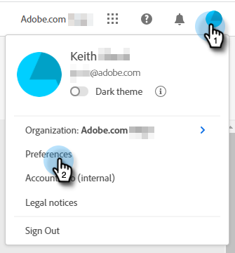
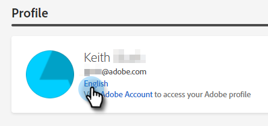
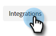

# Dynamic Chat Overview {#dynamic-chat-overview}

Dynamic Chat allows you to leverage an easy-to-use interface to target both people and accounts visiting your website. Collect relevant content such as name, contact information, and free text. Site visitors can also book meetings with your Sales Team. Dynamic Chat activity and engagement data can be used to add members to Marketo programs and trigger cross-channel activities.

   >[!TIP]
   >
   >Visit [this page](https://experienceleague.adobe.com/docs/marketo-learn/tutorials/dynamic-chat/dynamic-chat-overview.html){target="_blank"} to view tutorial videos of Dynamic Chat.

## Integrations {#integrations}

A key component of Dynamic Chat is its ability to natively interface with your Marketo subscription. In order to leverage the full capability of this integration, you'll first need to initiate the data sync. Depending on the size of your Marketo database, it may take up to 24 hours for data for the initial, [one-time sync](/help/marketo/product-docs/demand-generation/dynamic-chat/integrations/adobe-marketo-engage.md){target="_blank"} to complete.

The following is synced:

* Person field data
* Company field data
* Activity data

## Dialogues {#dialogues}

Dialogues represent a single chat engagement. Think of it as a container with all the stuff you need to have an engaging chat dialogue to your website visitors. In each Dialogue, you can specify which page(s) you'd like the Dialogue to appear on, to whom you'd like it to be shown to, and the content and flow of the Dialogue itself. Additionally, you can find metrics to see how well your Dialogue is performing. [Learn more about Dialogues](/help/marketo/product-docs/demand-generation/dynamic-chat/automated-chat/dialogue-overview.md){target="_blank"}.

## Configuration {#configuration}

In the Configuration tab, customize the look and feel of your various Dialogues. Change font, colors, response time, and more! [Learn more about Configuration](/help/marketo/product-docs/demand-generation/dynamic-chat/setup-and-configuration/configuration.md){target="_blank"}.

## Calendar {#calendar}

Connect your Outlook or Gmail calendar for use in appointment scheduling in the chatbot. [Learn more about Calendar](/help/marketo/product-docs/demand-generation/dynamic-chat/setup-and-configuration/agent-settings.md#connect-calendar){target="_blank"}

## Meetings {#meetings}

This is where you'll see all of the appointments that have been scheduled by website visitors through your various Dialogues. [Learn more about Meetings](/help/marketo/product-docs/demand-generation/dynamic-chat/meeting-list.md){target="_blank"}

## Routing {#routing}

This is where you can see a list of all the agents that have connected their calendars, what order they'll be presented to website visitors, and create custom routing rules. [Learn more about Routing](/help/marketo/product-docs/demand-generation/dynamic-chat/setup-and-configuration/routing.md){target="_blank"}

## Live Chat {#live-chat}

Offer your qualified web visitors to connect with your sales representatives via [live chat](/help/marketo/product-docs/demand-generation/dynamic-chat/live-chat/live-chat-overview.md){target="_blank"}.

## Conversational Flow {#conversational-flow}

[Design a conversation](/help/marketo/product-docs/demand-generation/dynamic-chat/automated-chat/conversational-flow-overview.md){target="_blank"} that can be triggered by a visitor based on an action you designate (e.g., filling out a form, clicking a link, etc.).

## Changing the Language {#changing-the-language}

Follow these steps to change your Dynamic Chat language.

>[!IMPORTANT]
>
>Changing your language at the profile level will change the language for _all_ Experience Cloud applications, not just Dynamic Chat.

1. In your Experience Cloud account, click the settings icon and choose **Preferences**.

   

1. Click the current language under your email address.

   

1. Choose your new language (second language is optional) and click **Save**.

   

   >[!NOTE]
   >
   >There are a few dozen languages to choose from, however, Dynamic Chat only supports the following: English, French, German, Japanese, Spanish, Italian, Brazilian Portuguese, Korean, Simplified Chinese, and Traditional Chinese.

When you update the language, everything in the app itself changes except for the words you've personally populated (e.g., stream responses).

## Dynamic Chat Data Retention Limits {#dynamic-chat-data-retention-limits}

Below are just some of the limits/parameters within Dynamic Chat. For a complete list, please see the Marketo Engage [Product Description page](https://helpx.adobe.com/legal/product-descriptions/adobe-marketo-engage---product-description.html){target="_blank"}.

<table>
  <th>Data Type</th>
  <th>Retention Period</th>
 <tr>
  <td>Anonymous Lead Without Any Engagement</td>
  <td>90 days</td>
 </tr>
 <tr>
  <td>Goal Activity</td>
  <td>24 months</td>
 </tr>
 <tr>
  <td>Document Activity</td>
  <td>24 months</td>
 </tr>
 <tr>
  <td>Interacted with Dialogue Activity</td>
  <td>90 days</td>
 </tr>
 <tr>
  <td>Meeting Booking Activity</td>
  <td>24 months</td>
 </tr>
</table>

## FAQ {#faq}

**Can I install Dynamic Chat anywhere on my company website or does it only work on Marketo landing pages?**

The Dynamic Chat JavaScript snippet can be installed on any website as well as Marketo landing pages.

**How long is data stored for reporting?**

90 days. For a full list of limits/parameters, please visit the Marketo Engage [Product Description page](https://helpx.adobe.com/legal/product-descriptions/adobe-marketo-engage---product-description.html){target="_blank"}.

**Does Dynamic Chat support any languages besides English?**

Yes. Dynamic Chat supports the following languages: French, German, Japanese, Spanish, Italian, Brazilian Portuguese, Korean, Simplified Chinese, and Traditional Chinese. Learn more in the [section below](#changing-the-language).

**Do you support AI/NLP functionality?**

We do not support AI/NLP functionality.

**How can I target anonymous people?**

In your dialogue, you would need to use the _Person Email is Empty_ attribute.
