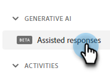
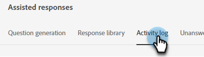
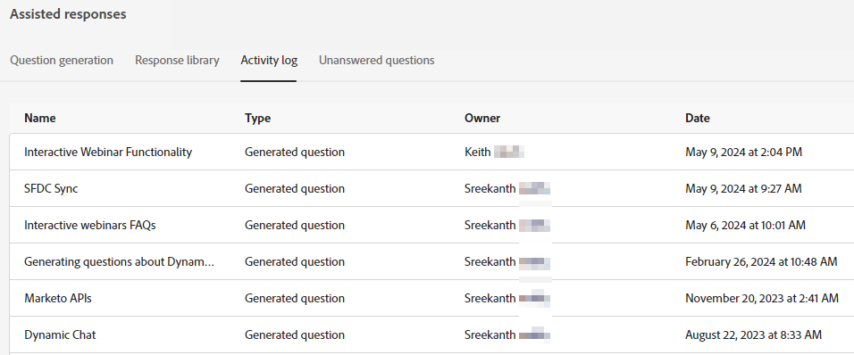

# Activity Log {#activity-log}

See a list of all tasks and their accompanying details, including name, owner, type, and who edited them and when.

1. Under Generative AI, click **[!UICONTROL Assisted responses]**.

   

1. Click the **[!UICONTROL Activity log]** tab.

   

1. All activity for your instance is displayed in one place.

   
