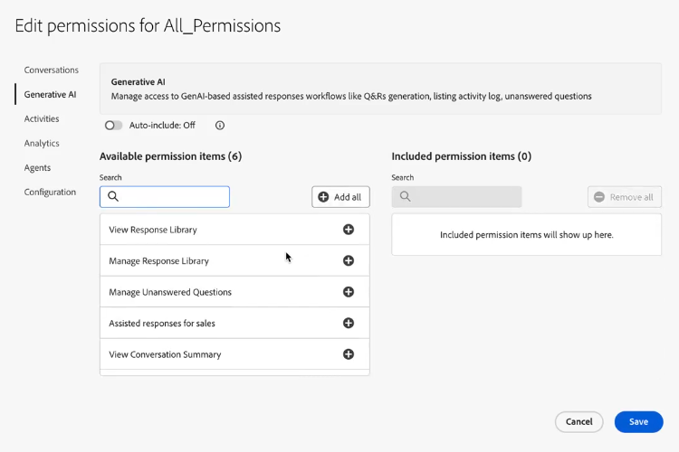
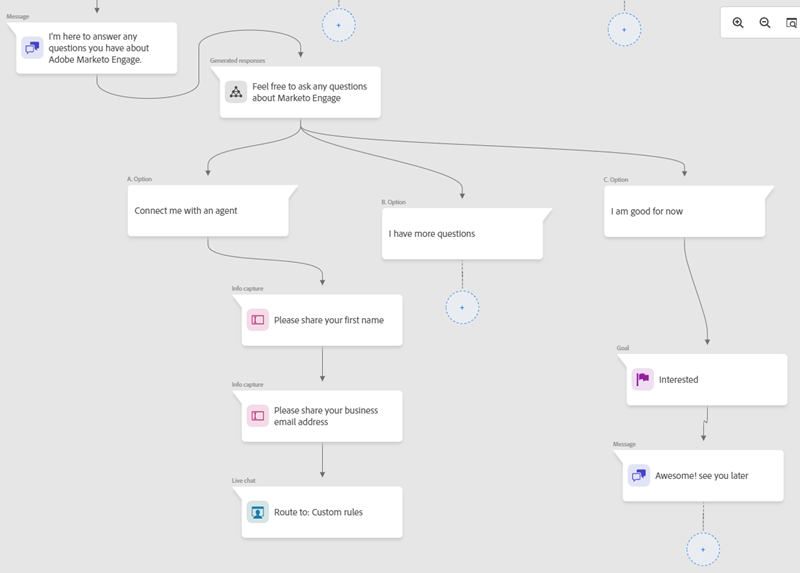
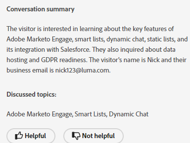
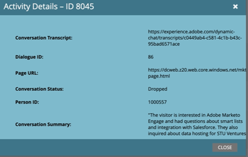
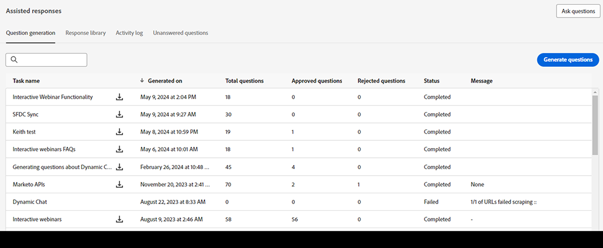
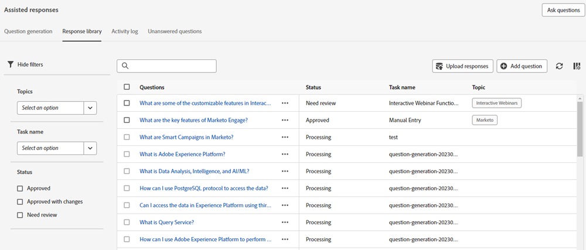
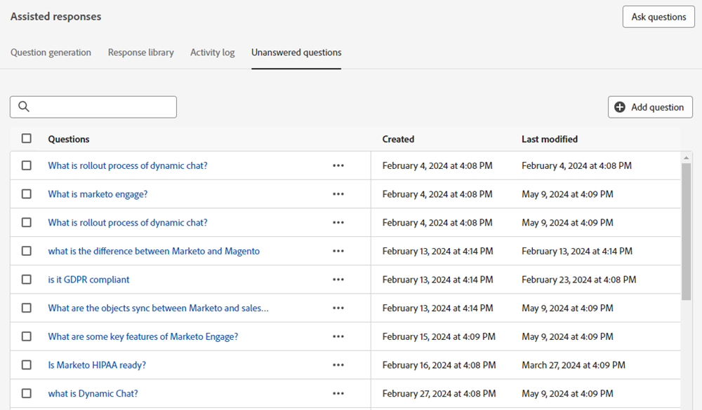
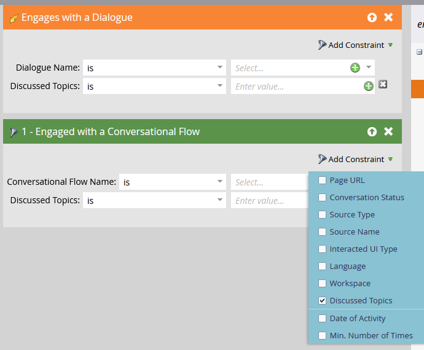

# Generative AI in Dynamic Chat {#generative-ai-overview}

Generative AI powered capabilities in Adobe Dynamic Chat allow you to optimize productivity for your sales agents, get insights into your website visitor intent, and respond to visitor questions in a safe manner.

## Permissions {#permissions}

In order to use generative AI, be sure to grant the desired users the appropriate [permissions](/help/marketo/product-docs/demand-generation/dynamic-chat/setup-and-configuration/permissions.md).

   

## Generation Response Card {#generation-response-card}

Create a message for the visitor for when they reach a certain point in the conversation. Set a number of questions they can ask in one go to achieve your desired key performance indicator. Add up to 5 follow-up questions and include a fallback message when there is no response available to a visitor's question.

   

## Conversation Summary {#conversation-summary}

Typically to get the full context of a visitor conversation, you must scroll through the entire chat transcript. Conversation Summary generates a summary for you in real-time, and even includes topics the visitor expressed interest in. This is particularly useful to chat agents who need quick context of a conversation when they're switching between chats with multiple visitors. In addition to being visible in the Agent Inbox chat screen, completed Conversation Summaries can also be found in the activity log of the visitor's Person Record in your Marketo Engage Database.

   

   

   >[!NOTE]
   >
   >A Conversation Summary is generated for both live and automated chats.

## Question generation {#question-generation}

[Elevate inbound experiences](/help/marketo/product-docs/demand-generation/dynamic-chat/generative-ai/question-generation.md) with AI-assisted conversations for visitors using an interface trained with sales, marketing, and product knowledge.

   

## Response library {#response-library}

[Produce a customized collection](/help/marketo/product-docs/demand-generation/dynamic-chat/generative-ai/response-library.md) of questions and answers, all pre-approved by you, for use inside Generative AI chat campaigns.

   

## Activity log {#activity-log}

[See a list of all tasks](/help/marketo/product-docs/demand-generation/dynamic-chat/generative-ai/activity-log.md) and their accompanying details, including name, owner, type, and who edited them and when.

   

## Unanswered questions {#unanswered-questions}

[Create additional pre-approved responses](/help/marketo/product-docs/demand-generation/dynamic-chat/generative-ai/unanswered-questions.md) for your response library using AI based on a repository of unanswered questions from previous conversations.

   

## Discussed Topics {#discussed-topics}

Discussed Topics is available in Smart List triggers and filters as a constraint, allowing you to drill down even further into your Dynamic Chat insights.

   

>[!IMPORTANT]
>
>When using generative AI, you must abide by the [Adobe Experience Cloud Generative AI User Guidelines](https://www.adobe.com/legal/licenses-terms/adobe-dx-gen-ai-user-guidelines.html) so we can ensure Adobe Experience Cloud features that incorporate generative AI are being used in a safe and responsible manner.

## FAQ {#faq}

**Is generative AI available to all Dynamic Chat users?**

Generative AI is only available to Dynamic Chat Prime subscribers. Please contact the Adobe Account Team (your Account Manager) for details.

**Is there a limit to the amount of questions & answers I can have generated?**

Yes. There is a lifetime limit of 1000 at this time.

**What languages are available in generative AI?**

Currently, only English is supported in generative AI.
