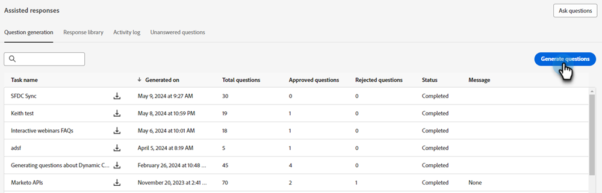
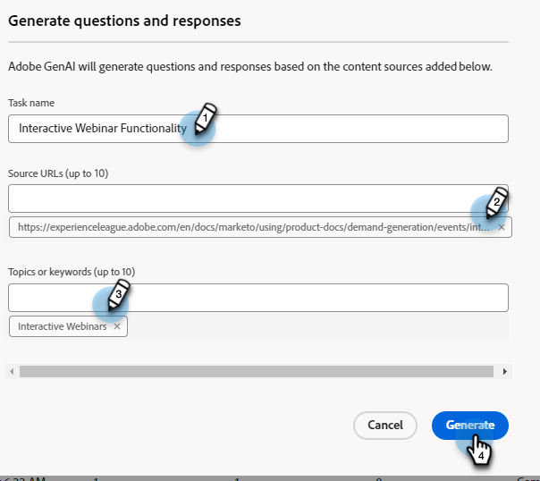
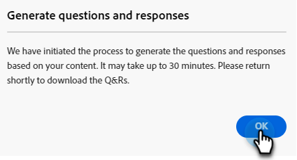
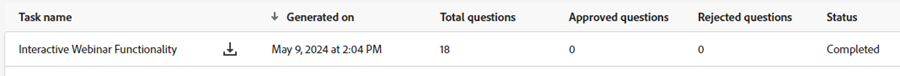
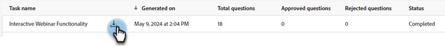
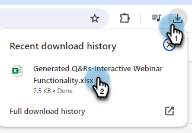
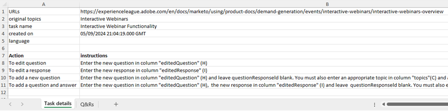
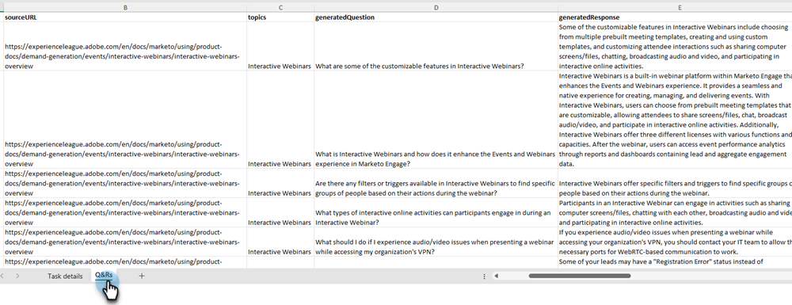

# Question Generation {#question-generation}

See all of your tasks and their pertinent details, such as when they were generated, the total number of questions, approval status, and more.

## Generate Questions {#generate-questions}

1. Under Generative AI, click **[!UICONTROL Assisted responses]**.

   

1. Click **[!UICONTROL Generate questions]**.

   

1. Give your task a name and input a source URL (up to 10) from which all content will be extracted. Enter desired topics/keywords and press enter on your keyboard. When done, click **[!UICONTROL Generate]**.

   

   >[!IMPORTANT]
   >
   >To ensure Marketo Engage can scrape content from the provided URLs, you must first allowlist several IP addresses. [See below for details](#ip-addresses-to-allowlist).

   >[!NOTE]
   >
   >Sites/pages must be public (i.e., not hidden behind a login) in order for their information to be scraped.

1. Based on your content, the question and response generation can take up to 30 minutes. Click **[!UICONTROL OK]**.

   

   >[!TIP]
   >
   >Hit refresh to see the latest status of your question generation.

   

## Download Questions and Responses {#download-questions-and-responses}

>[!NOTE]
>
>Generated questions and responses are also viewable in the [Response library](/help/marketo/product-docs/demand-generation/dynamic-chat/generative-ai/response-library.md).

1. Find the desired task and click the download icon next to its name.

   

1. Locate the downloads folder in your browser and select the file. This may look different depending on the browser you use.

   

1. In the Excel file, **[!DNL Task details]** shows just that, various details about the task, including instructions on how to add/edit questions and/or responses.

   

   >[!NOTE]
   >
   >If you do decide to bulk add/edit questions and/or responses, [learn how to reupload them here](/help/marketo/product-docs/demand-generation/dynamic-chat/generative-ai/response-library.md).

1. The **[!DNL Q&Rs]** tab provides additonal details, including the generated questions and responses.

   

## IP Addresses to Allowlist {#ip-addresses-to-allowlist}

In order to enable extraction of content from your web URLs during the generation of questions and responses, please locate your region below and make sure the IP address associated with it is allowlisted by your web team.

<table width=450>
<thead>
  <tr>
    <th>North America</th>
    <th>Europe</th>
    <th>APAC</th>
  </tr>
</thead>
<tbody>
  <tr>
    <td>13.68.17.252</td>
    <td>20.105.150.224</td>
    <td>20.213.91.77</td>
  </tr>
</tbody>
</table>
