# Response Library {#response-library}

In one place, view all your questions, their approval status, and the task name/topic(s) assigned to them.

## Manually Add a Question {#manually-add-a-question}

1. Under Generative AI, click **[!UICONTROL Assisted responses]**.

   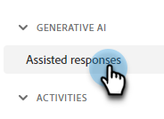

1. Click the **[!UICONTROL Response library]** tab.

   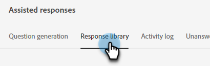

1. Click **[!UICONTROL Add question]**.

   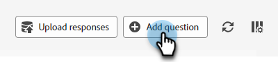

1. Input your question and response. Assign a topic and add an optional URL that users can share with visitors. Click **[!UICONTROL Save]** when done.

   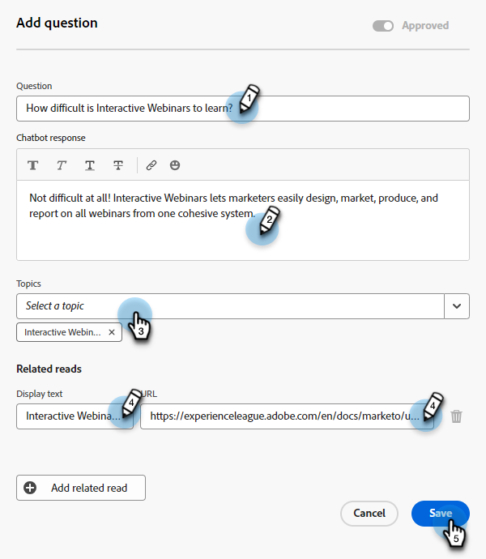

1. Click refresh and your new question appears at the top with the status of "[!UICONTROL Processing]." 

   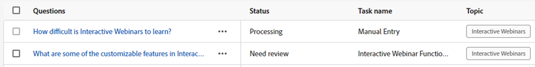

1. After a few minutes, refresh again and the status changes to "Approved."

   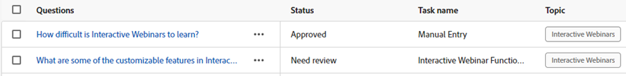

## Edit an Individual Question/Response {#generate-a-new-question}

>[!NOTE]
>
>All generated questions and responses are assigned the "[!UICONTROL need review]" status by default. Only "[!UICONTROL approved]" questions and responses are made available to chat visitors.

1. In the **[!UICONTROL Response library]**, click the desired question.

   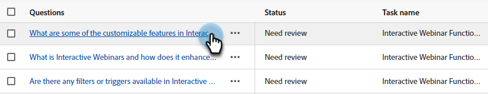

1. Make your edits and click **[!UICONTROL Save]**.

   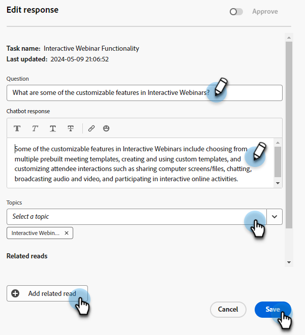

## Bulk Edit and Upload Questions/Responses {#bulk-edit-and-upload-questions-responses}

Instructions on how to make bulk edits in the downloaded Excel file are below. They can also be seen in the file's Task details tab.

<table>
<thead>
  <tr>
    <th>Action</th>
    <th>Instructions</th>
  </tr>
</thead>
<tbody>
  <tr>
    <td>Edit a question</td>
    <td>Enter the new question in column "editedQuestion" (column H)</td>
  </tr>
  <tr>
    <td>Edit a response</td>
    <td>Enter the new response in column "editedResponse" (column I)</td>
  </tr>
  <tr>
    <td>Add a new question</td>
    <td>Enter the new question in column "editedQuestion" (column H) and leave questionResponseld blank. You must also enter an appropriate topic in column "topics" (column C) and a source URL in column "sourceUr!"</td>
  </tr>
  <tr>
    <td>Add a question and answer</td>
    <td>Enter the new question in column "editedQuestion" (column H), the new response in column "editedResponse" (column I), and leave questionResponseld blank. You must also enter an appropriate topic in column "topics" (column C)</td>
  </tr>
</tbody>
</table>

1. After you're done making the edits in your file, go back to the **[!UICONTROL Response library]** tab and click **[!UICONTROL Upload responses]**.

   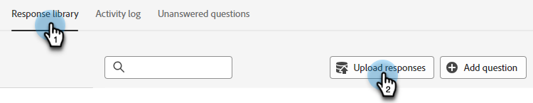

1. Enter the applicable task name. Drag and drop your file, or browse for it on your device and select it. Click **[!UICONTROL Save]** when done.

   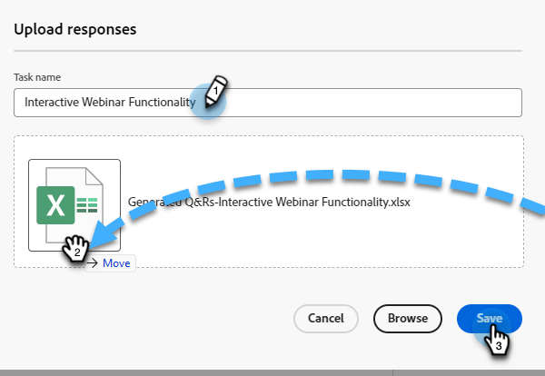

1. The confirmation appears and you're all set.

   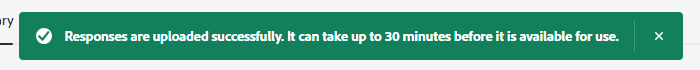

## Filter Your Questions {#filter-your-questions}

By default, questions are listed in order by time/date of creation, with the newest ones showing first. If you're looking for a specific question, apply filters to narrow your search. Filter by topics, task name, and/or approval status.

   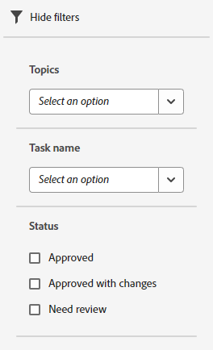
