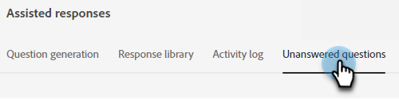
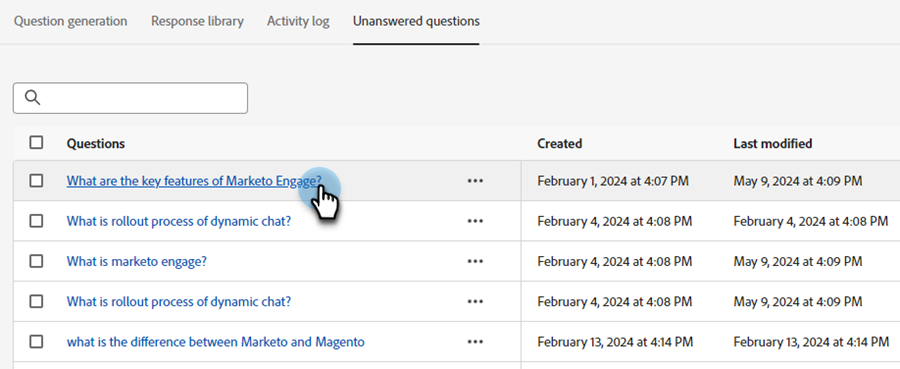
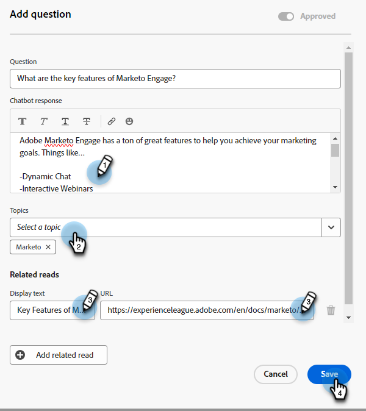
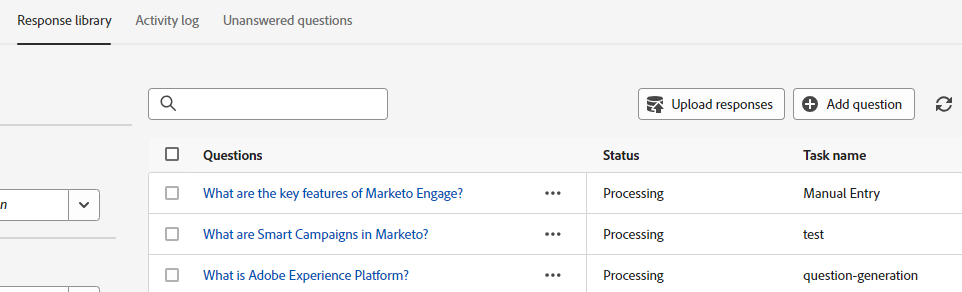

# Unanswered Questions {#unanswered-questions}

See all questions the chatbot couldn't answer and/or the ones visitors marked as "not helpful" and use this valuable information to create additional pre-approved responses.

>[!NOTE]
>
>The list of unanswered questions automatically refreshes every 24 hours.

1. Under Generative AI, click **Assisted responses**.

   

1. Click the **Unanswered questions** tab.

   

1. Select the unanswered question you want to create a response for.

   

1. Input your response. Assign a topic and add an optional URL that users can share with visitors. Click **Save** when done.

   

1. The unanswered question is now answered and is automatically added to your Response library.

   
