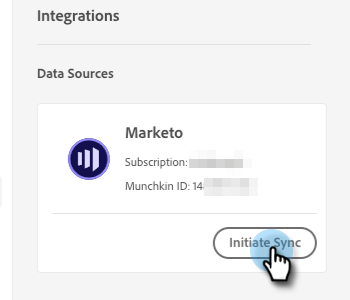
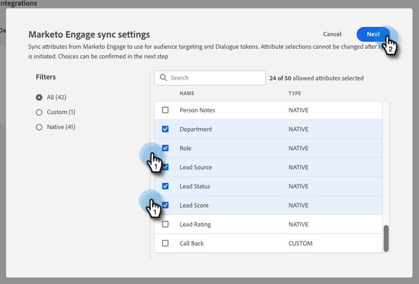

# Adobe Marketo Engage {#adobe-marketo-engage}

## Connecting Dynamic Chat {#connecting-dynamic-chat}

After you've completed the [initial setup](/help/marketo/product-docs/demand-generation/dynamic-chat/setup-and-configuration/initial-setup.md){target="_blank"}, it is time to perform the one-time sync connecting Dynamic Chat to your Adobe Marketo Engage subscription.

>[!NOTE]
>
>Dynamic Chat supports syncing [Marketo native](https://experienceleague.adobe.com/en/docs/marketo-developer/marketo/rest/lead-database/field-types){target="_blank"} and custom person fields and company fields.

1. In My Marketo, click the **[!UICONTROL Dynamic Chat]** tile.

   

   >[!NOTE]
   >
   >If you do not see the Dynamic Chat tile in your My Marketo screen, access Dynamic Chat from the App menu on experience.adobe.com and connect to Marketo via **Configuration** > **Integrations**. After connecting, the tile will appear.

1. If you've previously accessed an application with an Adobe ID, you'll be taken straight to Dynamic Chat. If not, [set up your Adobe ID](https://helpx.adobe.com/manage-account/using/create-update-adobe-id.html){target="_blank"}.

1. To connect your Marketo instance, select **[!UICONTROL Integrations]**.

   

1. On the Marketo card, click **[!UICONTROL Initiate Sync]**.

   

1. Select up to 50 attributes (standard or custom fields) from your Marketo instance to sync to Dynamic Chat for use in audience targeting, data mapping, and personalization. Click **[!UICONTROL Next]** when done.

   

1. Review your selections. Click **[!UICONTROL Confirm]** to initiate the sync.

   

>[!NOTE]
>
>It can take anywhere from 2 to 24 hours for the sync to complete, depending on the size of your database.

## Add an Attribute {#add-an-attribute}

After the initial sync, follow these steps to add additional attributes.

1. In **[!UICONTROL Integrations]**, verify that the **[!UICONTROL Adobe Marketo Engage]** tab is selected and click **[!UICONTROL Add Attribute]**.

   

1. Select the attribute(s) you'd like to add and click **[!UICONTROL Next]**.

   

1. Review your selections and click **[!UICONTROL Confirm]**.

   

## Remove an Attribute {#remove-an-attribute}

After the initial sync, follow these steps to remove an attribute.

>[!NOTE]
>
>You'll only see the option to remove an attribute  if it is not currently in use by any Dialogues.

1. In **[!UICONTROL Integrations]**, verify that the **[!UICONTROL Adobe Marketo Engage]** tab is selected and click on the attribute you want to remove.

   

1. Click **[!UICONTROL Remove Attribute]**.

   

>[!MORELIKETHIS]
>
>[Initial Setup](/help/marketo/product-docs/demand-generation/dynamic-chat/setup-and-configuration/initial-setup.md){target="_blank"}
