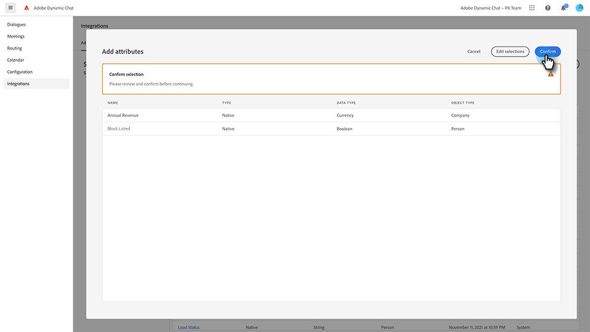

# Adobe Marketo Engage {#adobe-marketo-engage}

## Connecting Dynamic Chat {#connecting-dynamic-chat}

After you've completed the [initial setup](/help/marketo/product-docs/demand-generation/dynamic-chat/setup-and-configuration/initial-setup.md){target="_blank"}, it's time to perform the one-time sync connecting Dynamic Chat to your Adobe Marketo Engage subscription.

1. In My Marketo, click the **Dynamic Chat** tile.

   

   >[!NOTE]
   >
   >If you don't see the tile, reach out to your Marketo Admin.

1. If you've previously accessed an application with an Adobe ID, you'll be taken straight to Dynamic Chat. If not, [set up your Adobe ID](https://helpx.adobe.com/manage-account/using/create-update-adobe-id.html){target="_blank"}.

1. To connect your Marketo instance, select **Integrations**.

   

1. On the Marketo card, click **Initiate Sync**.

   

1. Select up to 50 attributes (standard or custom fields) from your Marketo instance to sync to Dynamic Chat for use in audience targeting, data mapping, and personalization. Click **Next** when done.

   

1. Review your selections. Click **Confirm** to initiate the sync.

   

>[!NOTE]
>
>It can take anywhere from 2 to 24 hours for the sync to complete, depending on the size of your database.

## Add an Attribute {#add-an-attribute}

After the initial sync, here's how to add additional attributes.

1. In **Integrations**, make sure the **Adobe Marketo Engage** tab is selected and click **Add Attribute**.

   

1. Select the attribute(s) you'd like to add and click **Next**.

   

1. Review your selections and click **Confirm**.

   

## Remove an Attribute {#remove-an-attribute}

After the initial sync, here's how to remove an attribute.

>[!NOTE]
>
>You'll only see the option to remove an attribute  if it's not currently in use by any Dialogues.

1. In **Integrations**, make sure the **Adobe Marketo Engage** tab is selected and click on the attribute you want to remove.

   

1. Click **Remove Attribute**.

   

>[!MORELIKETHIS]
>
>[Initial Setup](/help/marketo/product-docs/demand-generation/dynamic-chat/setup-and-configuration/initial-setup.md){target="_blank"}

