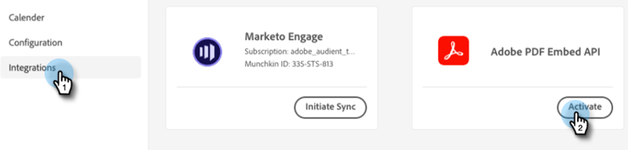

# Adobe PDF Embed API {#adobe-pdf-embed-api}

The Document card allows you to embed PDF documents in Dialogues and track document engagement activity of visitors. Follow these steps to set it up.

1. Navigate to [Adobe PDF Embed API](https://udp.adobe.io/document-services/apis/pdf-embed/){target="_blank"}.

1. Click **[!UICONTROL Get Credentials]**.

   

1. Sign in to your Adobe account.

   

1. Enter your credentials, accept the terms, and click **[!UICONTROL Create Credentials]**.

   

   >[!IMPORTANT]
   >
   >You'll need to use the domain on which you'll be hosting the chatbot (e.g., if you are hosting the chatbot on mycompany.com, enter that domain in Step 4).

1. Click **[!UICONTROL Copy]** to copy your Client ID.

   

1. Back in Dynamic Chat, click **[!UICONTROL Integrations]**. In the Adobe PDF Embed API card, click **[!UICONTROL Activate]**.

   

1. Paste your [!UICONTROL Client ID] and click **[!UICONTROL Save]**.

   

You can now use the Document card in your Dialogues' [Stream Designer](/help/marketo/product-docs/demand-generation/dynamic-chat/automated-chat/stream-designer.md){target="_blank"}.
