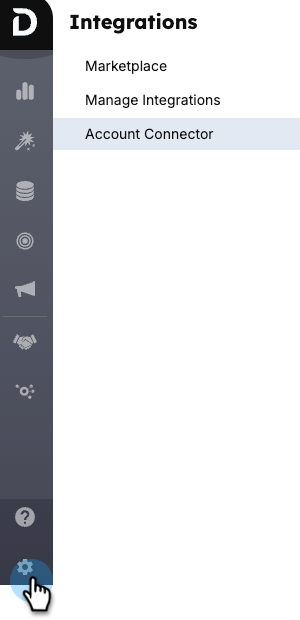
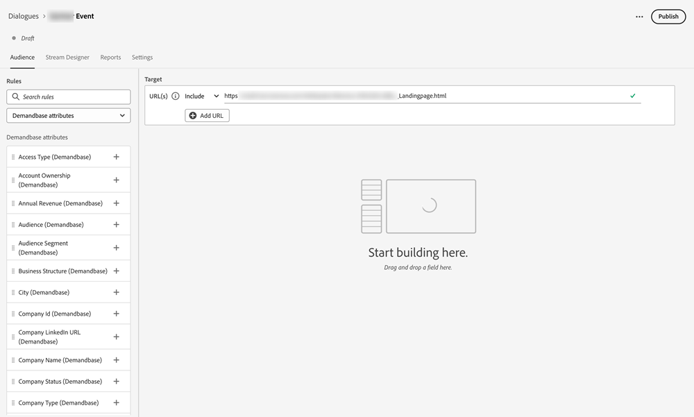
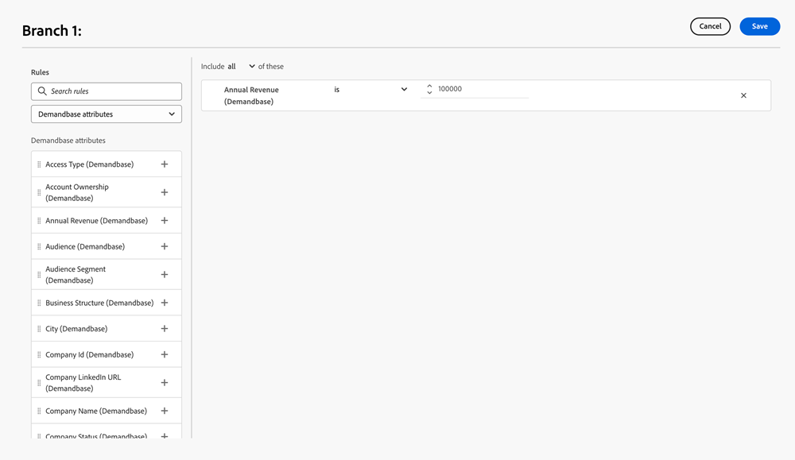
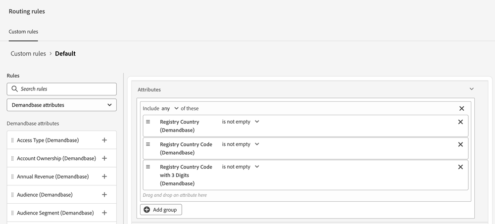

# Demandbase {#demandbase}

Demandbase users can use Demandbase person attributes for dialogue targeting, conditional branding, and custom routing in Dynamic Chat.

## Access the API key for Dynamic Chat {#access-the-api-key-for-dynamic-chat}

The steps below are to be done _in your Demandbase account_.

1. In Demandbase, click the _Settings_ icon.

   

1. Under _Integrations_, select **Account Connector**.

1. Click the **+ Create New** button.

1. In the _Integration Name_ drop-down, select **Adobe Dynamic Chat**.

1. Select the **Server side** radio button.

1. Click **Create**.

1. Using the _copy_ icon, copy the API Token string at the bottom of the page.

1. Submit a ticket with [Marketo Support](https://nation.marketo.com/t5/support/ct-p/Support) and provide the API Token String to activate the Demandbase integration.

>[!NOTE]
>
>For additional information, see [Set Up Demandbase to Send Data to an Integration (Account Connector)](https://support.demandbase.com/hc/en-us/articles/360057169531-Set-Up-Demandbase-to-Send-Data-to-an-Integration-Account-Connector){target="_blank"} in the Demandbase help site.

## Integration features {#integration-features}

Target your audience based on Demandbase attributes in addition to native and custom attributes, while creating a dialogue or a conversational flow.

   

Use Demandbase Attributes as a condition in your conditional branching, a dialogue, or a conversational flow.

   

Use Demandbase Attributes while defining any custom routing logic.

   
