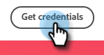
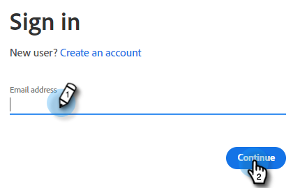
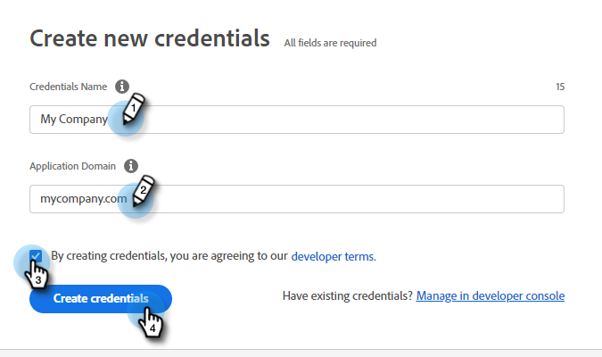

# Using the Document Card {#using-the-document-card}

The Document card allows you to embed PDF documents in Dialogues and track document engagement activity of visitors. Here's how to set it up.

1. Navigate to [Adobe PDF Embed API](https://udp.adobe.io/document-services/apis/pdf-embed/){target="_blank"}.

1. Click **[!UICONTROL Get credentials]**.

   

1. Sign in to your Adobe account.

   

1. Enter your credentials, accept the terms, and click **[!UICONTROL Create credentials]**.

   

   >[!IMPORTANT]
   >
   >You'll need to use the domain on which you'll be hosting the chatbot (e.g., if you're hosting the chatbot on mycompany.com, make sure you enter that in Step 4).

1. Click **[!UICONTROL Copy]** to copy your Client ID.

   

1. Back in [!DNL Dynamic Chat], click **[!UICONTROL Integrations]**. In the [!UICONTROL Adobe PDF Embed API] card, click **[!UICONTROL Activate]**.

   

1. Paste your Client ID and click **[!UICONTROL Save]**.

   

You can now use the Document card in your Dialogues' [Stream Designer](/help/marketo/product-docs/demand-generation/dynamic-chat/dialogues/stream-designer.md)!
