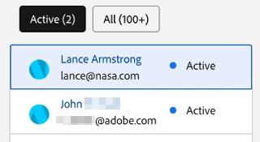
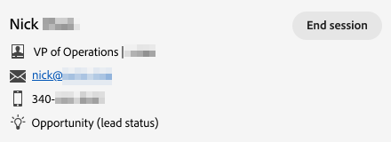
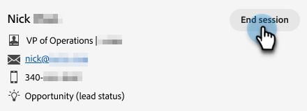
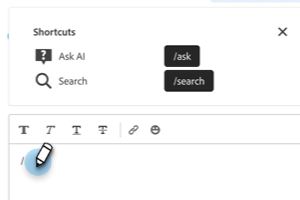
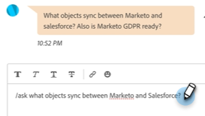
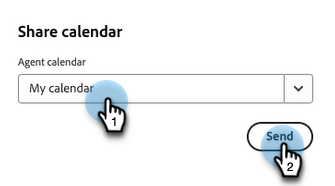

# Agent Inbox {#agent-inbox}

Agents will field live chats within the Agent Inbox. In addition to the active conversations, they can see past conversations, visitor information, and more.

   

## Availability Toggle {#availability-toggle}

On the upper-right side of the Agent Inbox screen, you have the option to set your status as available or unavailable. 

   

>[!IMPORTANT]
>
>**This will override** the [live chat availability](/help/marketo/product-docs/demand-generation/dynamic-chat/setup-and-configuration/agent-settings.md#live-chat-availability){target="_blank"} you established in Agent Settings. The status will remain until either you switch it back, or to the next block of time in your availability.

>[!NOTE]
>
>Setting your status to unavailable will not affect any active chats.

## Live Chat Notifications {#live-chat-notifications}

Learn more about notifications in the [Live Chat Overview](/help/marketo/product-docs/demand-generation/dynamic-chat/live-chat/live-chat-overview.md#live-chat-notifications){target="_blank"}.

## Conversations {#conversations}

On the left side of the Agent Inbox screen, you can choose to display only the active conversations, or all of them.

   

>[!NOTE]
>
>While you can see past (inactive) conversations from yourself and other agents, you will only be able to see your own active conversations.

## Visitor Information {#visitor-information}

On the right side of the Agent Inbox screen, you'll be able to see (from top to bottom) their: name, job title, email address, phone number, and CRM status. Any information not passed along will be displayed as a dash (-).

   

## Activity History {#activity-history}

Below the visitor information is activity history. View activity types and dates, and even view chat transcripts.

   

>[!NOTE]
>
>Information is displayed for the past 90 days only. 

## Calendar Sharing {#calendar-sharing}

At the bottom of the live chat window is an icon that allows you to share your or another agent's calendar with the chat visitor.

1. Click the calendar icon.

   

1. Choose the desired agent calendar and click **Send**.

   

1. The chat visitor will be able to book a meeting.

   
