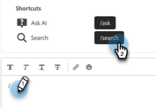
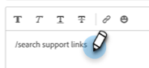
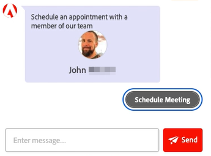
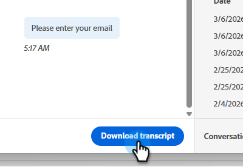

# Agent Inbox {#agent-inbox}

Agents will field live chats within the Agent Inbox. In addition to the active conversations, they can see past conversations, visitor information, and more.

   

## Availability Toggle {#availability-toggle}

On the upper-right side of the Agent Inbox screen, you have the option to set your status as available or unavailable.

   

>[!IMPORTANT]
>
>**This will override** the [live chat availability](/help/marketo/product-docs/demand-generation/dynamic-chat/setup-and-configuration/agent-settings.md#live-chat-availability){target="_blank"} you established in Agent Settings. The status will remain until either you switch it back, or to the next block of time in your availability.

>[!NOTE]
>
>Setting your status to unavailable will not affect any active chats.

## Live Chat Notifications {#live-chat-notifications}

Learn more about notifications in the [Live Chat Overview](/help/marketo/product-docs/demand-generation/dynamic-chat/live-chat/live-chat-overview.md#live-chat-notifications){target="_blank"}.

## Conversations {#conversations}

On the left side of the Agent Inbox screen, you can choose to display only the active conversations, or all of them.

   

>[!NOTE]
>
>While you can see past (inactive) conversations from yourself and other agents, you will only be able to see your own active conversations.

## Visitor Information {#visitor-information}

On the right side of the Agent Inbox screen, you'll be able to see (from top to bottom) their: name, job title, email address, phone number, and CRM status. Any information not passed along will be displayed as a dash (-).

   

## End a Session {#end-a-session}

Agents have the ability to manually terminate a session simply by clicking the **End session** button next to the visitor information.

   

## Shortcuts {#shortcuts}

>[!NOTE]
>
>This feature is part of generative AI, available via the Dynamic Chat Prime subscription. Contact the Adobe Account Team (your Account manager) for details.

Shortcuts, powered by the generative AI [Response library](/help/marketo/product-docs/demand-generation/dynamic-chat/generative-ai/response-library.md), is a great way to get help on the fly when chatting with a visitor. Simply type a forward slash (`/`) in the text box and choose `ask` or `search`.

   

**Ask** is for help with responses to a question.

1. Type or choose `/ask` in the text box. Type your question and hit enter on your keyboard.

   

1. An answer appears. Click the copy icon to have it pasted into the text box for you. You can edit the text prior to sending it to the visitor.

   

**Search** is for help finding pages related to specific text.

1. Type or choose `/search` in the text box.

   

1. Type what you want to search for and hit enter on your keyboard.

   

1. Applicable links appear. Click the copy icon to have them pasted into the text box for you. You can make edits prior to sending the info to the visitor.

   

## Activity History {#activity-history}

Below the visitor information is activity history. View activity types and dates, and even view chat transcripts.

   

>[!NOTE]
>
>Information is displayed for the past 90 days only.

## Calendar Sharing {#calendar-sharing}

At the bottom of the live chat window is an icon that allows you to share your or another agent's calendar with the chat visitor.

1. Click the calendar icon.

   

1. Choose the desired agent calendar and click **Send**.

   

1. The chat visitor will be able to book a meeting.

   

## Conversation Summary {#conversation-summary}

>[!NOTE]
>
>This feature is part of generative AI, available via the Dynamic Chat Prime subscription. Contact the Adobe Account Team (your Account manager) for details.

Conversation Summary generates a quick summary for you in real-time, including topics the visitor has expressed interest in. It is available in the bottom-right of every chat screen.

   

   >[!NOTE]
   >
   >A completed Conversation Summary can also be found in the activity log of the visitor's Person Record in your Marketo Engage Database.
