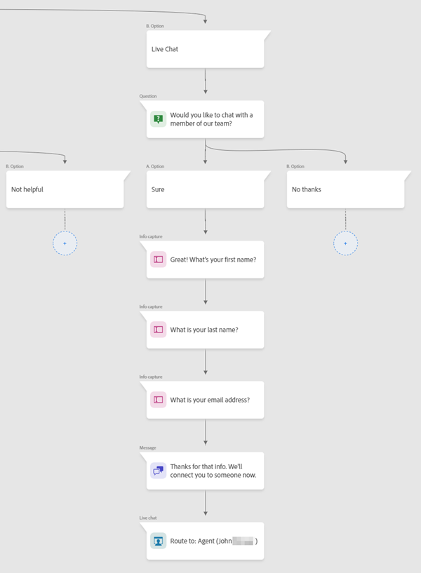

# Live Chat Overview {#live-chat-overview}

Live chat allows website visitors to engage in real-time chat conversations with your sales agents.

## Add Live Chat Agents {#add-live-chat-agents}

To get started with live chat, you'll need to add your live chat agents as [users in the Adobe Admin Console](/help/marketo/product-docs/demand-generation/dynamic-chat/setup-and-configuration/add-or-remove-chat-users.md#add-a-chat-user){target="_blank"} and give them the [Live Chat permission](/help/marketo/product-docs/demand-generation/dynamic-chat/setup-and-configuration/permissions.md){target="_blank"}. After this is done, you can then add a [live chat card](#using-the-live-chat-card) to a new or existing Dialogue. 

When visitors request to chat with an agent through your Dialogue, agents will have multiple [notification options](/help/marketo/product-docs/demand-generation/dynamic-chat/live-chat/agent-inbox.md#live-chat-notifications){target="_blank"}. When they click on the notification, they'll be taken to their [Agent Inbox](/help/marketo/product-docs/demand-generation/dynamic-chat/live-chat/agent-inbox.md){target="_blank"} where they can begin chatting with the visitor.

>[!NOTE]
>
>The live agent avatar uses the profile picture from the agent's Adobe account profile. To update the image, follow [these steps](https://helpx.adobe.com/manage-account/using/edit-adobe-account-personal-profile.html){target="_blank"}.

## Using the Live Chat Card {#using-the-live-chat-card}

Use the live chat card in the [Stream Designer](/help/marketo/product-docs/demand-generation/dynamic-chat/automated-chat/stream-designer.md){target="_blank"} when you want visitors to chat with a live agent.

   

>[!IMPORTANT]
>
>The live chat card must always be the last card in the branch. If the card is placed in a random point in the branch, it could surprise the visitor by suddenly connecting them to an agent.

### Best Practices {#best-practices}

* Use a question card before the live chat card asking the visitor if they'd like to connect.
* After the visitor agrees to connect, use the information capture card to collect some of their info, like first/last name, email address, job title, etc. (it's recommended to at least request first name and email address).

## Live Chat Card Options {#live-chat-card-options}

Clicking on the live chat card in the stream allows you to choose how the visitor gets routed. Choose from round robin, an agent, custom rules, or a team.

   

<table> 
 <tbody> 
  <tr> 
   <td><b>Round Robin</b></td>
   <td>Chats are assigned to agents in sequential order.</td>
  </tr> 
  <tr> 
   <td><b>Agent</b></td>
   <td>Choose a specific agent to receive the chat.</td>
  </tr>
    <tr> 
   <td><b>Custom Rules</b></td>
   <td>All custom rules will be cycled through when considering where to route the visitor. If the visitor doesn't qualify for any custom rule, they get the <a href="/help/marketo/product-docs/demand-generation/dynamic-chat/setup-and-configuration/agent-management.md#live-chat-fallback" target="_blank">live chat fallback message</a>.</td>
  </tr> 
  <tr> 
   <td><b>Team</b></td>
   <td>Choose a specific team to receive the chat. If this option is chosen, it will be assigned round robin within that team.</td>
  </tr>
 </tbody> 
</table>

>[!MORELIKETHIS]
>
>[Agent Inbox](/help/marketo/product-docs/demand-generation/dynamic-chat/live-chat/agent-inbox.md){target="_blank"}
