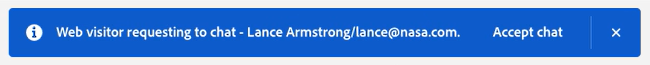

# Live Chat Overview {#live-chat-overview}

Live chat allows website visitors to engage in real-time chat conversations with your sales agents.

>[!NOTE]
>
>Conversational Flows and Live Chat are shared trial features that have a combined lifetime limit of 100 engagements for those on the Dynamic Chat Select package. When this limit is reached, all published Conversational Flows will stop triggering and visitors who request to chat with a live agent will receive the global fallback message. To increase this limit, please contact your Account Representative to discuss package upgrade options.

## Add Live Chat Agents {#add-live-chat-agents}

To get started with live chat, you'll need to add your live chat agents as [users in the Adobe Admin Console](/help/marketo/product-docs/demand-generation/dynamic-chat/setup-and-configuration/add-or-remove-chat-users.md#add-a-chat-user){target="_blank"} and give them the [Live Chat permission](/help/marketo/product-docs/demand-generation/dynamic-chat/setup-and-configuration/permissions.md){target="_blank"}. After this is done, you can then add a [live chat card](#using-the-live-chat-card) to a new or existing Dialogue. 

When visitors request to chat with an agent through your Dialogue, agents will have multiple [notification options](/help/marketo/product-docs/demand-generation/dynamic-chat/live-chat/agent-inbox.md#live-chat-notifications){target="_blank"}. When they click on the notification, they'll be taken to their [Agent Inbox](/help/marketo/product-docs/demand-generation/dynamic-chat/live-chat/agent-inbox.md){target="_blank"} where they can begin chatting with the visitor.

>[!NOTE]
>
>The live agent avatar uses the profile picture from the agent's Adobe account profile. To update the image, follow [these steps](https://helpx.adobe.com/manage-account/using/edit-adobe-account-personal-profile.html){target="_blank"}.

## Using the Live Chat Card {#using-the-live-chat-card}

Use the live chat card in the [Stream Designer](/help/marketo/product-docs/demand-generation/dynamic-chat/automated-chat/stream-designer.md){target="_blank"} when you want visitors to chat with a live agent.

   

>[!IMPORTANT]
>
>The live chat card must always be the last card in the branch. If the card is placed in a random point in the branch, it could surprise the visitor by suddenly connecting them to an agent.

### Best Practices {#best-practices}

* Use a question card before the live chat card asking the visitor if they'd like to connect.
* After the visitor agrees to connect, use the information capture card to collect some of their info, like first/last name, email address, job title, etc. (it's recommended to at least request first name and email address).

## Live Chat Card Options {#live-chat-card-options}

Clicking on the live chat card in the stream allows you to choose how the visitor gets routed. Choose from round robin, an agent, custom rules, or a team.

   

<table> 
 <tbody> 
  <tr> 
   <td><b>Round Robin</b></td>
   <td>Chats are assigned to agents in sequential order.</td>
  </tr> 
  <tr> 
   <td><b>Agent</b></td>
   <td>Choose a specific agent to receive the chat.</td>
  </tr>
    <tr> 
   <td><b>Custom Rules</b></td>
   <td>All custom rules will be cycled through when considering where to route the visitor. If the visitor doesn't qualify for any custom rule, they get the <a href="/help/marketo/product-docs/demand-generation/dynamic-chat/setup-and-configuration/agent-management.md#live-chat-fallback" target="_blank">live chat fallback message</a>.</td>
  </tr> 
  <tr> 
   <td><b>Team</b></td>
   <td>Choose a specific team to receive the chat. If this option is chosen, it will be assigned round robin within that team.</td>
  </tr>
 </tbody> 
</table>

## Live Chat Notifications {#live-chat-notifications}

>[!IMPORTANT]
>
>In order to receive browser notifications for live chat, all live chat agents must enable browser notifications for Dynamic Chat when prompted.

### Enabling Notifications {#enabling-notifications}

Live chat agents will see a banner at the top of the screen when they log in that reads "Please enable browser notifications to receive live chat notifications." Click **Enable**.

   

Live chat agents will then be prompted by the browser to show notifications. Click **Allow**.

   

If agents do not get browser notifications even after allowing in the browser, they may need to enable notifications for the browser in the OS notification settings:

[Steps for Mac](https://support.apple.com/guide/mac-help/change-notifications-settings-mh40583/mac){target="_blank"}

[Steps for Windows](https://support.microsoft.com/en-us/windows/change-notification-settings-in-windows-8942c744-6198-fe56-4639-34320cf9444e){target="_blank"}

### When a Live Chat is Routed to an Agent {#when-a-live-chat-is-routed-to-an-agent}

When a live chat is routed to an agent, they'll see a blue banner across the top of the screen asking them to accept.

   

>[!TIP]
>
>You also have the option to set up browser notifications, which will alert you in case you're not logged in to Dynamic Chat.
>
>* Enable browser notifications in [Google Chrome](https://support.google.com/chrome/answer/3220216?hl=en&co=GENIE.Platform%3DDesktop){target="_blank"}
>* Enable browser notifications in [Mozilla Firefox](https://support.mozilla.org/en-US/kb/push-notifications-firefox){target="_blank"}

### Things to Note {#things-to-note}

* Agents have 45 seconds to respond before the "Accept chat" message times out. After that, visitors will receive the [fallback message](/help/marketo/product-docs/demand-generation/dynamic-chat/setup-and-configuration/agent-management.md#live-chat-fallback){target="_blank"}. For Dynamic Chat Prime subscribers who have the routing option set to **Team**, one more agent will be tried before the fallback message appears.
* There is a limit of 10 live chats per agent at this time.

>[!MORELIKETHIS]
>
>[Agent Inbox](/help/marketo/product-docs/demand-generation/dynamic-chat/live-chat/agent-inbox.md){target="_blank"}
