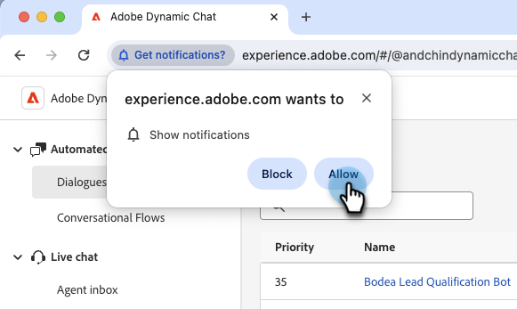

# Notifications {#notifications}

In order to receive browser notifications for live chat, all live chat agents must enable browser notifications for Dynamic Chat when prompted.

Live chat agents will see a banner at the top of the screen when they log in that reads "Please enable browser notifications to receive live chat notifications." Click **Enable**.

   

Live chat agents will then be prompted by the browser to show notifications. Click **Allow**.

   

## Enable Notifications in Chrome{#enable-notifications-in-chrome}

### Chrome for Windows

Google outlines the steps for enabling browser notifications for Windows in [this article](https://support.mozilla.org/en-US/kb/push-notifications-firefox){target="_blank"}.

### Chrome for Mac OS

(Insert John's steps here)

## Enable Notifications in Firefox{#enable-notifications-in-firefox}

Firefox outlines the steps for various browser versions and operating systems in [this article](https://support.mozilla.org/en-US/kb/push-notifications-firefox){target="_blank"}.

## OS Notifications {#os-notifications}

If agents still aren't receiving notifications after allowing them in their browser, they may need to enable notifications for the browser in the OS notification settings.

[Notifications: Mac](https://support.apple.com/guide/mac-help/change-notifications-settings-mh40583/mac){target="_blank"}

[Notifications: Windows](https://support.microsoft.com/en-us/windows/change-notification-settings-in-windows-8942c744-6198-fe56-4639-34320cf9444e){target="_blank"}

DID MSI ACTIONS NOTIFICATIONS EVER HAPPEN???
