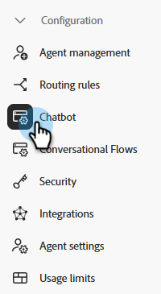
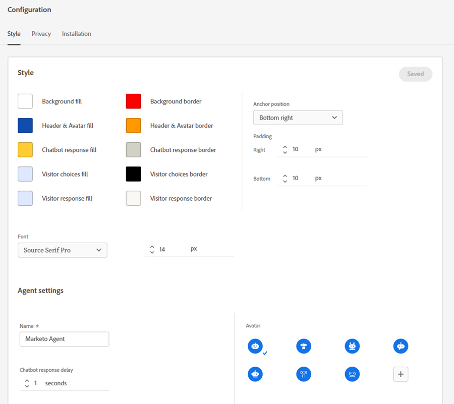
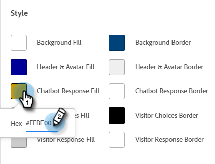
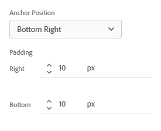
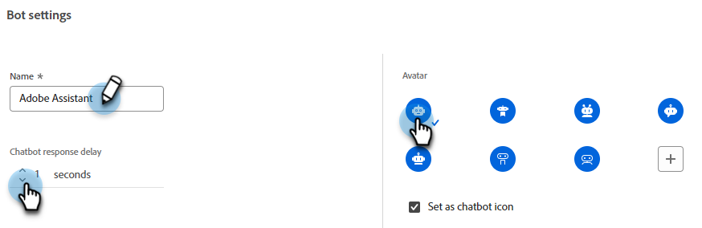
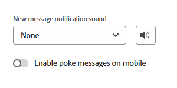
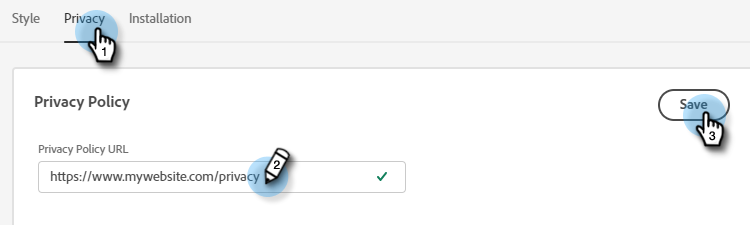
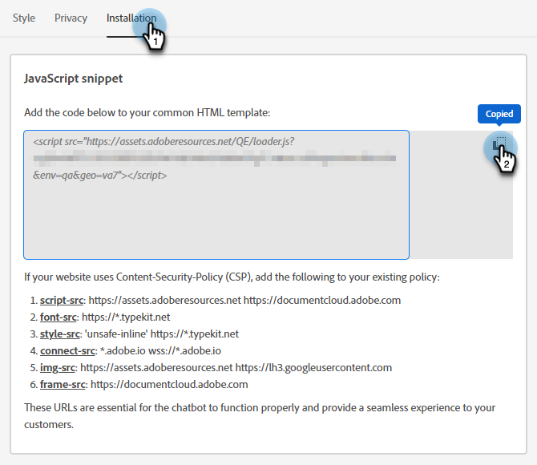

# Configuration {#configuration}

Learn how to customize the look and feel of your chatbot dialogue window.

To get started, click **Configuration**.

   

There are several different customization options.

   

## Style Tab {#style-tab}

### Style {#style}

This is where you'll define the look and feel of the chatbot where your Dialogues will be shown, including: colors, fonts, placement of the bot widget, and the chatbot's name/avatar.

Each category's color is determined by a [hexadecimal color value](https://color.adobe.com/create/color-wheel){target="_blank"} (e.g., white = #ffffff, red = #bf1932, etc.).

   

The Anchor allows your site visitor to open/close the chatbox. You can choose whether you want that icon to appear on the bottom right or bottom left. You can also increase/decrease padding (the amount of space between the icon and the bottom of the webpage).

   

### Agent Settings {#agent-settings}

In Agent Settings, you can add a label to your chatbox (ex: "Adobe Bot") that will appear at the top of it. You can also determine the response delay (in seconds), and change your chat avatar. To upload your own avatar image, click the **+** button.

   

   >[!NOTE]
   >
   >Custom avatars should be square images less than 256kb and smaller than 200x200 px. Supported file types include: .jpg, .png, .gif, .webp, .svg.

When you're done making changes, remember to click **Save**.

   

## Privacy Tab {#privacy-tab}

Click the **Privacy** tab to add/edit the URL of your site's privacy policy (optional).

   

## Installation Tab {#installation-tab}

In order for the chatbot to show up on your website, you'll first need to install the Dynamic Chat JavaScript snippet. Click this tab to find/copy the necessary code. If you're not familiar with this operation, please contact your web team or IT department for assistance.

   

>[!TIP]
>
>If your site utilizes a Content Security Policy, you may need to allowlist the following URLs for the chatbot to work as expected:
>
>* `*.adoberesources.net`
>* `*.adobe.io`
>* `*.typekit.net`

>[!NOTE]
>
>Marketo Support is not set up to assist with troubleshooting HTML. For HTML assistance, please consult a web developer.
