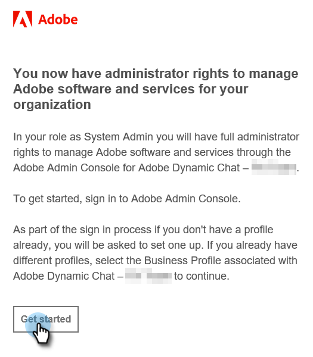

# Initial Setup {#initial-setup}

## Access Admin Console {#access-admin-console}

Follow the steps below to set up Dynamic Chat.

>[!NOTE]
>
>**Admin permissions required.**

1. After Dynamic Chat is enabled for your Marketo Instance, the designated System Admin will receive a welcome email. In that email, click **Get Started**.

   

1. If you've previously accessed an application with an Adobe ID, you'll be taken straight to the Adobe Admin Console. If not, [set up your Adobe ID](https://helpx.adobe.com/manage-account/using/create-update-adobe-id.html){target="_blank"}.

   

## Add Users {#add-users}

1. After logging in to the Admin Console, the next thing to do is add users. We have that process [documented here](/help/marketo/product-docs/demand-generation/dynamic-chat/setup-and-configuration/add-or-remove-chat-users.md#add-a-chat-user){target="_blank"}.

Next, it's time to [connect Dynamic Chat to Marketo](/help/marketo/product-docs/demand-generation/dynamic-chat/integrations/adobe-marketo-engage.md){target="_blank"}.
