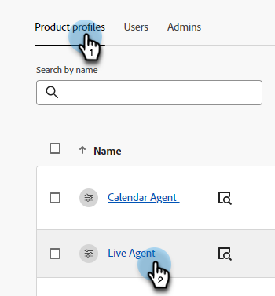
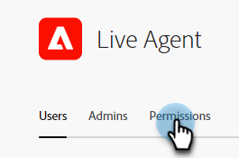
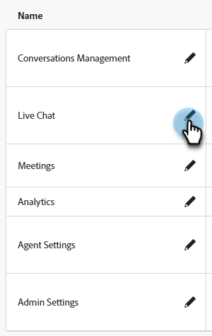
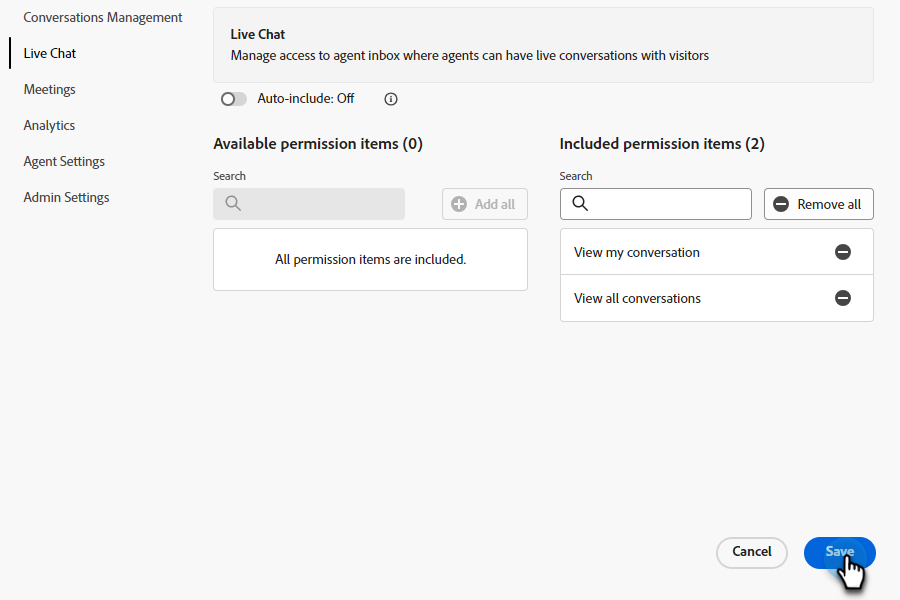
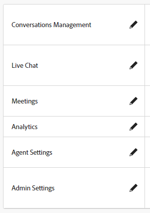
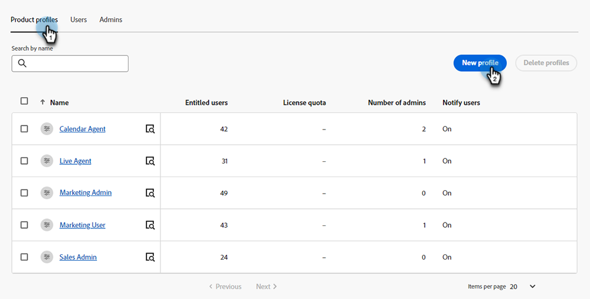
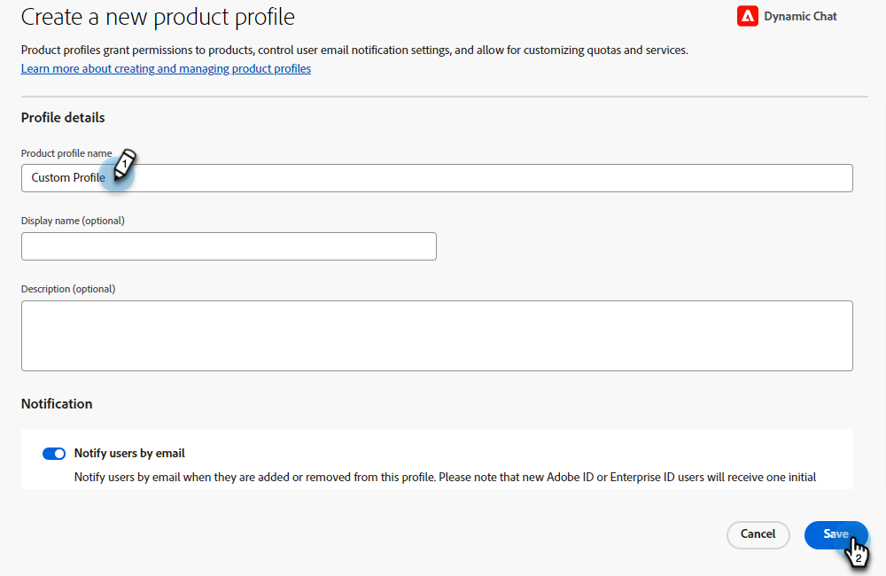
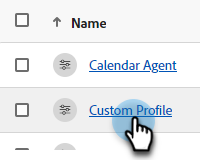

# Permissions {#permissions}

There are five default profiles with predefined permissions you can edit in Dynamic Chat. You can also create a custom profile with a custom set of permissions. Let's go over both.

## Edit Existing Permissions {#edit-existing-permissions}

1. In the [Adobe Admin Console](https://adminconsole.adobe.com/){target="_blank"}, click **Dynamic Chat**.

   

1. In the **Product profiles** tab, select the profile you want to edit. In this example, we're choosing **Live Agent**.

   

1. Click the **Permissions** tab.

   

1. Select the area of the profile you want to edit. In this example, we're choosing Live Chat. Click the pencil icon.

   

1. Available permission items are listed on the left. You can choose to add permissions one by one, or all at once. In this example there's only one available, so we're adding that one. Click the **+** sign.

   

   >[!NOTE]
   >
   >Enabling Auto-include will add all permission items to the included list. When new permission items become available, they'll automatically be included for that product profile.

1. Click **Save**.

   

You can now repeat this process for any/all other Dynamic Chat areas.

   

## Create a Profile {#create-a-profile}

1. In the [Adobe Admin Console](https://adminconsole.adobe.com/){target="_blank"}, click **Dynamic Chat**.

   

1. In the **Product profiles** tab, click **New profile**.

   

1. **Name** your product profile. Optionally, you can give it a display name and/or description, and choose to have users notified when they're added/removed. Click **Save** when done.

   

1. Your new profile will appear in the Product profiles tab. Select it.

   

1. Now follow steps 3-6 from the [section above](#edit-existing-permissions) for each desired area.

## List of Permissions {#list-of-permissions}

Below you'll find a list of all available permissions for each area.

<table>
<thead>
  <tr>
    <th style="width:30%">Dynamic Chat Area</th>
    <th>Permissions</th>
  </tr>
</thead>
<tbody>
  <tr>
    <td>Conversations Management</td>
    <td><li>View Dialogues</li>
    <li>Manage Dialogues (create, delete)</li>
    <li>Publish Dialogues</li>
    <li>View Conversational Flows</li>
    <li>Manage Conversational Flows (create, delete)</li>
    <li>Publish Conversational Flows</li></td>
  </tr>
  <tr>
    <td>Live Chat</td>
    <td><li>Agent Inbox</li>
    <li>View My Conversations</li>
    <li>View All Conversations</li>
    <li>View Conversation Summary <b>&#42;</b></li>
    <li>View Assisted Responses <b>&#42;</b></li></td>
  </tr>
  <tr>
    <td>Meetings</td>
    <td><li>Manage All Meetings</li>
    <li>Manage My Meetings</li></td>
  </tr>
  <tr>
    <td>Analytics</td>
    <td><li>View Global Performance Reports</li>
    <li>View Live Chat Reports</li>
    <li>View Meetings Reports</li>
    <li>Export Reports</li></td>
  </tr>
  <tr>
    <td>Agent Settings</td>
    <td><li>Manage Live Chat Availability</li>
    <li>Connect Your Calendar</li>
    <li>Manage Calendar Availability</li></td>
  </tr>
  <tr>
    <td>Admin Settings</td>
    <td><li>View Workspaces <b>&#42;</b></li>
    <li>Manage Workspaces (create, edit, delete) <b>&#42;</b></li>
    <li>View Round-robin</li>
    <li>View Custom Rules</li>
    <li>Manage Custom Rules (add, edit, delete)</li>
    <li>View Account List <b>&#42;</b></li>
    <li>Manage Accounts (add, edit, delete) <b>&#42;</b></li>
    <li>Manage Chatbot Settings</li>
    <li>Manage Conversational Flows Settings</li>
    <li>Manage Privacy and Security</li>
    <li>Manage Integrations</li>
    <li>Manage Languages <b>&#42;</b></li>
    <li>Manage Agents</li>
    <li>View Agent Teams <b>&#42;</b></li>
    <li>Manage Agent Teams (add, edit, delete) <b>&#42;</b></li>
    <li>View Usage Limits</li></td>
  </tr>
</tbody>
</table>

**&#42;** Currently only available to Dynamic Prime users
