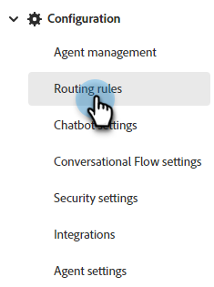
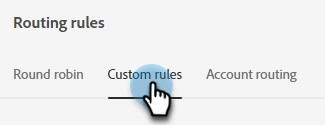
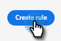
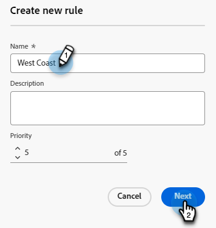
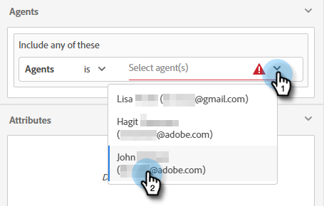
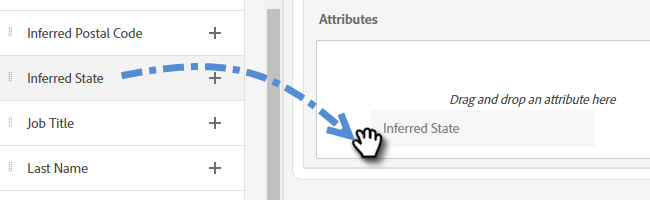
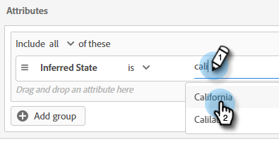
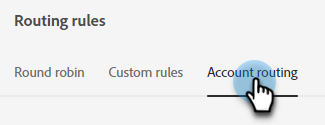
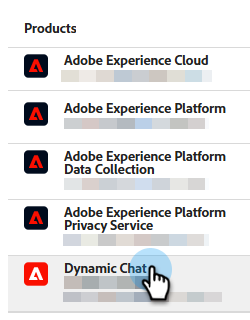
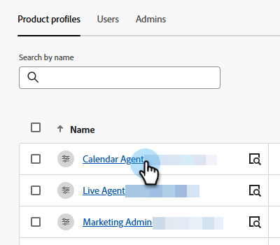

# Routing {#routing}

Meetings booked in Dynamic Chat can be routed two ways. Round robin, or using a custom rule.

Round robin: Meetings get assigned to agents sequentially. So if you have five agents and agent three took the last meeting, agent four will get the next one, followed by agent five, then back to agent one.

Custom rule: You can choose specific agents to receive meetings based on attributes you select.

>[!NOTE]
>
>Account Routing is given the highest priority. When a visitor reaches the point in the conversation to either book a meeting or initiate a live chat, [Account Routing](#account-routing) is checked first before other routing options are considered.

## Create a Custom Rule {#create-a-custom-rule}

In this example we're sending all meetings from the inferred states of CA, OR, and WA to agent John.

1. Under Configuration, click **Routing Rules**.

   

1. Click the **Custom Rules** tab.

   

1. Click **Create Rule**.

   

1. Name your rule. Optionally, you can add a description and set its priority level. Click **Next**.

   

1. Choose your desired agent(s).

   

1. Drag over your desired attribute(s).

   

1. Find and select your desired value(s).

   

1. When all of your desired values are selected, click **Save**.

   

## Account Routing {#account-routing}

Identify and upload your target account and respective sales owners and route visitors coming from those accounts directly to the respective account owner.  

   

### Add an Account {#add-an-account}

In this example, we'll route all employees from Lego directly to agent Steven.

1. In the Account Routing tab, click **+ Add Account**.

   

   >[!TIP]
   >
   >You can create multiple Accounts at once by clicking **Upload Account List** and uploading a CSV.

1. Enter the company's name, domain, and select the desired agent.

   
