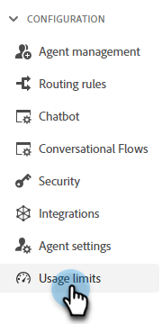
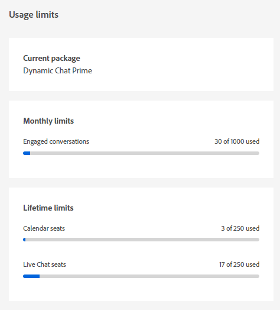

# Usage Limits {#usage-limits}

Visit the Usage limits page to see important information, such as package information and usage limit status.

1. Under Configuration, click **[!UICONTROL Usage limits]**.

   

1. View your current package, monthly limit status for engaged conversations, and lifetime limit status for Calendar/Live Chat seats.

   

>[!NOTE]
>
>Monthly limits automatically reset on the 1st of every month.
