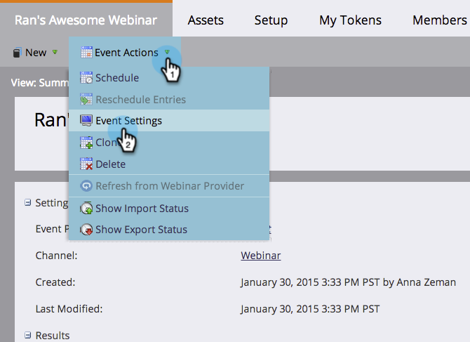
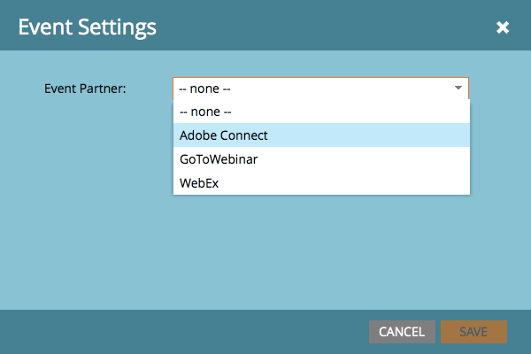
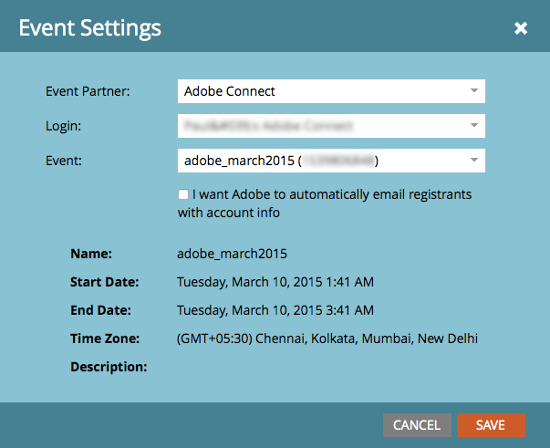

# Create an Event with Adobe Connect {#create-an-event-with-adobe-connect}

Syncing with Adobe Connect allows you to manage your webinar registration and attendance inside Marketo, which ensures that engagement doesn't go untracked.

>[!PREREQUISITES]
>
>* [Link Adobe Connect and Marketo](/help/marketo/product-docs/administration/additional-integrations/add-adobe-connect-as-a-launchpoint-service.md)
>* [Create a New Event Program](/help/marketo/product-docs/demand-generation/events/understanding-events/create-a-new-event-program.md)

First, make sure you've created your meeting or seminar in Adobe Connect. If you need help, check out the [Adobe Connect User Guide](http://help.adobe.com/en_US/connect/9.0/using/index.html). The meetings and seminars that you create in Adobe Connect must be created under the folder that you specified when you entered your credentials in Marketo. After you create your meeting or seminar, make note of any relevant logistical information (such as the phone number), to use in your confirmation email and ICS file.

>[!NOTE]
>
>We **do not** support Adobe Connect On-Site at this time.

1. On the home of a new event, select **Event Actions**, and then **Event Settings**.

   

   >[!NOTE]
   >
   >If you don't see **Event Settings** in the drop-down, make sure the event's channel has **Event with Webinar** selected under "Applies to."

1. Under **Event Partner**, select **Adobe Connect**.

   

1. Select your **Login** ID and the select your **Event**.

   

1. Click **Save**.

   

   Nice! Your Adobe Connect event is now synced with your Marketo event.

   >[!NOTE]
   >
   >The fields Marketo sends over are: First Name, Last Name, Email Address.

   >[!TIP]
   >
   >To insert the person’s unique URL into an email, use this token: `{{member.webinar url}}`. When the email is sent, this token automatically resolves the person’s unique confirmation URL from Adobe Connect.
   >
   >Set your confirmation email to **Operational** to ensure that people who register and may be unsubscribed still receive their confirmation information.

   

   >[!CAUTION]
   >
   >Avoid using nested email programs to send out your confirmation emails. Use the event program's smart campaign instead, as shown above.

   >[!TIP]
   >
   >It can take up to 48 hours for the data to appear in Marketo. If after waiting that long you still don't see anything, select **Refresh from Webinar Provider** from the Event Actions menu in the Summary tab of your event.

   >[!MORELIKETHIS]
   >
   > * [Add Adobe Connect as a LaunchPoint Service](../../../../product-docs/administration/additional-integrations/add-adobe-connect-as-a-launchpoint-service.md)
   > * [Edit an Event Channel](../../../../product-docs/demand-generation/events/understanding-events/edit-an-event-channel.md)

People who sign up for your webinar will get pushed to your webinar provider via the Change Program Status flow step when the New Status is set to "Registered." No other status will push the person over. Also, be sure to make Change Program Status flow step #1, and Send Email flow step #2.
