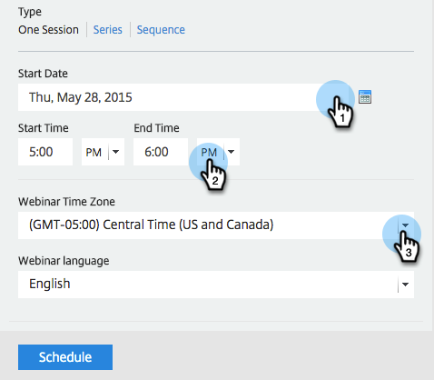

# Create an Event with GotoWebinar {#create-an-event-with-gotowebinar}

>[!NOTE]
>
>**Prerequisites**
>
>* [Add GoToWebinar as a LaunchPoint service](../../../../product-docs/administration/additional-integrations/add-gotowebinar-as-a-launchpoint-service.md) 
>* [Create a New Event Program](../../../../product-docs/demand-generation/events/understanding-events/create-a-new-event-program.md)
>* Set the appropriate [flow actions](http://docs.marketo.com/display/DOCS/Flow+Actions)to track engagement
>

First create your webinar in GoToWebinar. Certain settings in the creation of your GoToWebinar are used by Marketo and some are only used by GoToWebinar.&nbsp;

After you create a Marketo event and associate the GoToWebinar with it, the systems will be able to share registration and attendance information. For help creating a GoToWebinar, see the&nbsp; [GoToWebinar User Guide](http://docs.marketo.com/display/docs/assets/gotowebinar-user-guide.pdf).

Below is a list of the settings used by Marketo.

### Title and Description {#title-and-description}

* `**Webinar Name** - enter the name for the webinar. This name will be viewable in Marketo.`
* `**Description** (optional) - enter the description for the webinar. The description will be`viewable in Marketo.

### Date & Time {#date-time}

`Enter the following information for your webinar and it will be pulled into Marketo via the`adapter. If you make any changes to this information, you must click the link “**Refresh from Webinar Provider**” under **Event Actions**, in order for Marketo to see the changes.

**Start date** - enter your start date. This will be viewable in Marketo.

**Start time** - enter your start time. This will be viewable in Marketo.

**End Time** - enter your end time. This will be viewable in Marketo.

**Time Zone** - select the applicable time zone. It will be viewable in Marketo.

**Type - **set to **One Session**.

>[!NOTE]
>
>Marketo does not currently support recurring webinars. You must set up a single session between each Marketo Event and GoToWebinar webinar.

>[!TIP]
>
>There are additional fields that you will configure in GoToWebinar that will NOT affect the integration. Please refer to the [GoToWebinar User Guide](http://docs.marketo.com/display/docs/assets/gotowebinar-user-guide.pdf) for additional information on those fields, as they will not be covered in this article. If you need additional GoToWebinar help, please visit their [Help Site](http://support.logmeininc.com/gotowebinar).

Now, let's jump into Marketo!

1. Select an event. Click **Event Actions** and choose **Event Settings**.

   

   >[!NOTE]
   >
   >The channel type of the event selected must be **webinar**.

1. Choose **GoToWebinar** from the **Event** **Partner** List.

   

1. Choose the account.

   

1. Select the webinar.

   

1. Click **Save**.

   

1. Excellent! Now the event is synced and scheduled by **GoToWebinar**.

   

   >[!NOTE]
   >
   >The fields Marketo sends over are: First Name, Last Name, Email Address. These fields are required and must not be empty.

   >[!TIP]
   >
   >To populate your confirmation email with this unique URL, use the following token in your email: {{member.webinar url}}. When the confirmation URL is sent out, this token automatically resolves to the person's unique confirmation URL.&nbsp;
   >
   >
   >Set your confirmation email to **Operational** to ensure that people who register and may be unsubscribed still receive their confirmation information.

   

   >[!CAUTION]
   >
   >Avoid using nested email programs to send out your confirmation emails. Use the event program's smart campaign instead, as shown above.

   >[!TIP]
   >
   >It can take up to 48 hours for the data to appear in Marketo. If after waiting that long you still don't see anything, select **Refresh from Webinar Provider** from the Event Actions menu in the **Summary** tab of your event.

People who sign up for your webinar will get pushed to your webinar provider via the Change Program Status flow step when the New Status is set to "Registered." No other status will push the person over. Also, be sure to make Change Program Status flow step #1, and Send Email flow step #2. 

#### Viewing the Schedule  {#viewing-the-schedule}

In the [program schedule view](http://docs.marketo.com/display/docs/program+schedule+view), click the calendar entry for your event. You can see the schedule on the right side of the screen.

>[!NOTE]
>
>To change your event schedule, you'll need to edit the webinar on GoToWebinar.

