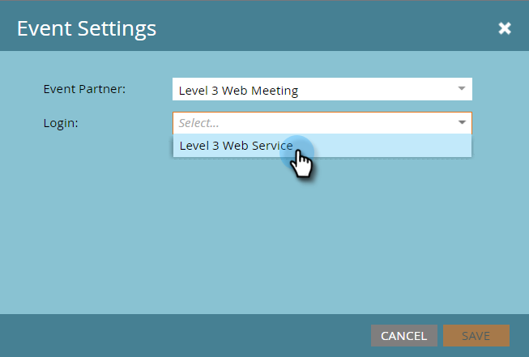
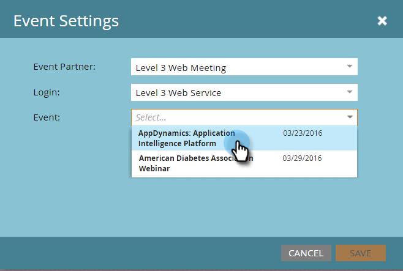
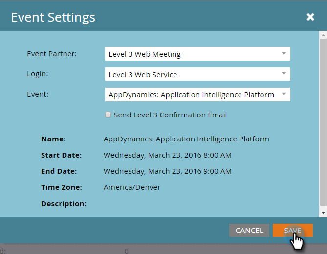
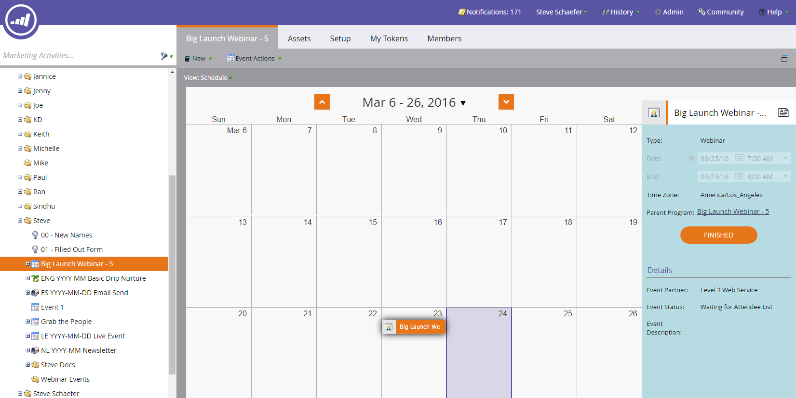

# Create an Event with [!DNL Level 3 Web Meeting] {#create-an-event-with-level-web-meeting}

>[!PREREQUISITES]
>
>* [Add [!DNL Level 3 Web Meeting] as a [!DNL LaunchPoint] Service](/help/marketo/product-docs/administration/additional-integrations/add-level-3-web-meeting-as-a-launchpoint-service.md)
>* [Create a New Event Program](/help/marketo/product-docs/demand-generation/events/understanding-events/create-a-new-event-program.md)
>* Set the appropriate [flow actions](/help/marketo/product-docs/core-marketo-concepts/smart-campaigns/flow-actions/add-a-flow-step-to-a-smart-campaign.md)to track engagement

First create your Webinar in [!DNL Level 3]. If you need help, check out the [[!DNL Level 3] Resource Library](https://www.level3.com/en/resource-library/). You'll find it to be very similar to [!DNL BrightTalk].  Marketo uses a small subset of [!DNL Level 3] fields:

* **Name** - The name of the webcast.
* **Start Date** - The start date for the webcast.
* **End Date** - The end date for the webcast.
* **Time Zone** - The time zone set for the webcast.
* **Description** - The webcast description.

1. Select your new event. Click **[!UICONTROL Event Actions],** then **[!UICONTROL Event Settings].**

   

1. Under [!UICONTROL Event Partner], select **[!UICONTROL Level 3 Web Meeting]**.

   

1. Under [!UICONTROL Login], select your [!DNL Level 3] login.

   

1. Under [!UICONTROL Event], choose the [!DNL Level 3] event you'd like to use.

   

1. Click **[!UICONTROL Save]**.

   

   Most excellent! You've connected your event to [!DNL Level 3]!

## Viewing the Schedule  {#viewing-the-schedule}

   In the program schedule view, click the calendar entry for your event. You can see the schedule on the right side of the screen!

   
