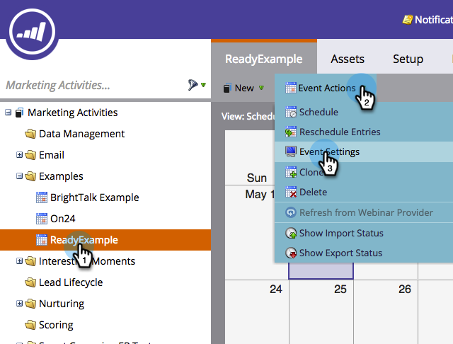
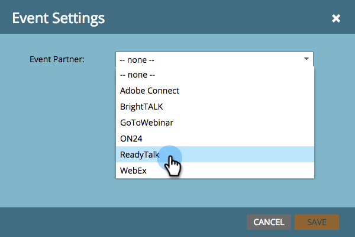
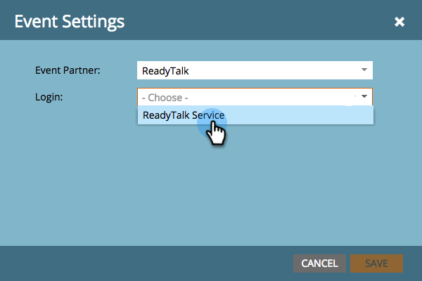
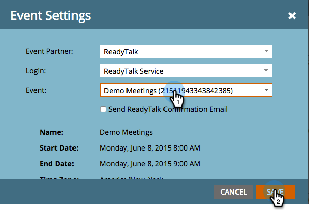
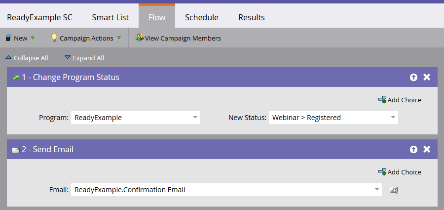

# Create an Event with ReadyTalk {#create-an-event-with-readytalk}

>[!NOTE]
>
>**Prerequisites**
>
>* [Add ReadyTalk as a LaunchPoint Service](../../../../product-docs/administration/additional-integrations/add-readytalk-as-a-launchpoint-service.md)
>* [Create a New Event Program](../../../../product-docs/demand-generation/events/understanding-events/create-a-new-event-program.md)
>* Set the appropriate [flow actions](http://docs.marketo.com/display/DOCS/Flow+Actions)to track engagement
>

First set up your event in the ReadyTalk conference center. If you need help, check out the [ReadyTalk Resource Center.](https://www.readytalk.com/resources/readytalk)  When choosing the registration type, select **pre-register before the meeting**. If you select *register at time of meeting*,&nbsp;Marketo will **not** capture a Registered status for your people and will only pull in a person status of Attended *after* the webinar concludes.

Leave **notify me of new registrations via email **unchecked.

If you're using ReadyTalk to send confirmation emails, you'll need to also add a description. Save your event in ReadyTalk when you're finished.

>[!NOTE]
>
>To schedule an Operator Assisted Event, click the **Request Event Services** link located on the left side of your Conference Center home screen to schedule an event with our Events Team.

Now you're ready to link your event to Marketo.

1. Select your event, then click **Event Actions**, and finally **Event Settings.**

   ** 

   **

   >[!NOTE]
   >
   >The channel type of the event selected must be **webinar.**

1. Under **Event Partner,** select **ReadyTalk**.

   ** 

   **

1. Under** Login, **select your ReadyTalk login.

   ** 

   **

1. Under **Event**, select the event you want to link then click **Save**.

   

   Nice! Your event is now synced.

   >[!NOTE]
   >
   >The fields Marketo sends over are: First Name, Last Name, Email Address.

   >[!TIP]
   >
   >To populate your confirmation email with this unique URL, use the following token in your email: {{member.webinar url}}. When the confirmation URL is sent out, this token automatically resolves to the person's unique confirmation URL.&nbsp;
   >
   >
   >Set your confirmation email to Operational to ensure that people who register, who might be unsubscribed, receive their confirmation information.

   

   >[!CAUTION]
   >
   >Avoid using nested email programs to send out your confirmation emails. Use the event program's smart campaign instead, as shown above.

   >[!TIP]
   >
   >It can take up to 48 hours for the data to appear in Marketo. If after waiting that long you still don't see anything, select **Refresh from Webinar Provider** from the Event Actions menu in the **Summary** tab of your event.

   ## Viewing the Schedule  {#viewing-the-schedule}

   In the [program schedule view](http://docs.marketo.com/display/docs/program+schedule+view), click the calendar entry for your event. You can see the schedule on the right side of the screen!

   

People who sign up for your webinar will get pushed to your webinar provider via the Change Program Status flow step when the New Status is set to "Registered." No other status will push the person over. Also, be sure to make Change Program Status flow step #1, and Send Email flow step #2. 