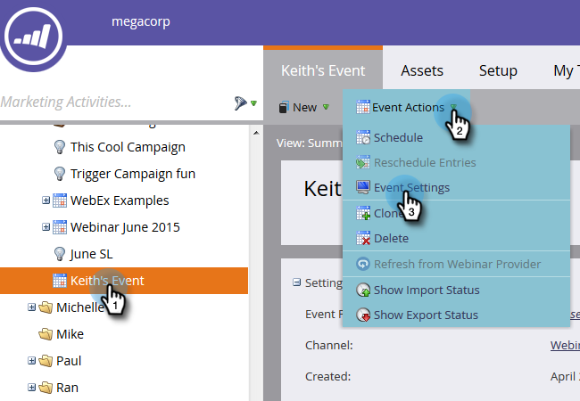
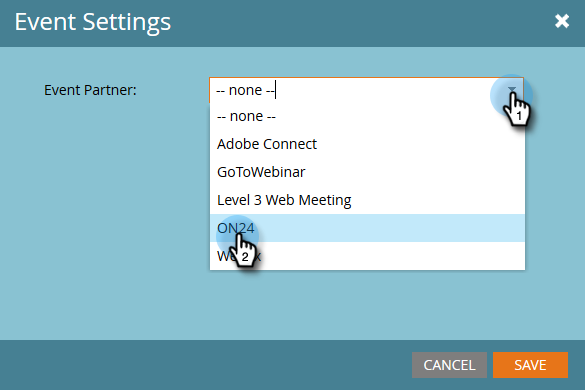
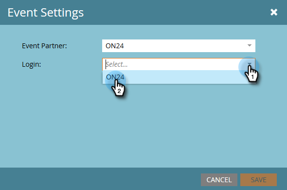
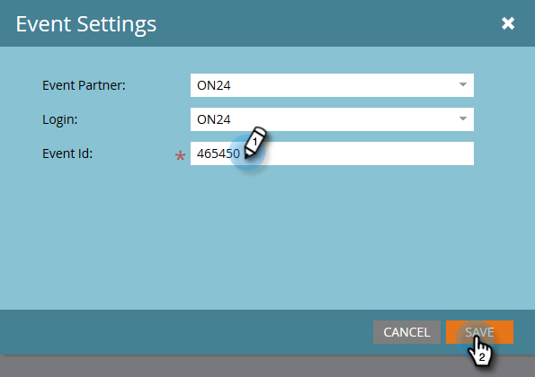
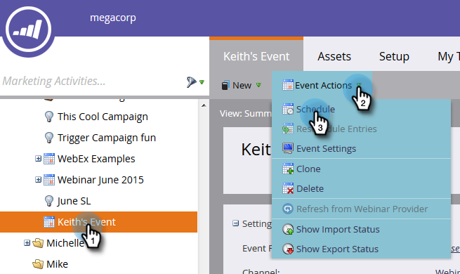

# Configure Event Settings and Sync Marketo with Your Webinar {#configure-event-settings-and-sync-marketo-with-your-webinar}

>[!IMPORTANT]
>
>As of August 2022, ON24 no longer supports new Marketo integrations. The information in this article only applies to existing users.

Follow these steps to configure the Marketo event settings and connect Marketo and ON24.

## Set the Event {#set-the-event}

1. Choose the event you wish to associate to an ON24 webinar, then click the **Event Actions** drop-down and select **Event Settings**.

   

1. Select ON24 as the Event Partner.

   

1. Select the Login account (for example, the display name).

   

1. Enter the Event Id (get this from ON24). Click **Save**.

   

   >[!NOTE]
   >
   >During peak times it can take 15 to 20 minutes for ON24 to make the Event information available to Marketo. If you receive an "Invalid Session Id" message, please try again a bit later.

## Set the Schedule {#set-the-schedule}

When you set up an event that is associated with an ON24 Webinar, the event schedule populates with data from ON24. To access the Event Schedule dialog box, follow these steps.

1. Select the event. Click the **Event Actions** drop-down and select **Schedule.**

   

1. Choose your **Start Date, End Date**, and **Time Zone**. Click **Save**.

   

   >[!NOTE]
   >
   >If you update any event information in ON24, you must click **Refresh from Webinar Provider** in the Event Actions menu to see the new data populate.

Now you can move on to the next step: [creating child campaigns and local assets](/help/marketo/product-docs/demand-generation/events/create-an-event/create-an-event-with-the-marketo-on24-adapter/create-child-campaigns-and-local-assets.md).

>[!MORELIKETHIS]
>
>[Understanding Marketo On24 Adapter Events](/help/marketo/product-docs/demand-generation/events/create-an-event/create-an-event-with-the-marketo-on24-adapter/understanding-marketo-on24-adapter-events.md)
