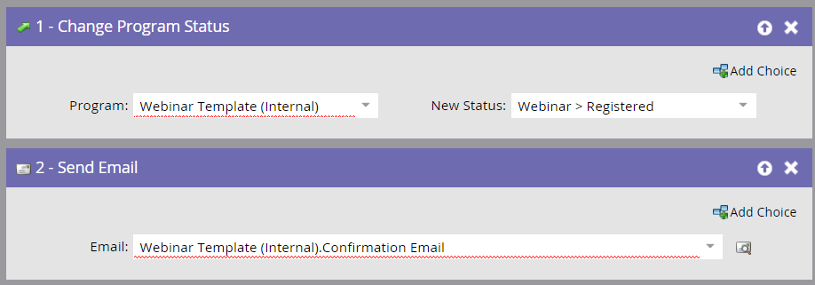

# Create Child Campaigns and Local Assets {#create-child-campaigns-and-local-assets}

Create your child campaigns and local assets using the Design Studio.

## Landing Page and Form {#landing-page-and-form}

To ensure that people are properly registered with ON24, the following fields must be included in your Marketo form:

* First Name 
* Last Name 
* Email Address

You can also push the following fields to ON24:

* Company Name 
* Job Title

With the proper flow step added to the registration campaign, the people will get pushed to ON24 and be marked as registered. You can add other fields to the form and the information will get captured in Marketo as part of the person detail record.

>[!CAUTION]
>
>For a successful integration, you must either use a Marketo form to register your people for the Event, or a non-Marketo form with the proper API integration to push registration data to Marketo.

## Emails and URL Tokens {#emails-and-url-tokens}

Create the invitation, confirmation, follow-up, and thank you emails using Marketo.

## Marketo Confirmation Email and URL Token {#marketo-confirmation-email-and-url-token}

Use Marketo to send out the confirmation email for your event. When a person registers, he or she receives a unique URL to use to enter the event.

>[!NOTE]
>
>**Reminder**
>
>To populate your confirmation email with this unique URL, use the following token in your email: `{{member.webinar url}}`. When you send out the confirmation URL, this token automatically resolves to the person’s unique confirmation URL.
>
>Set the type of your confirmation email to **Operational** to ensure that people who register receive their confirmation information, even if they are unsubscribed.

>[!TIP]
>
>You can configure ON24 to send out confirmation, reminder, or follow-up emails. See the [ON24 Help Site](http://webcastelitehelp.on24.com) for more information.

## Registration Child Campaign Requirements {#registration-child-campaign-requirements}

Events contain one or more child campaigns that all work together to move people through the program statuses and let you track the performance of your event.

Examples of child campaigns are an invite campaign, a registration campaign, and follow-up campaigns.

>[!CAUTION]
>
>For the adapter to do its job, you MUST create a Registration campaign. This campaign must be triggered by the person filling out a form, and the first step must change the person’s program status to **Registered**. The campaign then sends a confirmation email. See the rest of this article for details.

**Registration/Confirmation (Trigger Campaign)**

* Smart List
* Trigger based on **Fills Out Form**. Be sure to include the landing page that the form lives on by using **Add Constraint**, especially if the same form is used on multiple landing pages.

>[!CAUTION]
>
>You must use a Marketo form to register your people for the event, or a non-Marketo form with the proper API integration to push registration data to Marketo. This is critical to the success of your event partner integration.

>[!NOTE]
>
>If you are using a Marketo form on a non-Marketo landing page, your trigger will be **Fills out Form** with the Form Name.

**Flow**

* **Change Program Status** - Set to Webinar -> Registered.

This flow step is required as the FIRST FLOW STEP when setting up your child campaign. When a person’s program status changes to Registered, Marketo pushes the registration information to ON24. No other status will push the person over.

* **Send Email** - Confirmation email. Set this email to **Operational** so that unsubscribed people that have registered still receive it.

The **Send Email** flow step MUST be the second step. The confirmation email contains the `{{member.webinar url}}`, which is populated with information sent back to Marketo from ON24.

>[!NOTE]
>
>The order of these flow steps is important because of the order in which actions are performed in Marketo. The **Change Program Status** step sends the person to ON24 to register and a unique URL is generated. After this occurs, you can then send out the confirmation email that includes this unique URL using the `{{member.webinar URL}}` token.
>
>If the person is returned with a registration error, they will not receive the email confirmation.

Your next step is to [test Your ON24 event integration](test-your-on24-event-integration.md). 

>[!NOTE]
>
>**Related Articles**
>
>* [Understanding Marketo ON24 Adapter Events](understanding-marketo-on24-adapter-events.md)
>* [Example ON24 Event Integration](example-on24-event-integration.md)
>* [Understanding Webinar Program Statuses](understanding-webinar-program-statuses.md)
>* [Test Your ON24 Event Integration](test-your-on24-event-integration.md)
>

