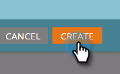
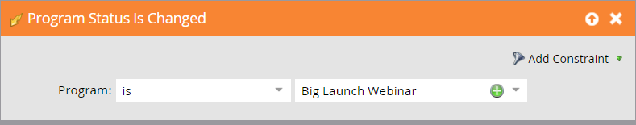

# Example ON24 Event Integration {#example-on-event-integration}

Here's a sample event, including campaigns, for an ON24 webinar. When you build your event, be sure to test your campaigns before running them.

## Create a New Event in Marketing Activities {#create-a-new-event-in-marketing-activities}

1. Select **New** > **New Program**.

   

1. Select a **Campaign Folder** where the event will live.

   

1. Enter a **Name** for the event.

   

1. Select **Event** as the **Program Type**.

   

1. Select **Webinar** as the **Channel** for the event.

   

1. Click **Create**.

   

## Invite (Batch Campaign)  {#invite-batch-campaign}

* **Smart List** - Define whom you will invite to the event.
* **Flow**

    * Send Email - If this is a local asset email, it will have the following naming convention: EventName.EmailName. You can also use global emails.
    * Change Status in Progression - Set to Webinar > Invited.

* **Schedule** - Set the date for the invitation to be sent.

## Registration/Confirmation (Trigger Campaign) {#registration-confirmation-trigger-campaign}

* **Smart List**

    * Trigger the campaign based on **Fills Out Form**. Be sure to include the landing page that the form lives on by using **Add Constraint**, especially if the form is used on multiple landing pages.

>[!CAUTION]
>
>You must use a Marketo form to register people for the event, or a non-Marketo form with the proper API integration to push registration data to Marketo. This is critical to the success of your Event Partner integration. **NOTE**: If you are using a Marketo form on a non-Marketo landing page, your trigger will be **Fills Out Form** with the Form Name.

* **Flow**

    * **Change Status in Progression** - Set to Webinar > Registered. **CAUTION**: This flow step is required when setting up your child campaign. When a person’s progression status changes to **Registered**, Marketo pushes the registration information to ON24.

    * **Send Email** - Confirmation email (set to **Operational** so that unsubscribed people that have registered still receive it).

**NOTE**: If the person is returned with a registration error, they won't receive the email confirmation.

## Reminder (Batch Campaign) {#reminder-batch-campaign}

* **Smart List** - Filter using **Member of Program** and set the status to **Registered**.

* **Flow** - Send Email (Reminder Email).

**NOTE**: You could use a similar campaign to send a *different* follow-up email to people who were invited but who haven't registered yet.

## Follow-Up Campaign (Batch or Trigger Campaign) {#follow-up-campaign-batch-or-trigger-campaign}

* **Smart List** - Trigger based on changes in program status.

* **Flow** - Send Email. Use choices to send different emails based on program status.

>[!MORELIKETHIS]
>
>[Understanding Marketo ON24 Adapter Events](/help/marketo/product-docs/demand-generation/events/create-an-event/create-an-event-with-the-marketo-on24-adapter/understanding-marketo-on24-adapter-events.md){target="_blank"}
