# Set up the ON24 Integration with Marketo{#set-up-the-on24-integration-with-marketo}

Here's how to set up your ON24 event integration.

## Create an API Only Role {#create-an-api-only-role}

1. From My Marketo, click **Admin**.

   

1. Under Security, click **Users & Roles**.

   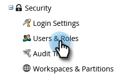

1. Click the **Roles** tab and then **New Role**.

   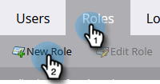

1. Enter a Role Name. Open the **Access API** menu and select "Read-Write Custom Object" and "Read-Write Person." Click **Create**.

   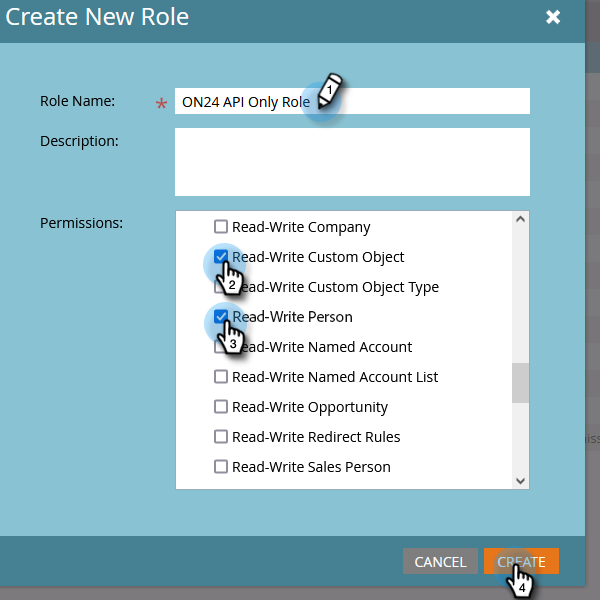

## Create a New User {#create-a-new-user}

1. Still in Users & Roles, click the **Users** tab and click **Invite New User**.

   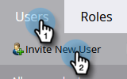

1. Enter the new user's information and click **Next**.

   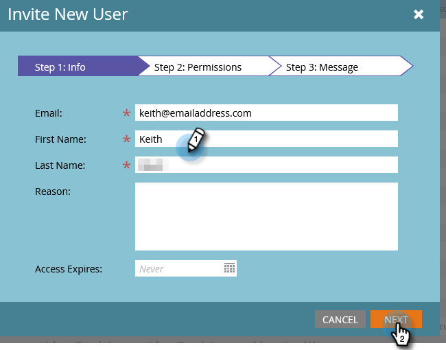

1. Select the ON24 API Only Role you just created. Select the **API Only** checkbox. Click **Next**.

   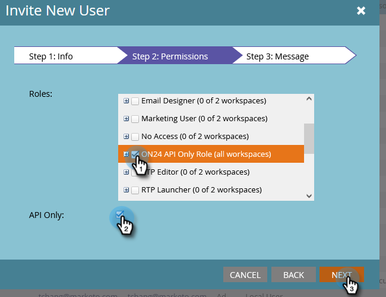

1. Click **Send**.

   

>[!NOTE]
>
>An invitation isn't required for API Only users.

## Set up ON24 Connection {#set-up-on24-connection}

1. Still in the Admin section, click **LaunchPoint**.

   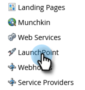

1. Click **New** then **New Service**.

   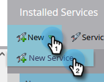

1. Choose a display name. Click the **Service** drop-down and select **Custom**. Enter a description. Click the API Only User drop-down and select the user you created [in the steps above](#create-a-new-user). Click **Create**.

   

1. Find the custom LaunchPoint service you just created and click View Details.

   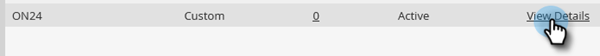

1. Highlight, right-click, copy, and save the Client ID (you'll need it later). Repeat for Client Secret.

   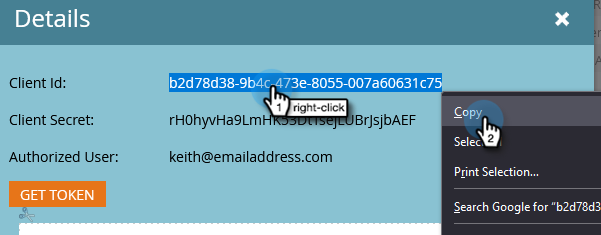

1. In the tree on the left, click Web Services.

   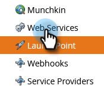

1. Under "REST API," highlight, right-click, copy, and save the first part of the Identity (up until the 'm' in .com).

   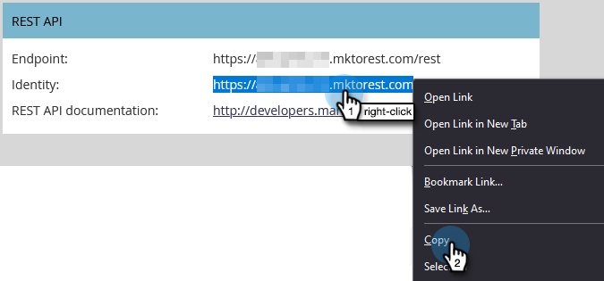

1. With your saved Client ID, Client Secret, and Identity, navigate to your ON24 account. The rest of the steps are performed there, and are [outlined here](https://on24support.force.com/Support/s/article/Connect-Marketo-ON24-Connect-Data-Integration#Step6){target="_blank"}.
