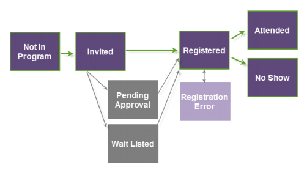

# Understanding Webinar Program Statuses {#understanding-webinar-program-statuses}

Program statuses represent the different event statuses that a person progresses through as a member of the event. They are associated to a channel type. Marketo has a built-in channel type called **Webinar**. Statuses can be used in both batch and trigger campaigns.

People move through program statuses in a linear fashion and do not go back in status. For example, a person with a status of **Attended** can't move back to **Registered**.

Here's a brief description of the program statuses associated to the Webinar channel.

>[!TIP]
>
>To manually update statuses, click  **Refresh from Webinar Provider** in the **Event Actions** drop-down.

**Not in Program** - Use this status to remove people from the event.

**Invited** - Use this status to add people to the event.

**Pending Approval** - Use this status to hold off on sending your people a confirmation email. See "Manually Approving Registrants" in [ON24 Event Registration Updates](/help/marketo/product-docs/demand-generation/events/create-an-event/create-an-event-with-the-marketo-on24-adapter/on24-event-registration-updates.md) for more information.

**Wait Listed** - Use this status to keep some people waiting until additional seats become available.

**Rejected** - Use this status to reject the registration of a person to your Event.

**Registered** - This status pushes people to ON24 when you are using the ON24 integration. The person’s status is updated when ON24 responds that the person was successfully registered.

**Registration Error** - This status reflects that the user encountered an error when trying to register for the Event.

>[!NOTE]
>
>If a registration error occurs, you can get additional information for that person by looking at the Status Reason column in the Members tab of your program. After the error is fixed, you can manually change the user’s program status to Registered within Marketo.

**Attended** - At the conclusion of the webinar, ON24 returns a list of people who attended. This status is pulled into Marketo automatically.

**Attended On-demand** - People who attended the archived version of the webinar receive this status.

**No Show** - At the conclusion of the webinar and after attendance data is pulled in from ON24, the status of people who registered but did not attend is updated to No Show. It can take anywhere from 30 minutes to 3 hours for ON24 to prepare the final attendance information and make it available in Marketo.

>[!NOTE]
>
>In order for Marketo to pull the No Show status, the people must have been registered *in Marketo*. We are not able to capture No Shows that come from the On24 data feed.

>[!MORELIKETHIS]
>
>[Understanding Marketo ON24 Adapter Events](/help/marketo/product-docs/demand-generation/events/create-an-event/create-an-event-with-the-marketo-on24-adapter/understanding-marketo-on24-adapter-events.md)
