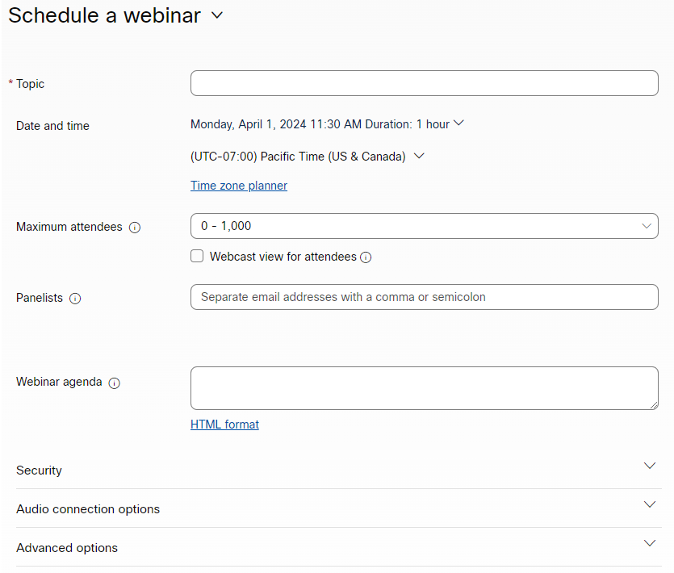
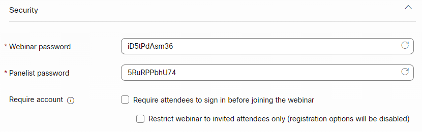
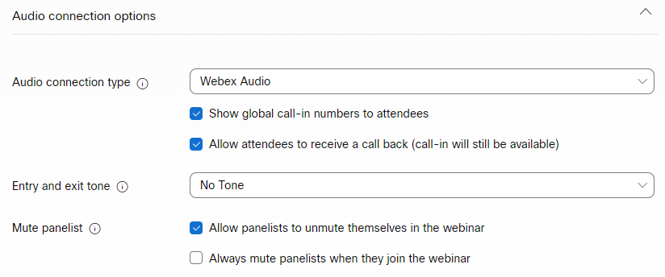
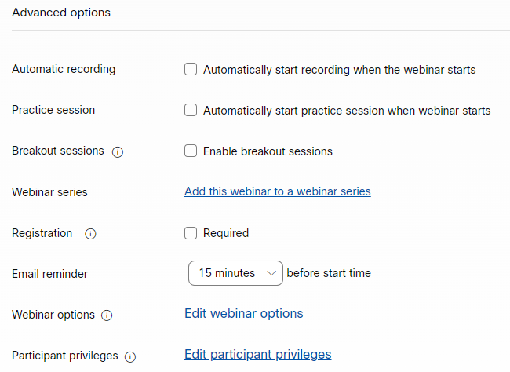
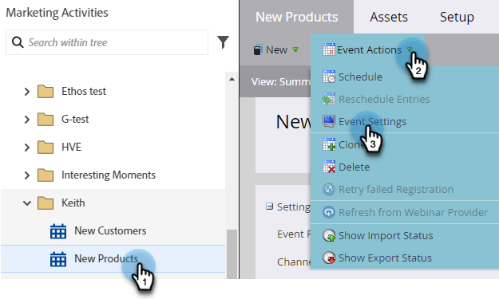
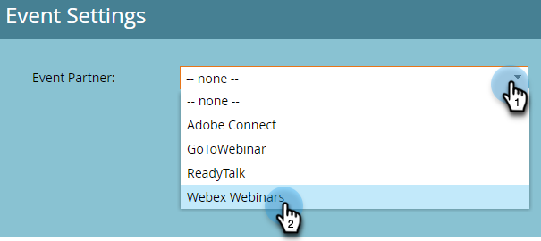
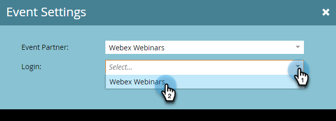
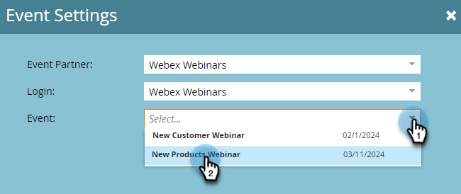
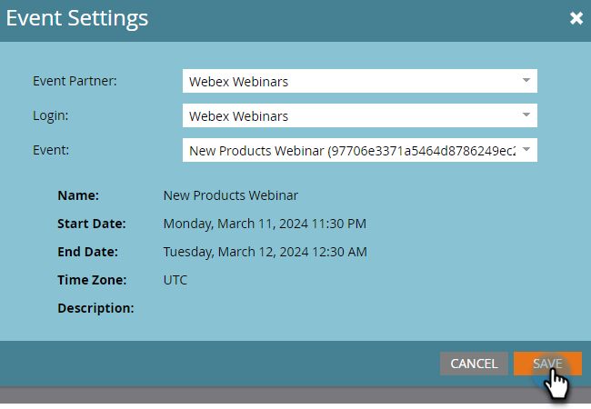

# Create an Event with Webex {#create-an-event-with-webex}

>[!PREREQUISITES]
>
>* [Add Webex as a LaunchPoint Service](/help/marketo/product-docs/administration/additional-integrations/add-webex-as-a-launchpoint-service.md)
>* [Create a New Event Program](/help/marketo/product-docs/demand-generation/events/understanding-events/create-a-new-event-program.md)
>* Set the appropriate [flow actions](/help/marketo/product-docs/core-marketo-concepts/smart-campaigns/flow-actions/add-a-flow-step-to-a-smart-campaign.md) to track engagement

## Schedule a Webinar {#schedule-a-webinar}

First, create a webinar in [Webex](https://www.webex.com/){target="_blank"}. Marketo Engage only uses specific settings and fields for your integration, which we'll go through shortly. For additional information, please see the [Webex Webinars Help Documentation](https://help.webex.com/en-us/landing/ld-7srxjs-WebexWebinars/Webex-Webinars){target="_blank"}.

   >[!NOTE]
   >
   >You choose your preferred settings in Webex, but only the following information is viewable in Marketo Engage: Webinar name, start/end date & time, time zone, and description.

### Basic Information {#basic-information}

* **Topic**: This is your event name and will be viewable in Marketo.
* **Date and time**: Start/end date, start/end time, duration, and time zone are all viewable in Marketo.
* **Maximum attendees**: The maximum number of attendees determines which Webex features are supported.
* **Webcast view for attendees**: Check this to have your webinar streamed live to all attendees.
* **Panelists**: Invite specific people to be panelists on your webinar.
* **Webinar agenda**: Populate this if you want to provide context in the email invitation that's sent to panelists.

### Security {#security}

* **Webinar password**: (optional) If you use this field, be sure to include it in your confirmation email.
* **Panelist password**: (optional) If you use this field, be sure to include it in your Webinar agenda.
* **Require account**: Limits attendees to only those who have Webex accounts.

### Audio Connection Options {#audio-connection-options}

* **Audio connection type**: Choose how webinar participants join the audio portion of your webinar.
* **Entry and exit tone**: Select the sound you want users when someone enters or exits the webinar (phone audio connection required).
* **Mute panelist**: Choose your desired panelist mute settings.

### Advanced Options {#advanced-options}

* **Automatic recording**: Check this to have your webinar recorded automatically.
* **Practice session**: Check this to have a practice session started when the webinar begins.
* **Breakout sessions**: Breakout sessions allow you to preassign panelists and attendees before the webinar starts, or allow them to join during the webinar.
* **Webinar series**: Adding to a webinar series lets people see your webinar whether it's public or not. 
* **Registration**: Requires attendees to register and receive host approval before attending.
* **Email reminder**: Choose an email reminder ranging from 15 minutes before the webinar starts up to two days.
* **Webinar options**: Determine which features are available to participants in the webinar. 
* **Participant privileges**: Participant privileges determine the actions available to webinar participants.

>[!NOTE]
>
>The Marketo-Webex integration cannot support sending confirmation emails out of Webex. The confirmation must be sent via Marketo. After you've scheduled the event, be sure to copy the event information to the Marketo confirmation email and set the email as _Operational_.

Now we're ready to jump into Marketo Engage!

## Sync Your Event with Marketo Engage {#sync-your-event-with-marketo-engage}

1. In Marketo, find and select the Event Program you created. In the **Event Actions** drop-down, select **Event Settings**.

   

   >[!NOTE]
   >
   >The channel type of the event selected must be **webinar**.

1. In the **Event Partner** drop-down, select **Webex Webinars**.

   

1. In the **Login** drop-down, choose your Webex login.

   

1. In the **Event** drop-down, choose your Webex event.

   

1. Your webinar details will populate. Click **Save**.

   

Your Webex event is now synced with your Marketo event. People who sign up for your webinar will get pushed to your webinar provider via the _Change Program Status_ flow step when the New Status is set to "Registered." No other status will push the person over. Be sure to make _Change Program Status_ flow step #1, and _Send Email_ flow step #2.

## Things to Note {#things-to-note}

* Avoid using nested Email Programs to send out your confirmation emails. Use your Event Program's Smart Campaign instead.

* It can take up to 48 hours for data to appear in Marketo. If after waiting that long you still don't see anything, click **Refresh from Webinar Provider** in the **Event Actions** drop-down in the **Summary** tab of your Event Program.
