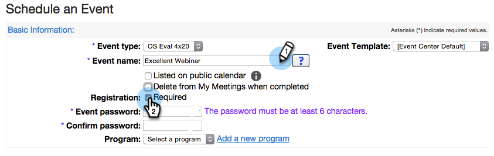
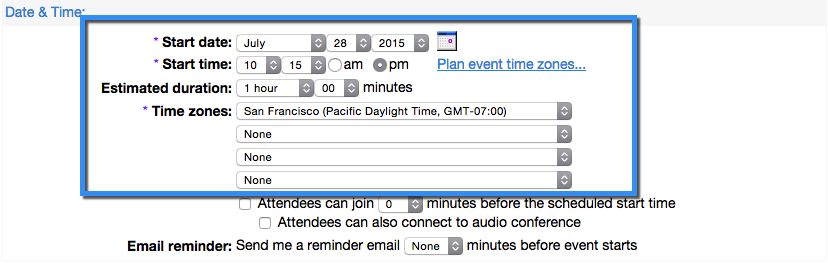
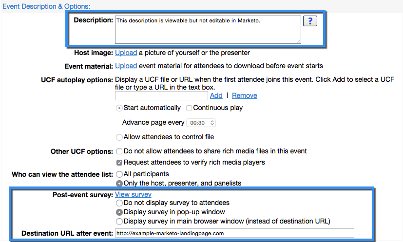
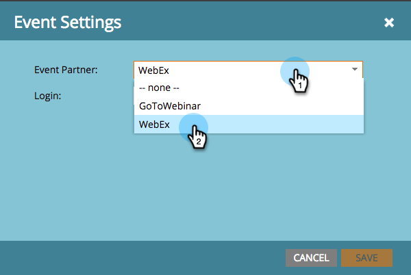
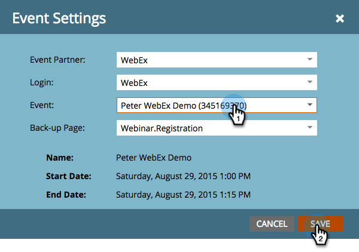
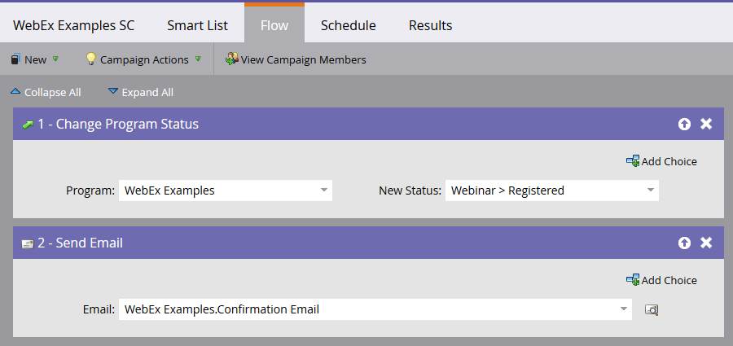
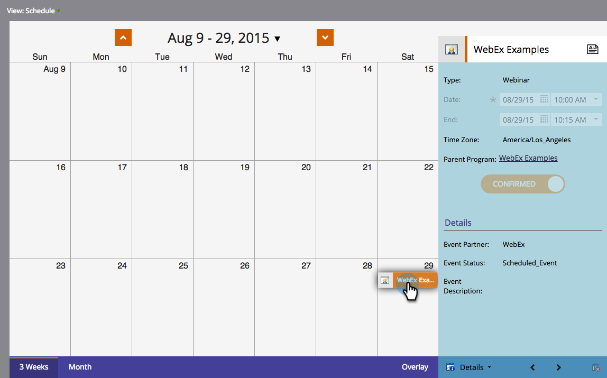

# Create an Event with WebEx {#create-an-event-with-webex}

>[!PREREQUISITES]
>
>* [Add WebEx as a LaunchPoint Service](/help/marketo/product-docs/administration/additional-integrations/add-webex-as-a-launchpoint-service.md)
>* [Create a New Event Program](/help/marketo/product-docs/demand-generation/events/understanding-events/create-a-new-event-program.md)
>* Set the appropriate [flow actions](/help/marketo/product-docs/core-marketo-concepts/smart-campaigns/flow-actions/add-a-flow-step-to-a-smart-campaign.md)to track engagement

First create a Webex Event in the WebEx Event Center. Marketo only uses specific settings and fields for your integration, which we’ll go through shortly. Other fields that you might want to configure for WebEx are explained in the [WebEx Event Center User Guide](https://www.cisco.com/c/dam/en/us/td/docs/collaboration/meeting_center/wbs298/wx_ec_host_ug.pdf).

## Basic Information {#basic-information}

* **Event Name -** This name will be viewable in Marketo.
* **Unlisted Checkbox**

  * It's recommended that you do **not** list your event. This will ensure that all people register through your Marketo landing page. People who register through a mechanism other than Marketo will be displayed in Marketo after the event is concluded AND only if they attended the event.
  * If you choose to list the event, it will appear on the List of Events page for anyone who visits your Event Center website.

* **Registration -** Check this box to set to “required.” You'll use a Marketo form/landing page to capture registration information that will be pushed to WebEx.
* **Event Password**- (optional) If you use this field be sure to include it in your confirmation email!

## Date & Time {#date-time}

* **Start date** - Enter your start date. This will be viewable in Marketo.

* **Start time** - Enter your start time. This will be viewable in Marketo.

* **Estimated duration** - Specify the duration of the event. This will be viewable in Marketo.

* **Time Zones** - Enter the applicable time zones. They will be viewable in Marketo.

## Audio Conference Settings {#audio-conference-settings}

These settings reside in WebEx only. They are not used by or viewable in Marketo, but they may be important for your webinar, so double-check them!

## Event Description & Options  {#event-description-options}

The following options are used by or viewable in Marketo. Other fields reside in WebEx only.

* **Description** - Enter a description. This will be viewable but not modifiable in Marketo.
* **Post-event survey** - Marketo isn't able to capture the information on a WebEx post-event survey at this time.
* **Destination URL** - (optional) You can enter the URL of a Marketo landing page to serve as the destination URL to display after the session ends.

## Attendees & Registration {#attendees-registration}

You will be controlling the invitation list, registration form, and other emails using a Marketo Event. Other functionality will not be supported by Marketo, including:

* **Maximum number of registrants** - Currently **not** supported using the Marketo-WebEx integration.  Manual approval of registrants is available using the Pending Approval progression status in Marketo.

* **Registration ID required** - Currently supported using the Marketo-WebEx integration. You can use Marketo to send out the confirmation email for your event. When the person registers, they receive a unique URL that they use to enter the event.

  >[!TIP]
  >
  >To populate your confirmation email with this unique URL, use the following token in your email: `{{member.webinar url}}`. When the confirmation URL is sent out, this token automatically resolves to the person's unique confirmation URL.
  >
  >Set your confirmation email to **Operational** to ensure that people who register and may be unsubscribed still receive their confirmation information.

* **Registration Password** - (Optional) Currently not supported using the Marketo-WebEx integration.
* **Approval Rules** - Currently not supported using the Marketo-WebEx integration. However, you can use smart campaigns in Marketo to control approvals.

### Presenters & Panelists {#presenters-panelists}

The information configured in this section is not passed to Marketo.

### Email Messages {#email-messages}

You'll use Marketo to send out emails to your registrants, confirmation emails, etc. You don't need to configure anything in this section. Disable (uncheck) the email message options within WebEx.

>[!NOTE]
>
>The Marketo-WebEx integration cannot support sending confirmation emails out of WebEx. The confirmation must be sent via Marketo. After you've scheduled the event, be sure to copy the event information to the Marketo confirmation email and set the email as **Operational**.

Now we're ready to jump into Marketo!

1. Select the event you created. Open the **Event Actions** drop-down. Choose **Event Settings.**

   

   >[!NOTE]
   >
   >The channel type of the event selected must be **webinar**.

1. Under **Event Partner**, select **WebEx**.

   

1. Under **Login**, choose your WebEx login.

   

1. Under **Event**, choose your freshly created WebEx event. Then, select an optional Back-up Page and click **Save**.

   

1. Select an optional Back-up Page for your WebEx event. Choose from the drop-down of approved Marketo landing pages or enter the URL of a non-Marketo landing page.

   >[!TIP]
   >
   >Set a Back-up Page to direct a member to a specific page if they click on their custom event URL prior to the event's start time.

   >[!NOTE]
   >
   >The fields Marketo sends over are: First Name, Last Name, Email Address.

   

   >[!CAUTION]
   >
   >Avoid using nested email programs to send out your confirmation emails. Use the event program's smart campaign instead, as shown above.

   >[!TIP]
   >
   >It can take up to 48 hours for the data to appear in Marketo. If after waiting that long you still don't see anything, select **Refresh from Webinar Provider** from the Event Actions menu in the **Summary** tab of your event.

Sweet! Your WebEx event is now synced with your Marketo event.  People who sign up for your webinar will get pushed to your webinar provider via the Change Program Status flow step when the New Status is set to "Registered." No other status will push the person over. Also, be sure to make Change Program Status flow step #1, and Send Email flow step #2.

## Viewing the Schedule  {#viewing-the-schedule}

In the program schedule view, click the calendar entry for your event. You can see the schedule on the right side of the screen!

>[!NOTE]
>
>To change your event schedule you'll need to edit the webinar on WebEx.
