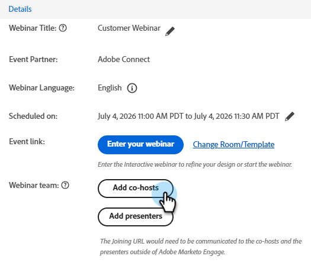
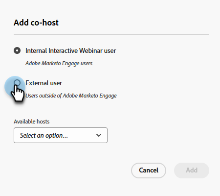
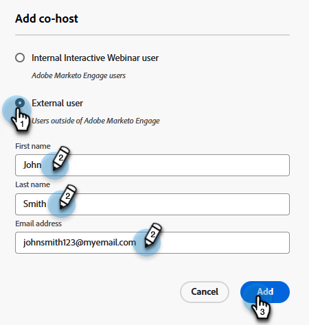
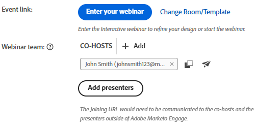
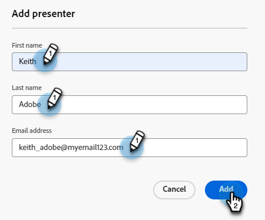
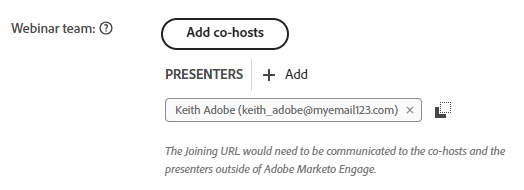

# Add a Webinar Team {#add-a-webinar-team}

A Webinar Team in Interactive Webinars consists of all the roles that contribute to the successful delivery of the webinar in Adobe Connect. This includes both presenters and co-hosts.

>[!NOTE]
>
>Presenters and co-hosts in Marketo map exactly to the roles of presenter and host during the webinar delivery in Adobe Connect.

The presenter is an external role that participates in delivering the webinar experience, whereas co-hosts can act as a presenter as well as handle administrative aspects of webinar delivery. Co-hosts can be both internal and external. External co-hosts will not have access to the Interactive Webinar Event Programs in Marketo, but have host permissions during delivery in Adobe Connect. Internal co-hosts will have access to both the Interactive Webinar Event Program in Marketo as well as host permissions during delivery. This helps ensure that the internal co-hosts can take the reins of the Interactive Webinar Event Program when the original creator of the Interactive Webinar program is either no longer part of Interactive Webinars' user set, or not even a Marketo user.

>[!PREREQUISITES]
>
>[Create an Interactive Webinar](/help/marketo/product-docs/demand-generation/events/interactive-webinars/create-an-interactive-webinar.md)

## Add a Co-host {#add-a-co-host}

1. In the Interactive Webinar's Overview page, click **Add co-hosts**.

   

1. You can add internal or external users. In this example, we'll choose external.

   

   >[!NOTE]
   >
   >If you select **Internal Interactive Webinar user**, you'll simply have to click the **Available hosts** drop-down and choose from the list of people who've been added as Interactive Webinars users in Marketo Engage.

1. Enter the desired co-host's first name, last name, and email address. Click **Add**.

   

1. Your new co-host will appear in the Webinar team section.

   

## Add a Presenter {#add-a-presenter}

1. In the Interactive Webinar's Overview page, click **Add presenters**.

   

1. Enter the desired presenter's first name, last name, and email address. Click **Add**.

   

   >[!NOTE]
   >
   >The presenter's information will be made available to Adobe Connect during webinar delivery so the appropriate details can be auto-populated without the user having to enter them during the entry for webinar delivery. 

1. Your new presenter will appear in the Webinar team section.

   

>[!TIP]
>
>After adding a Webinar Team, you can click the copy icon next to each user to copy (then share) their joining URLs.

>[!MORELIKETHIS]
>
>[Create an Interactive Webinar](/help/marketo/product-docs/demand-generation/events/interactive-webinars/create-an-interactive-webinar.md)
