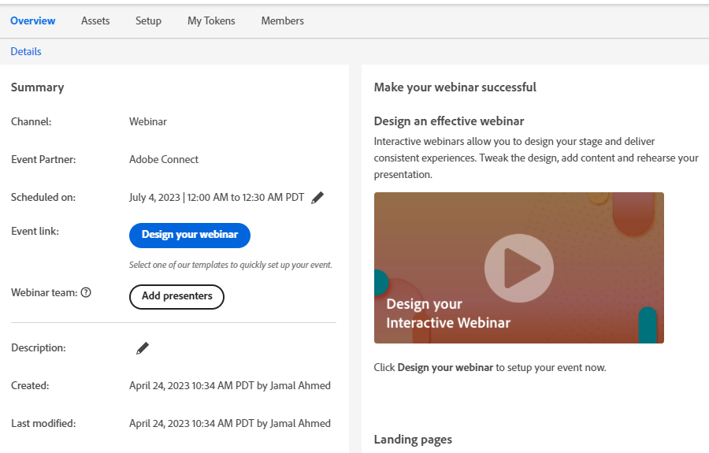

# Create an Interactive Webinar {#create-an-interactive-webinar}

Create an Interactive Webinar in a few easy steps.

1. Go to **Marketing Activities**.

   

1. Right-click the desired folder and select **New Program**.

   

1. Name the program. Under Program Type, select **Event**.

   

1. Click the Channel drop-down and select any channel that has _Event with Webinar_ in its "Applies To" column. In this example, we're choosing **Webinar**.

   

   >[!NOTE]
   >
   >To see which Channels apply to _Event with Webinar_, go to **Admin** > **Tags**. "Applies To" should be the middle column. Learn more about "Applies To" in Step 5 of [this article](/help/marketo/product-docs/administration/tags/create-a-program-channel.md){target="_blank"}.

1. Choose **Interactive Webinars** and click **Next**.

   

   >[!NOTE]
   >
   >Information on partner webinars can be found here.

1. Set the maximum audience size for your webinar and how long it will last.

   

1. Schedule the date/time of your webinar and click **Create**.

   

Your Interactive Webinar is created. You now have the option of adding a webinar team.

## Webinar Team {#webinar-team}

A Webinar Team in Interactive Webinars consists of all the roles that contribute to the successful delivery of the webinar in Adobe Connect. This includes both presenters and co-hosts. 

>[!NOTE]
>
>Presenters and co-hosts in Marketo map exactly to the roles of presenter and co-host during the webinar delivery in Adobe Connect.

The presenter is an external role that participates in delivering the webinar experience, whereas co-hosts can act as a presenter as well as handle administrative aspects of webinar delivery. Co-hosts can be both internal and external. External co-hosts will not have access to the Interactive Webinar Event Programs in Marketo, but have co-host permissions during delivery in Adobe Connect. Internal co-hosts will have access to both the Interactive Webinar Event Program in Marketo as well as co-host permissions during delivery. This helps ensure that the internal co-hosts can take the reins of the Interactive Webinar Event Program when the original creator of the Interactive Webinar program is either no longer part of Interactive Webinars' user set, or not even a Marketo user.

### Adding a Webinar Team {#adding-a-webinar-team}

To add a co-host or presenter, click **Add co-hosts** or **Add presenters** on the Overview screen.

   

Upon clicking **Add presenters**, you'll be prompted to enter their first name, last name, and email address. This info will be made available to Adobe Connect during webinar delivery so the appropriate details can be auto-populated without the user having to enter them  during the entry for webinar delivery. A joining URL is populated for all presenters and can be shared by the creator.

Upon clicking **Add co-hosts**, you will be prompted to add either an internal or an external user. If you select internal, you can select the desired user from the list of all users who've been added as Interactive Webinars users in Marketo Engage. If you select external, you'll be prompted to add their first name, last name, and email ID (similar to the process of adding a presenter). You can also obtain the joining URLs for both internal and external users to be shared with them.

After adding a Webinar Team, you can click the copy icon next to each user to copy (then share) their joining URLs.

 

Now, it's time to [design your webinar](/help/marketo/product-docs/demand-generation/events/interactive-webinars/designing-interactive-webinars.md){target="_blank"}.
