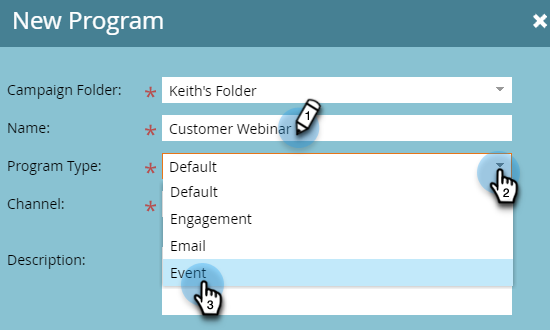

# Create an Interactive Webinar {#create-an-interactive-webinar}

Create an Interactive Webinar in a few easy steps.

1. Go to **Marketing Activities**.

   

1. Right-click the desired folder and select **New Program**.

   

1. Name the program. Under Program Type, select **Event**.

   

1. Click the Channel drop-down and select any channel that has _Event with Webinar_ in its "Applies To" column. In this example, we're choosing **Webinar**.

   

   >[!NOTE]
   >
   >To see which Channels apply to _Event with Webinar_, go to **Admin** > **Tags**. "Applies To" should be the middle column. Learn more about "Applies To" in Step 5 of [this article](/help/marketo/product-docs/administration/tags/create-a-program-channel.md){target="_blank"}.

1. Choose **Interactive Webinars** and click **Next**.

   

   >[!NOTE]
   >
   >Information on partner webinars can be found here.

1. Set the maximum audience size for your webinar and how long it will last.

   

1. Schedule the date/time of your webinar and click **Create**.

   

Your Interactive Webinar is created. [Learn how to add presenters and or co-hosts](/help/marketo/product-docs/demand-generation/events/interactive-webinars/add-a-webinar-team.md){target="_blank"}.

 

Now, it's time to [design your webinar](/help/marketo/product-docs/demand-generation/events/interactive-webinars/designing-interactive-webinars.md){target="_blank"}.
