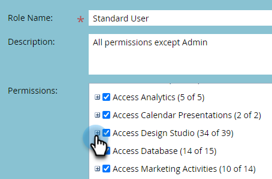
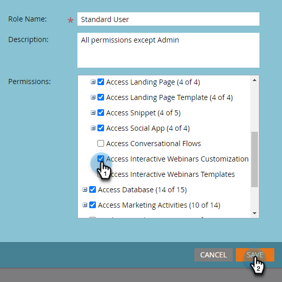
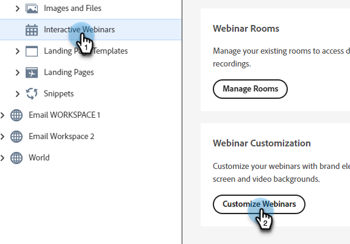
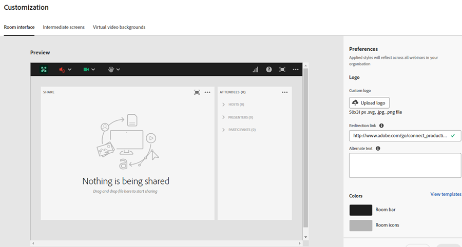
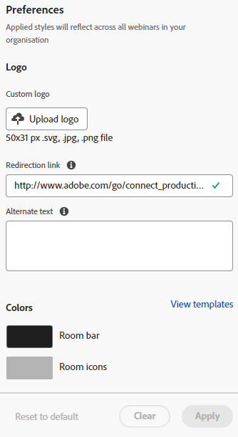
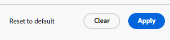
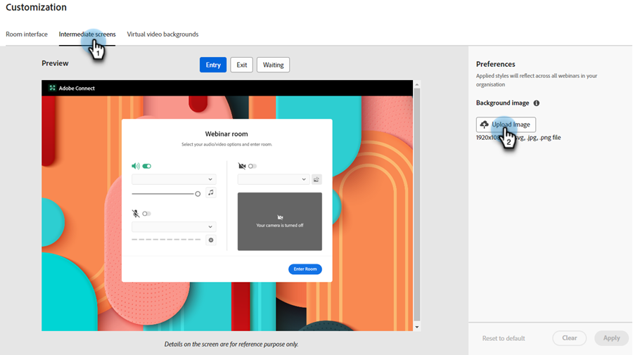
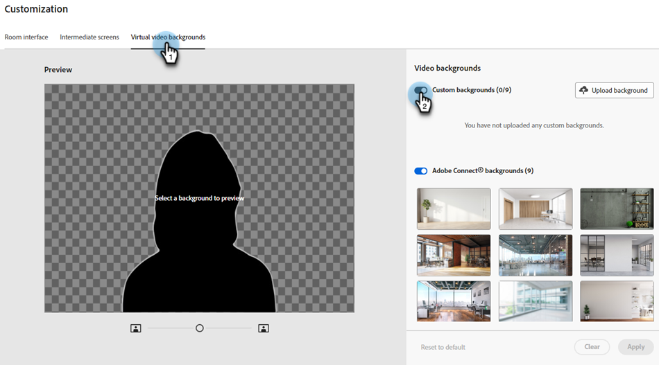
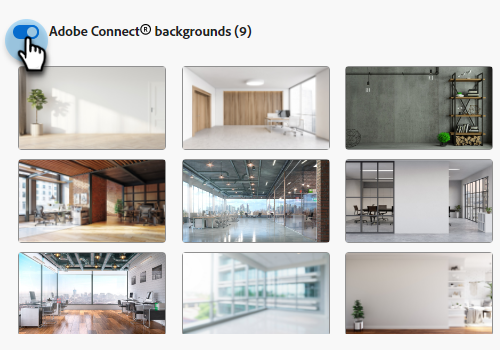

# Interactive Webinars Customization {#interactive-webinars-customization}

Customizing your webinars is crucial to creating a more engaging and effective experience for participants.

Interactive Webinars offer several customization options to tailor the webinar environment to your needs. Customize the appearance of different screens to reflect your organization's branding.

You can customize the following options:

* Brand colors for the room
* Custom background to represent your organization on the entry, exit, and waiting screens
* Logo
* Virtual video backgrounds

## Grant permissions {#grant-permissions}

Before any users in your organization have the ability to customize your Interactive Webinars, a Marketo Engage admin must first add access to the desired role(s).

1. In Marketo Engage, click **[!UICONTROL Admin]**.

   

1. Click **[!UICONTROL Users & Roles]**, then the **[!UICONTROL Roles]** tab.

   

1. Double-click the role you'd like to add the permissions to.

   

1. Click to open **[!UICONTROL Access Design Studio]**.

   

1. Select the **[!UICONTROL Access Interactive Webinars Customization]** checkbox.

   

## Customize interactive webinar screens {#customize-interactive-webinar-screens}

1. Go to the **Design Studio**.

   

1. Click **Interactive Webinars** and select **Customize Webinars**.

   

1. You can customize the Room interface, Immediate screens, or Virtual video backgrounds.

   

## Customize the room interface {#customize-the-room-interface}

You can customize the appearance of the session room by changing the logo, clickable redirection link, and colors. Your changes will be reflected across all events and rooms in your organization.

To customize the appearance of a room, select the Room interface tab from the menu bar.

1. From the right panel, customize the following preferences:

   

   **Custom logo**: Select Upload logo and browse the image from your device. The image size must not exceed 50 x 31 pixels and can be in different file formats: .svg, .gif, .jpg, and .png. You can change or delete your logo.

   **Redirection link**: Add a URL to redirect your attendees after they click the logo.

   **Alternate text**: Add an alternate text for attendees using accessibility features.

   **Colors**: Select colors for Room bar, Room icons, Room background, Pod bar, and Pod tiles/icons to change the color of different sections.

   You can also enter the HEX color code using the HEX option.

   Select **[!UICONTROL View templates]** to change the theme of the room.

   After making the changes, you can check the logo and colors in Preview.

1. Select **[!UICONTROL Apply]** to save the changes. To reset to the default settings, click **[!UICONTROL Reset to default]**.

   

### Customize intermediate screens {#customize-intermediate-screens}

Change the background image to change the look and feel of the entry, exit, and waiting screens. The changes are reflected across all events and rooms in your organization.

To customize the appearance of a room, select the Intermediate screens tab from the menu bar.

1. From the right panel, customize the Background image by selecting **Upload image** and browse an image for a logo. The image size must not exceed 1920 x 1080 pixels and can be in different file formats: .svg, .gif, .jpg, and .png. You can change or delete the logo if desired.

   

   >[!NOTE]
   >
   >The uploaded image is applied across the Entry, Exit, and Waiting screens.

1. Select **[!UICONTROL Apply]** to save the changes. To reset to the default settings, click **[!UICONTROL Reset to default]**.

### Customize virtual video backgrounds {#Customize-virtual-video-backgrounds}

Use organization defined backgrounds during your events to display your organization's logo or brand image in the background of your camera video feed. To add your organization's virtual backgrounds, select the Virtual video backgrounds tab from the menu bar. You can opt to show only Custom backgrounds, Adobe Connect backgrounds, or both.

**Custom backgrounds**

1. Click the toggle switch to allow custom backgrounds in your events and rooms.

   

1. Select **Upload background** to upload a custom background. The image size must not exceed 1920 x 1080 pixels and can be in different file formats: .svg, .gif, .jpg, and .png.

Hover over the custom background image to delete it from Video backgrounds.

After making the changes, view the background in Preview.

You can use the slider in the Preview screen to zoom in or out to test how the virtual background would look if the user was close to or far from the camera. If there is any text in the background, this would help to ensure it would remain visible.

1. Select **[!UICONTROL Apply]** to save the changes. To reset to the default settings, click **[!UICONTROL Reset to default]**.

**Adobe Connect backgrounds**

Adobe Connect provides nine default backgrounds that are ready to use. You can see their appearance in Preview.

Use the toggle switch to control the availability of these default backgrounds in your events and rooms.

   

Select **Apply** to save the changes or **Reset to default** to reset to the default settings.

### Create Customizable Themes {#create-customizable-themes}

* Admins can create/manage themes with custom logos, colors, and video backgrounds.

* Hosts can choose themes during room creation or update them later from the room information page (**Room top bar** > **More menu** > **View room information**).

Learn more about [Themes](https://helpx.adobe.com/adobe-connect/connect-central-admin/connect-central-ui-customization-basics.html){target="_blank"}.
