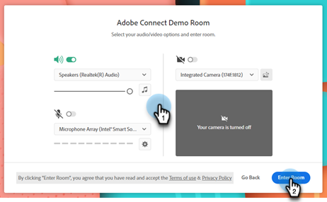
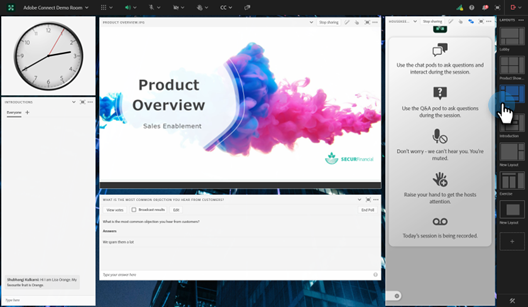
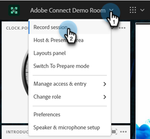
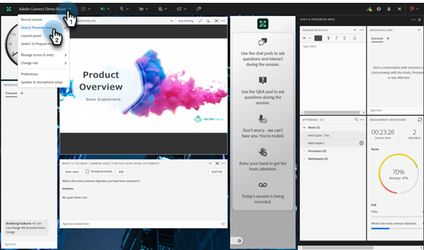
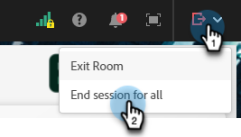
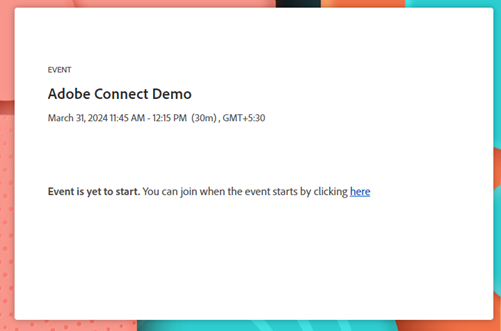
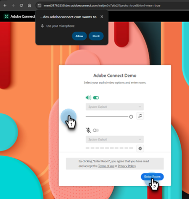
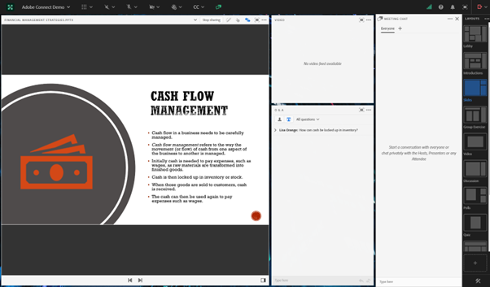
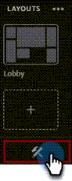

# Deliver an Interactive Webinar {#deliver-an-interactive-webinar}

Your Interactive Webinar is ready to go. Learn everything you need to know about presenting it.

1. Select your event and click **Enter your webinar**.

   

   >[!NOTE]
   >
   >It's recommended to do this at least 15 minutes prior to the scheduled start time.

1. If you're a co-host or a presenter, click the personalized link in the email you received for the webinar.

1. Select your audio/video preferences and click **Enter Room**.

   

1. Select the layout to be shown to early joiners.

   

   >[!NOTE]
   >
   >Participants can enter the room up to 15 minutes before the scheduled start and will see the active layout. We recommend designing a 'Lobby' layout for them.

   >[!TIP]
   >
   >Enable Broadcast Controls to enter a virtual green room. This allows the hosts and presenters to speak privately and see each other without that audio and video being broadcast to participants in the room. It's ideal before and after the session, where you can test your audio and video, or debrief after the webinar.

1. You can record the session if needed. Select **Record session** from the room menu. Recording can be stopped later from the same menu.

   

1. Your session begins at the designated time.

1. Click the room name. In the drop-down, select **Host & Presenter area** to chat or share notes with the presentation team backstage. The host & presenter area opens on the right side of the screen. Only hosts/co-hosts and presenters are able to see this portion of the screen.

   

1. When the session is complete, click the red arrow icon and select **End session for all**.

   

   >[!CAUTION]
   >
   >Clicking exit room will only cause you to leave the room. It will **not** end the webinar.

   >[!TIP]
   >
   >Learn more about [event performance and recordings](/help/marketo/product-docs/demand-generation/events/interactive-webinars/event-workflows.md){target="_blank"}.

## Participant experience {#participant-experience}

Participants can join the webinar by clicking the personalized link received after registering for the event.

1. Participants who launch the event link more than 15 minutes before the scheduled start will see a landing page informing them to wait for the event to start.

   

1. Participants need to select their audio preferences and then click Enter room. Participants joining an Adobe Connect room for the first time will also see a browser popup for microphone permission. Adobe Connect needs this access for participants to be able to use their microphone later within the room.

   

   >[!NOTE]
   >
   >The permission popup can be closed without providing the access. Participants will need to provide access within the room if they try to enable their microphone.

## Settings and Areas {#settings-and-areas}

### Host & Presenter area {#host-and-presenter-area}

The "Host & Presenter area" (also referred to as "Backstage") is a private area found on the right side of a meeting room that only hosts and presenters can see. It can be used to collaborate before, during, and after an event. Use Chat, Notes, and other pods as backchannels within the Host & Presenter area.

To access, select **Host & Presenter area** from the room drop-down menu. Learn more about this area in the [following video](https://www.youtube.com/watch?v=11GkcvIUttY){target="_blank"}.

### Broadcast Controls {#broadcast-controls}

Broadcast Control adds a virtual green room to your Interactive Webinars session. It enables hosts and presenters to speak and see each other privately without broadcasting to the participants in the room. It's a great way to test your microphone and webcam before a session. Presenters can also collaborate in the Host & Presenter area until they're ready to go live. It provides a way for the speaker and producers to debrief with each other privately after a session, in case an attendee forgets to leave the webinar.

Broadcast Controls can be set up to automatically begin recording after you leave the green room. This ensures hosts do not have to remember to manually start and stop the recording. Pausing or stopping the broadcast will also pause or stop the recording. Everything is automatic.

Learn more about Broadcast Controls [in this video](https://www.youtube.com/watch?v=TcoCeEJoyjg){target="_blank"}.

### Chats in Recordings {#chats-in-recordings}

Depending on the use case, it might be a good idea to either include or exclude the in-room chat within the event recordings.

Discussions within the Chat pods are always recorded. So, if the chat discussions add value to recording viewers (attendees and the on-demand viewers post the live event), use the chat pods when designing the room.

Discussion within Chat Panel are not recorded. The Chat Panel also frees up the real estate which would have been occupied by chat pod within the layout. So, if the chat discussions are not going to add value to recording viewers, use the Chat Panel instead of chat pods when designing the room.

   

Learn more about [the Chat Panel](https://helpx.adobe.com/adobe-connect/using/notes-chat-q-a-polls.html#chat_panel){target="_blank"}.

### Prepare Mode {#prepare-mode}

Prepare Mode allows hosts and presenters to create or modify a meeting room layout behind the scenes while a session is taking place, but without the participants seeing the changes until the host makes them visible. The Prepare Mode function highlights the live pods in blue and non-live pods in white.

To use Prepare Mode:

1. Click the wrench icon at the bottom of Layouts Panel.

   

1. From the Layouts Panel, choose the layout you want to adjust. Move, hide, or show pods as needed. You can also update the content in pods like upload a new version of presentation in a share pod.

1. When the changes are done, choose **End Prepare Mode** from the drop-down menu, or click the wrench icon a second time.

This turns off Prepare Mode and return you to the active layout.

Learn more about Prepare Mode [in this video](https://www.youtube.com/watch?v=kUya84sx-E4){target="_blank"}.

>[!NOTE]
>
>* Any changes made to the live pods are instantly reflected to the participants.
>* [Chat Panel](https://helpx.adobe.com/adobe-connect/using/notes-chat-q-a-polls.html#chat_panel){target="_blank"} isn't part of Prepare mode and any changes to it will reflect instantly to the participants.

### Accessibility {#accessibility}

Adobe endeavours to include presenters and participants with disabilities by improving the accessibility of Interactive Webinars. The software is continuously enhanced to meet the needs of all types of users and to adhere to the worldwide standards that include individuals with visual, auditory, mobility, or other impairments.

Learn about how Adobe Connect provides assistance for [visual, auditory, and mobility needs](https://helpx.adobe.com/adobe-connect/using/accessibility-features.html){target="_blank"}.

### Closed Captions {#closed-captions}

Closed captions are a textual representation of the audio within an Adobe Connect room and helps participants who are deaf or hard of hearing participate in events. You can integrate real-time captioning of audio content into events and present these captions in the Closed Caption display.

Learn how to [enable closed captions](https://helpx.adobe.com/adobe-connect/using/closed-captioning-html-client.html){target="_blank"}.
