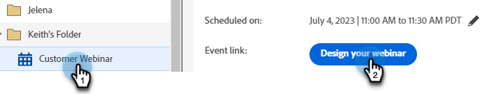
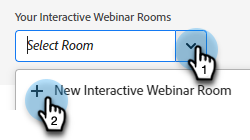
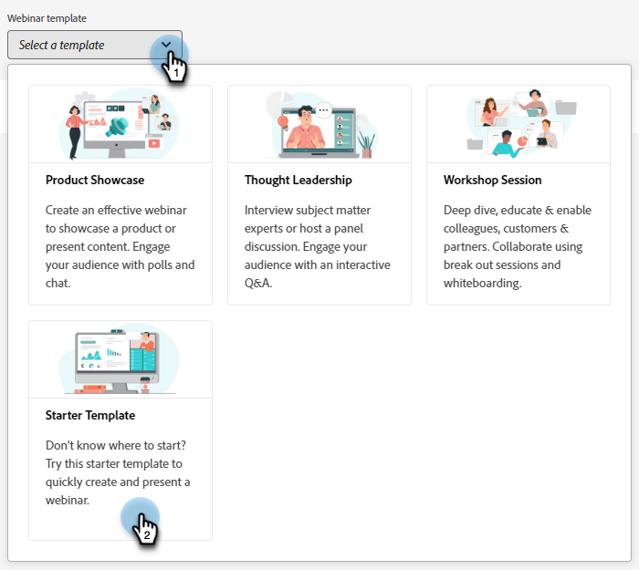
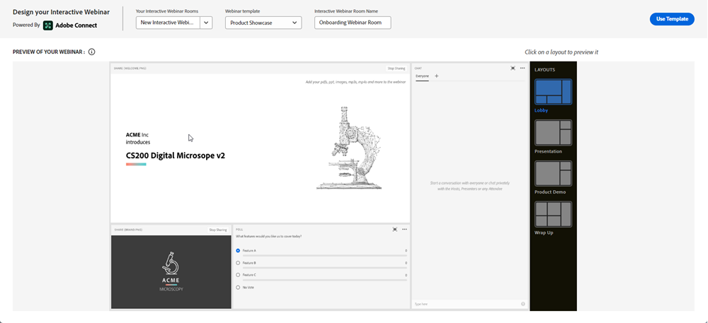
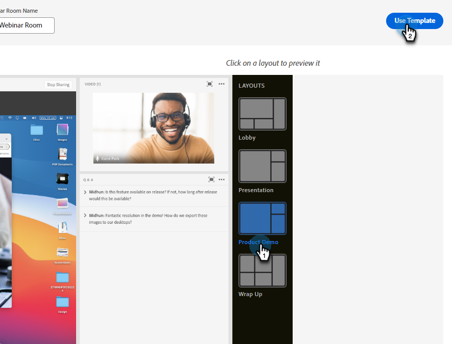
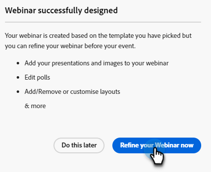
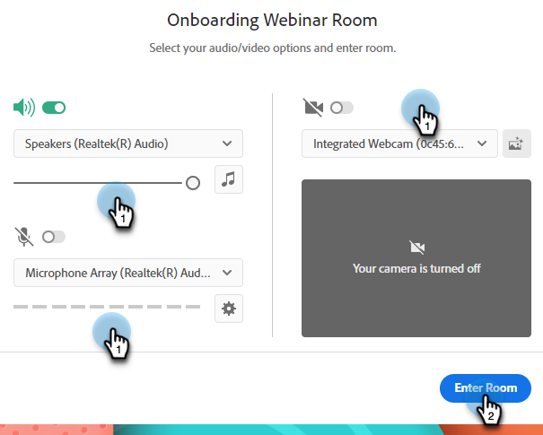
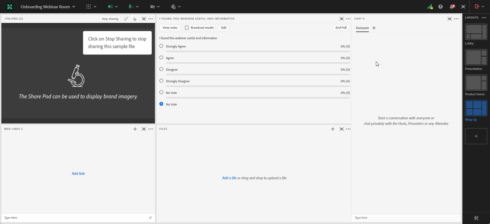

# Designing Interactive Webinars {#designing-interactive-webinars}

Learn how to design your webinar to suit your needs.

1. Select your event and click **Design Your Webinar**.

   

1. You can choose an existing Webinar Room or create a new one. In this example we're creating a new one, so click the **Select Room** drop-down and choose **New Interactive Webinar Room**. 

   

   >[!NOTE]
   >
   >A room is an online space that's used to conduct meetings.

1. Choose a template.

   

1. Your webinar preview will appear.

   

   >[!NOTE]
   >
   >By default, the name of the room indicated in the "Interactive Webinar Room Name" field is the same name as your Interactive Webinar Event Program. You have the option of changing it to reflect the title of the webinar itself, since this name is visible to your audience.

   >[!TIP]
   >
   >Your webinar will be set to the default language in your Marketo Engage instance, but you have the option to change languages on a per-webinar basis by using the drop-down above the preview.

1. You can select different layouts to preview. To proceed, click **Use Template**.

   

1. You can refine your webinar right away, or later. Let's do it now. Click **Refine Your Webinar Now**.

   

1. Select your audio/video preferences and click **Enter Room**.

   

1. Your selected template is now editable.

   

1. For detailed information on rooms and templates, check out the "Meeting room templates and layouts" section of [this Adobe help article](https://helpx.adobe.com/in/adobe-connect/using/creating-arranging-meetings.html#creating_and_arranging_meetings){target="_blank"}.

1. When you're done designing your webinar, click **Exit Room**.

   

## Design Elements {#design-elements}

**Template**: Structure provided to a room based on the objective of the webinar being delivered. For example, if you want to schedule a product showcase webinar, screen sharing would be an essential component to showcase the demo. The template ensures that the essential components required for an effective delivery of a particular type of webinar are in place during the configuration of the webinar room.

**Layout**: Refers to various ways that the multiple components required to ensure the success of the webinar are arranged in a particular template. A single template can have multiple layouts for you to choose from. The essential components of the webinar would remain the same across templates. The arrangement you selected would be best suited to the style/needs of you or the presenter delivering the webinar.

**Pod**: A component inside a template that performs a particular activity during the webinar. For example, setting up and delivering a poll to capture participants' responses in one activity that can be fulfilled by a poll pod. Similarly, chatting with the participants to convey a message or casually interacting with them can be an activity delivered through the chat pod. Multiple other pods are available, such as Share, Notes, Video, Chat, Attendee List, Files, Web Links, Polls, and Q & A.
