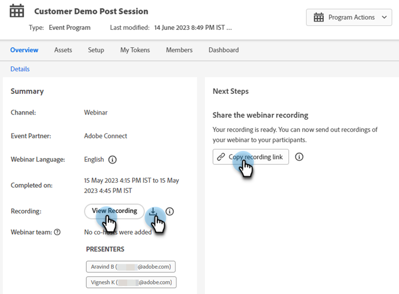
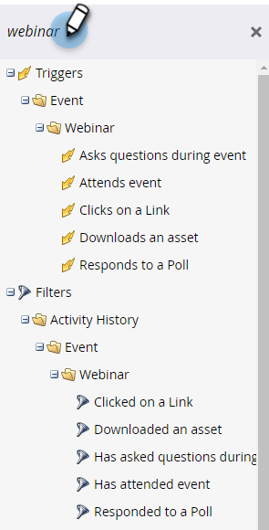
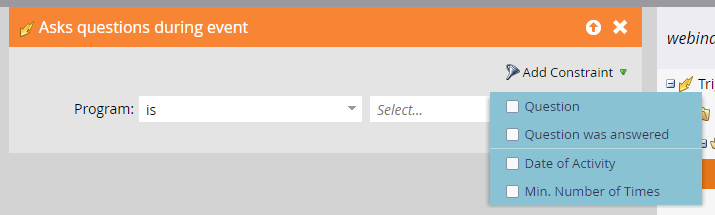
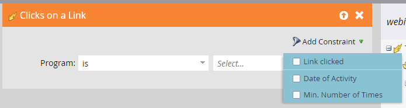
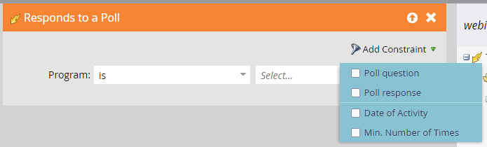

# Event Workflows {#event-workflows}

After your webinar is completed, go to the Dashboard tab to see the aggregated performance.

   

>[!NOTE]
>
>If the webinar has not been completed or the data has not been received for any reason, the Dashboard tab will not yet be available.

## Manual Sync {#manual-sync}

Interactive Webinars allows you to obtain your webinar's engagement data from Adobe Connect if you haven't automatically received it within two hours of the webinar's completion. Thirty one days after the Interactive Webinar delivery date, a "Sync On-Demand Activity" options appears on the right side of the header the webinar's _Dashboard_. Clicking it triggers a pull from Adobe Connect to populate the data in Marketo Engage. It syncs data from the date of your webinar until the date you click **Sync On-Demand Activity**.

## Dashboard Widgets {#dashboard-widgets}

The Dashboard consists of four widgets.

**Event Program Status**: Shows the various program statuses for that event and the number of members of the program that are currently holding that program status value.

**Attendance**: Highlights the attendance duration of various members who have attended the webinar in comparison to the overall webinar duration in terms of percentage.

**Poll Performance**: Displays various polls launched during the webinar powered by Adobe Connect and the distribution of the members who have attended and responded to the poll across each of the answers.

**Click and File Download Activity**: Provides the download count of file and weblinks clicked during the webinar powered by Adobe Connect by various members who have attended the webinar and taken that specific action.

## Webinar Recording {#webinar-recording}

Go to the Overview tab to view the recorded webinar, get the link to share it, even download a copy.

   

>[!NOTE]
>
>* Interactive Webinars are not recorded automatically. After your webinar begins, click the drop-down next to the name of the webinar and select **Record Session**.
>* If the session is recorded, the host needs to manually end the recording or select "End session for all" to stop recording. Otherwise, the recording will automatically stop within 10 minutes of the last attendee leaving the room.
>* The recording is downloaded in MP4 format.
>* When sharing the recording it will be viewable by anyone who has the link, so make sure it's shared with the intended audience.

## Triggers and Filters {#triggers-and-filters}

Use Interactive Webinar-related triggers and filters to locate specific groups of people within your Event Program.

   

Each trigger/filter comes with additional constraints, allowing you to capture a focused subset of that group.

**Asks questions during event** (Filter version: Has asked questions during event)

   

**Attends event** (Filter version: Has attended event)

   

**Clicks on a link** (Filter version: Clicked on a link)

   

**Downloads an asset** (Filter version: Downloaded an asset)

   

**Responds to a poll** (Filter version: Responded to a poll)

   
