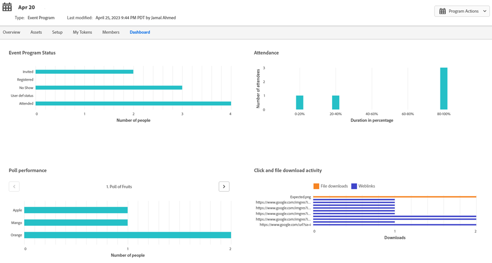

# Event Workflows {#event-workflows}

After your webinar is completed, go to the Dashboard tab to see the aggregated performance. 

   

>[!NOTE]
>
>If the webinar has not been completed yet or the data has not been received for any reason, the Dashboard tab will not be available yet.

## Dashboard Widgets {#dashboard-widgets}

The Dashboard consists of four widgets.

**Event Program Status**

Shows the various program statuses for that event and the number of members of the program that are currently holding that program status value.

**Attendance**

Highlights the attendance duration of various members who have attended the webinar in comparison to the overall webinar duration in terms of percentage.

**Poll Performance**

Displays various polls launched during the webinar in Adobe Connect and the distribution of the members who have attended and responded to the poll across each of the answers.

**Click and File Download Activity**

Provides the download count of file and weblinks clicked during the Webinar in Adobe Connect by various members who have attended the webinar and taken that specific action.

## Triggers and Filters {#triggers-and-filters}

Filter and Trigger on IW - "Webinar" in Smart Lists
