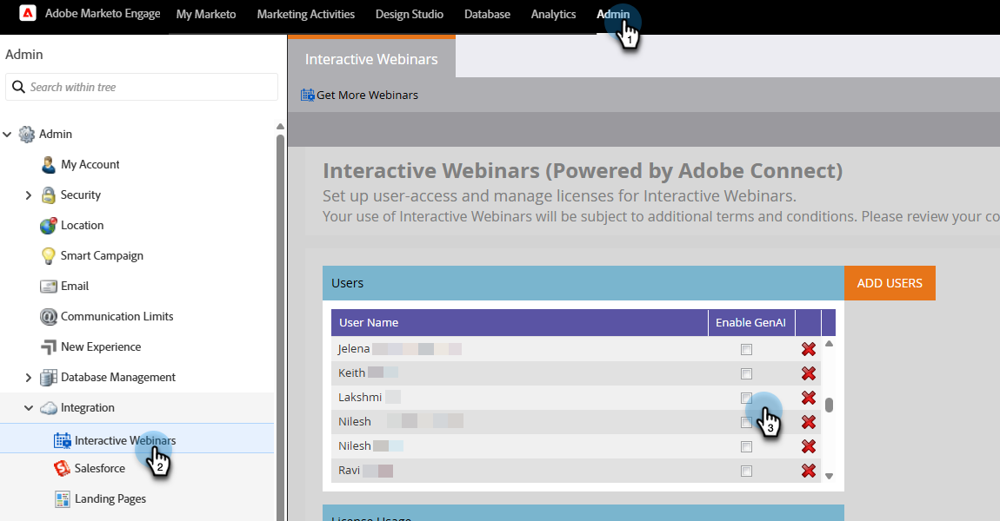
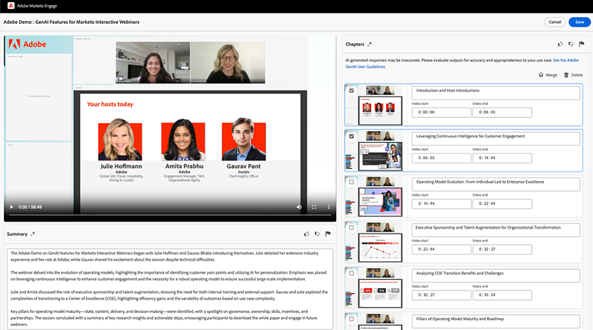
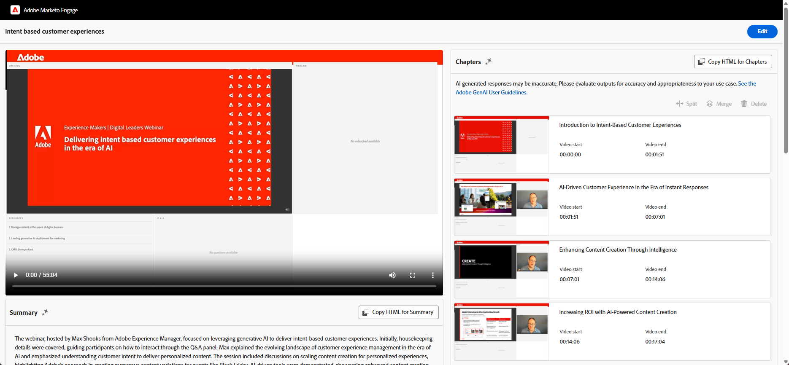
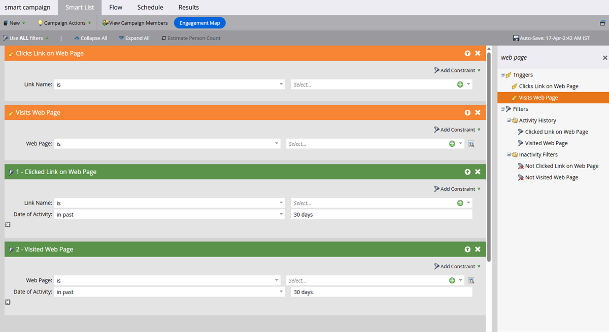

# GenAI features {#gen-ai-features}

Automatically generate chapters and summaries for your recorded webinars, making them more accessible and easier to navigate for your audience.

* **Automatic Chapter Generation**: AI-powered technology creates chapters for your webinar content.

* **AI-generated Summary**: Get an automated text summary of your webinar.

* **AI-based Blog Generation**: Lets you automatically generate on-brand blog content from your webinars.

* **Editable Content**: Modify generated chapters and summaries if desired, using manual and AI-powered editing functionalities.

* **Easy Integration**: Easily add chapters and summaries to your Landing Pages by copying the HTML code to the webpage editor of your choice.

## Enable GenAI {#enable-genai}

>[!PREREQUISITES]
>
>Before using these features, you must first accept the Adobe GenAI terms and conditions. If you have yet to do so, please reach out to the Adobe Account Team (your Account Manager) for details.

After you've accepted the Adobe GenAI terms and conditions, the next step is to enable it for individual users. Do so by going to **[!UICONTROL Admin]** > **[!UICONTROL Interactive Webinars]** and selecting which users should have access to GenAI.

   {width="800" zoomable="yes"}

## How to access {#how-to-access}

1. Navigate to the webinar overview page in Marketo Engage Interactive Webinars.

1. After conducting your on-demand webinar, wait 30 to 60 minutes for the AI to process your recording. The Generate button will become clickable when it's available.

1. Click **[!UICONTROL View GenAI Content]**.

   {width="800" zoomable="yes"}

1. A new tab opens, displaying AI-generated chapters and a text summary.

## Edit generated content {#edit-generated-content}

1. Review the generated chapters and summary.

1. If changes are needed, click the **[!UICONTROL Edit]** button.

   Making modifications:

   * Edit text in the summary and/or the chapter titles.

   * Adjust timestamps if necessary by editing the values in timestamp fields.

   * Delete unwanted chapters by selecting them and clicking **[!UICONTROL Delete]**.

   * Merge two consecutive chapters by selecting them and clicking **[!UICONTROL Merge]**.

     * AI generates a composite chapter comprised of the two selected chapters

     * To merge multiple chapters, you must do two at a time

      {width="800" zoomable="yes"}

   >[!NOTE]
   >
   >* If desired, you can rate the quality of the generated chapters/summary with the _thumbs-up_  or _thumbs-down_  icons. You can also flag any problematic content by clicking the flag icon .
   >
   >* If you are not satisfied with the initial summary, you can click the **[!UICONTROL Regenerate summary]** button and another version will be generated.

1. Save your changes by clicking the **[!UICONTROL Save]** button in the top-right of the screen.

## Use generated content {#use-generated-content}

After you copy the content you want to use, paste it in the editor of your choice (e.g., Marketo Engage Landing Page editor) and make any desired adjustments.

### Summary {#summary}

**Copy HTML** - Click the **[!UICONTROL Copy HTML]** button to get all of the text, complete with HTML code formatting it inside of a table.

**Text only** - If you want the text only, simply highlight it and select Ctrl/Cmd+C (or right-click) to copy.

### Chapters {#chapters}

**Copy HTML** - Click the **[!UICONTROL Copy HTML]** button to get all of the recording and its chapters formatted inside of a video player.

## Target your audience

Leverage Smart Campaign/List filters and/or triggers to see what each viewer watched, how many times, etc., allowing for personalized follow-ups.

{width="800" zoomable="yes"}

* **Triggers**: _Clicks Link on Web Page_, _Visits Web Page_

* **Filters**: _Clicked Link on Web Page_, _Visited Web Page_

The "link" is the name of the chapter, and the "web page" is the page that hosts your On Demand webinar.

>[!TIP]
>
>Use [constraints](/help/marketo/product-docs/core-marketo-concepts/smart-lists-and-static-lists/using-smart-lists/add-a-constraint-to-a-smart-list-filter.md){target="_blank"} to further refine your target audience.

## Things to note {#things-to-note}

* Deleting or merging chapters only affects the chapter stack, not the video content itself. These actions are permanent.

* The GenAI features are flexible and can be used with various web page editors, not just the ones in Marketo Engage.

* Only sessions held in seminar rooms will be available for generation of blogs. Seminar rooms are available only on accounts with an Event Module or a Seminar (Shared Room/Events) license.

* Always preview your changes to ensure desired functionality and appearance.

* Deleting the webinar also deletes the GenAI content.

* If you want to delete the GenAI content without deleting the webinar, reach out to the Adobe Account Team (your Account Manager), or send a data deletion request to: `marketo-webinar-genai-alerts@adobe.com`.
