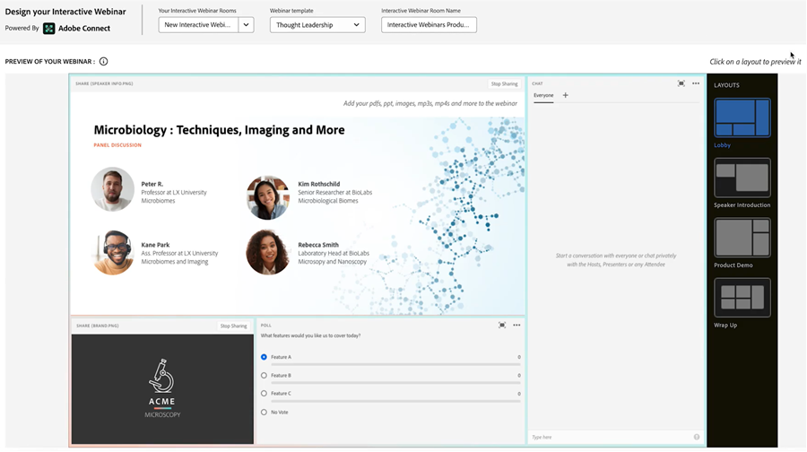

# Get Started with Interactive Webinars {#get-started-with-interactive-webinars} 

So, you've read the [Interactive Webinars Overview](/help/marketo/product-docs/demand-generation/events/interactive-webinars/interactive-webinars-overview.md){target="_blank"}{target="_blank"} and are ready to dive in. Follow the steps below to get started.

   

## What to do {#what-to-do}

**Step One**: [Add Users](/help/marketo/product-docs/demand-generation/events/interactive-webinars/user-and-license-management.md#add-a-user){target="_blank"} &mdash; Learn how to add (and later remove, if desired) users for Interactive Webinars access.

**Step Two**: [Create an Interactive Webinar](/help/marketo/product-docs/demand-generation/events/interactive-webinars/create-an-interactive-webinar.md){target="_blank"}{target="_blank"} &mdash; Learn how to create an Event Program and set initial parameters for your webinar.

**Step Three (optional)**: [Add a Webinar Team](/help/marketo/product-docs/demand-generation/events/interactive-webinars/add-a-webinar-team.md){target="_blank"}{target="_blank"} &mdash; If you're not planning to host the webinar by yourself, learn how to add presenters and co-hosts to share hosting/presenting duties.

**Step Four**: [Design Your Interactive Webinar](/help/marketo/product-docs/demand-generation/events/interactive-webinars/designing-interactive-webinars.md){target="_blank"} &mdash; After the webinar is created and an optional team has been added, it's time to tailor the event to suit your specific needs.

**Step Five**: [Promote Your Webinar](/help/marketo/product-docs/demand-generation/events/interactive-webinars/promoting-an-interactive-webinar.md){target="_blank"} &mdash; Learn valuable tips on how to promote your upcoming event.

**Step Six**: [Deliver Your Interactive Webinar](/help/marketo/product-docs/demand-generation/events/interactive-webinars/deliver-an-interactive-webinar.md){target="_blank"} &mdash; Everything you need to know about presenting your webinar.

That's it! 

## Additional documentation {#additional-documentation} 

After your webinar is over, see how it performed using the helpful dashboard in the event's Overview screen. You can see detailed engagement of your audience in the [Engagement Dashboard](/help/marketo/product-docs/demand-generation/events/interactive-webinars/engagement-dashboard.md){target="_blank"}. Take advantage of the webinar engagement to target the audience in a personalized fashion using Smart Filters and Triggers in [Event Workflows](/help/marketo/product-docs/demand-generation/events/interactive-webinars/event-workflows.md){target="_blank"}. And learn how to track your On-Demand performance through [On-Demand Webinars](/help/marketo/product-docs/demand-generation/events/interactive-webinars/on-demand-webinars.md){target="_blank"}.

We have more help articles on this topic, including [Best Practices for Interactive Webinars](/help/marketo/product-docs/demand-generation/events/interactive-webinars/best-practices-for-interactive-webinars.md){target="_blank"}, how to [customize your webinars](/help/marketo/product-docs/demand-generation/events/interactive-webinars/customization.md){target="_blank"} to reflect your needs/branding, creating organization-wide templates by using [Templates for Interactive Webinars](/help/marketo/product-docs/demand-generation/events/interactive-webinars/templates.md){target="_blank"}, and how to manage rooms and recordings in [Room Management](/help/marketo/product-docs/demand-generation/events/interactive-webinars/room-management.md){target="_blank"}.

&nbsp;

Enjoy using Interactive Webinars (powered by Adobe Connect)!
