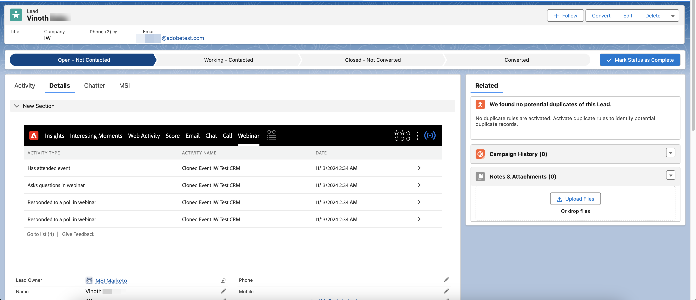
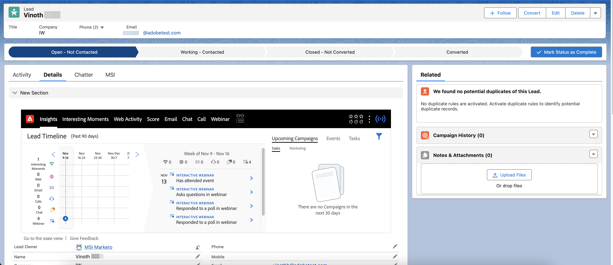

# Interactive Webinars in Marketo Sales Insight {#interactive-webinars-in-marketo-sales-insight}

Interactive Webinars in Marketo Sales Insight makes your webinars' activities available in the Marketo Sales Insight (MSI) plugin in Salesforce.

>[!PREREQUISITES]
>
>This feature is only supported for those who have purchased the [Marketo Sales Insight](https://business.adobe.com/products/marketo/sales-intelligence-engagement.html) add-on.

Once activities register in Marketo Engage (after the webinar has been completed in Adobe Connect), they are synchronized in real-time to Salesforce via the MSI plugin.

Every activity that has been made available in Marketo Engage is synced. Those activities are:

* Attends an event
* Responds to a poll
* Answers a question
* Clicks a link
* Downloads an asset

All relevant attributes of these activities are also made available for the salesperson to review and take actions on the individual leads. The activity information is available in the generic Insights section as well as in a separate Webinar tab.

In the Insights section, the Lead Timeline chart contains another swimlane for webinars that highlight the activities synced for the past 90 days for every week. When selecting a particular week, the activities are displayed per day in a separate section. You can expand individual activities to see their details.

{width="800" zoomable="yes"}

In the separate Webinar tab, all the activities (and their dates) are also listed in a tabular format.

{width="800" zoomable="yes"}
