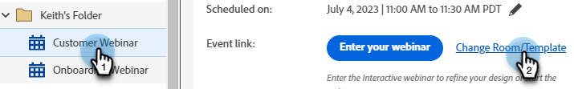
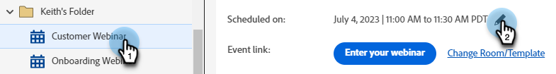
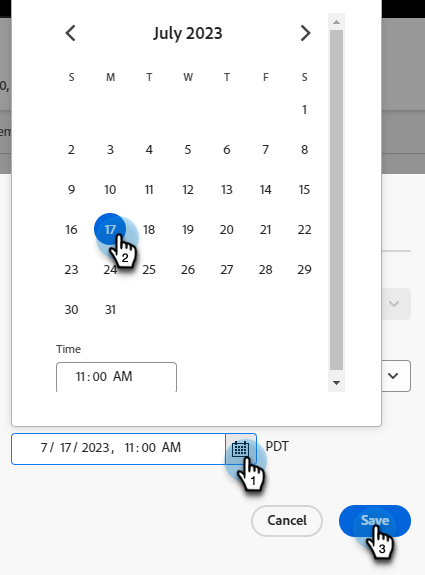
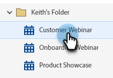
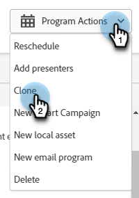
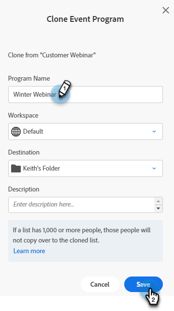

# Modify or Delete an Interactive Webinar {#modify-or-delete-an-interactive-webinar}

Intro.

## Modify an Interactive Webinar {#modify-an-interactive-webinar}

1. Select the desired Event Program and click **Change Room/Template**.

   

1. Text

PICC

## Reschedule an Interactive Webinar {#reschedule-an-interactive-webinar}

1. Select the desired Event Program and click the pencil icon next to the currently scheduled date/time.

   

1. Click the calendar icon, choose the new date/time, and click **Save**.

   

## Clone an Interactive Webinar {#clone-an-interactive-webinar}

1. Select the desired Event Program.

   

1. Click the Program Actions drop-down and select **Clone**.

   

   >[!TIP]
   >
   >You can also right-click on the Event Program in the tree and select **Clone** from there.

## Delete an Interactive Webinar {#delete-an-interactive-webinar}

1. Select the desired Event Program.

   

1. Click the Program Actions drop-down and select **Delete**.

   

   >[!TIP]
   >
   >You can also right-click on the Event Program in the tree and select **Delete** from there.
