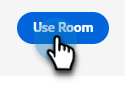
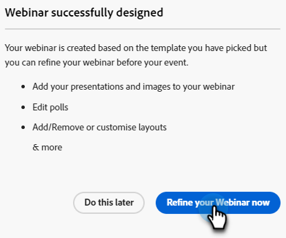
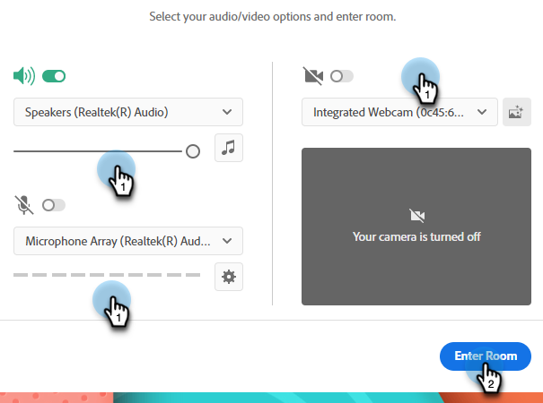
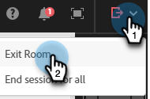
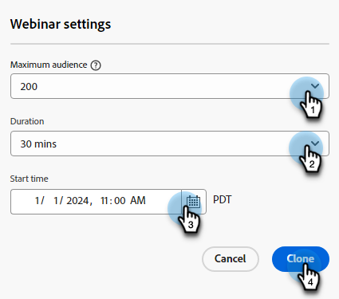
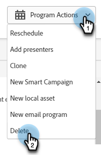
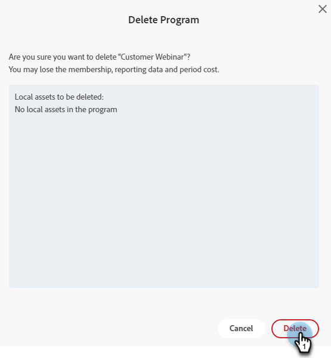

# Modify or Delete an Interactive Webinar {#modify-or-delete-an-interactive-webinar}

Laern how to make changes to your Interactive Webinar.

## Modify an Interactive Webinar {#modify-an-interactive-webinar}

1. Select the desired Event Program and click **Change Room/Template**.

   

1. The room will load. If you want to change the room, select one from the Rooms drop-down. To just update your template, click **Use Room**.

   

>[!NOTE]
>
>Changing your room is optional and not required to update your template.

1. Click **Refine Your Webinar Now**.

   

1. Select your audio/video preferences and click **Enter Room**.

   

1. When you're done making your modifications, click **Exit Room**.

   

## Reschedule an Interactive Webinar {#reschedule-an-interactive-webinar}

1. Select the desired Event Program and click the pencil icon next to the currently scheduled date/time.

   

1. Click the calendar icon, choose the new date/time, and click **Save**.

   

## Clone an Interactive Webinar {#clone-an-interactive-webinar}

1. Select the desired Event Program.

   

1. Click the Program Actions drop-down and select **Clone**.

   

   >[!TIP]
   >
   >You can also right-click on the Event Program in the tree and select **Clone** from there.

1. Give the cloned program a name, set the Workspace and Destination (if you want the program to live somewhere else), and click **Save**.

   

1. Click **Next**.

   

   >[!NOTE]
   >
   >You can only save a cloned Interactive Webinar as an Interactive Webinar at this time. Saving a cloned webinar as a Partner Webinar (e.g., Zoom, ON24, etc.) will be available soon.

1. Choose the settings for your cloned webinar and click **Clone**.

   

## Delete an Interactive Webinar {#delete-an-interactive-webinar}

1. Select the desired Event Program.

   

1. Click the Program Actions drop-down and select **Delete**.

   

   >[!TIP]
   >
   >You can also right-click on the Event Program in the tree and select **Delete** from there.

1. Click **Delete**.

   

   >[!IMPORTANT]
   >
   >If there are any local assets in the program they will be deleted as well.
