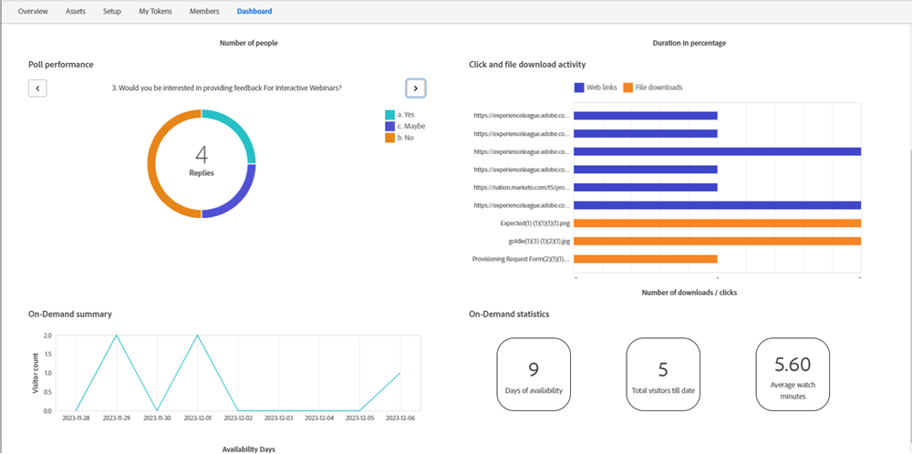

# On-Demand Webinars {#on-demand-webinars}

On-Demand Webinars capture and refine the leads that registered for your event and didn't attend, but want to obtain information related to the event by watching the recording. Information such as Name, Email ID, and Watch Date/Duration can be captured in Marketo Engage and used to target these no-show leads. 

The Webinar Joining URL that was shared with the registrants prior to the event can be used to watch the on-demand recording. Once a registrant who did not attend the live event (e.g., a lead with a program status as "No-Show"), clicks on the Webinar Joining URL, the program status of that lead changes from "No-Show" to "Attended On-Demand". The program status of the leads who watched the event live and have the status "Attended" would not be affected if they decide to visit the Joining URL and watch the on-demand recording.

Adobe Connect, the technology that powers Interactive Webinars, tracks the visit as well as the watch duration pertaining to the leads that watch the recording, and reports the information to Marketo on a daily basis. The recording is available at the Joining URL for 30 days after the event. The duration cannot be modified.

Marketo provides the watch statistics for On-Demand Webinars on the Dashboard tab with the help of the following widgets:

* On-Demand Summary: This provides a summary of the count of visitors (No-Shows) that watch the recording after the event on a given day(s)

* On-Demand Statistics: This widget provides information on:
  * Days the On-Demand recording is available for viewing&mdash;Helps marketers perform actions, such as executing email campaigns close to the end of the recording availability duration of 30 days.
  * Overall visitor count for On-Demand webinars to date&mdash;The count of all the No-Show registrants that have watched the on-demand recording to date.
  * Average watch duration in minutes for all visitors&mdash;Gives marketers a sense of how much of the recording is viewed and what Smart Campaigns can be used to target leads above a certain watch duration.
  

The filters and triggers for Interactive Webinars have been modified to cater to On-Demand Webinars. The trigger "Attends Event" and filter "Has attended event" is added with an additional constraint ("Event Mode"), where a marketer can choose whether the target is Live audience or On-Demand audience. If the "Event Mode" constraint is not selected, both the Live and On-Demand audiences would be targeted. Other constraints, such as "Watch Date" and "Watch Duration," could be used with the "On-Demand" event mode. The Inactivity Filter "Has not attended an event" can also be used for On-Demand webinars with "On-Demand" event mode.
