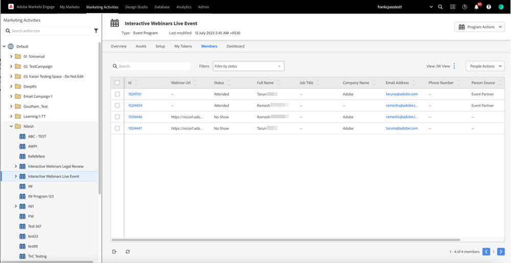

# Promoting an Interactive Webinar {#promoting-an-interactive-webinar}

Promoting an Interactive Webinar is similar to promoting a partner webinar via Launchpoint. When creating an Interactive Webinar event program you can add members to a program either by running a campaign or importing members to the program. To check the members that have been added to the Interactive Webinars Event Program, click on the Members Tab.

After the members have been added or imported into the program, you can create an email campaign inside the Interactive Webinar Event Program to send an invitation to all the program members, and change their status as "invited" once the email has been delivered.

The email can contain specific details of the program, as well as include a landing page URL that would redirect the recipient to a specific page where more information regarding the webinar (e.g., content, presenter info, etc.) can be added. This landing page can be created as a local asset in the Interactive Webinars Event Program.

You can solicit registration for this webinar by enabling a form on the Landing Page and linking the form clicks to enabled registration in the Interactive Webinar Event Program. A campaign can then be created that uses form submissions as a trigger and changes the Program Status from "invited" to "registered."

>[!NOTE]
>
>The transition from "invited" to "registered" is not automatic in Interactive Webinars, as there can be multiple triggers that create the transition.

Once a member has been in the "registered" program status in an Interactive Webinar Event Program, a registration is automatically made to the webinar created in Adobe Connect. Registration data such as First Name, Last Name and Email ID then gets transferred to Adobe Connect. This means that once the user joins the webinar as a participant, the information will be available to the presenter or host during the webinar.

Within a few minutes of registration, the Webinar URL for the member gets populated in the Members Tab. If you're not able to locate the column for Webinar URL, make sure that column has been added to your view. This is a personalized URL for each registered member to be able to enter the webinar at scheduled time without requiring any authentication. Tokens exchanged internally take care of the authentication for the members.

You can use tokens to include the Webinar URL to individual members in an email campaign to communicate that they've been registered in the event and to use the joining URL to enter the webinar at the scheduled time. Calendar tokens can be used in the same email campaign to ensure that the webinar schedule can be added to the members' calendars.

Links have been provided in the [Overview page](/help/marketo/product-docs/demand-generation/events/interactive-webinars/interactive-webinars-overview.md) to create a Landing Page, as well as an email campaign. The rest of the promotions related to an event remain the same as partner webinars using the Launchpoint integration.
