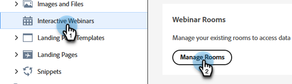
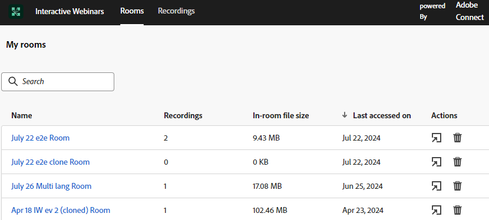
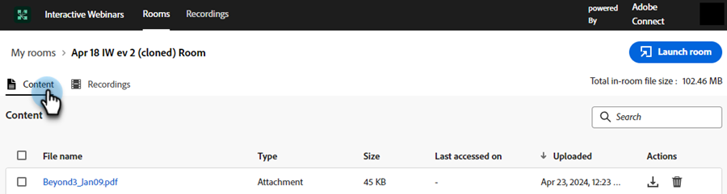
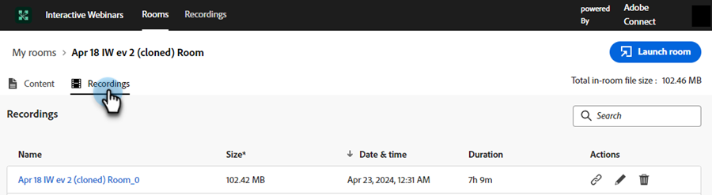
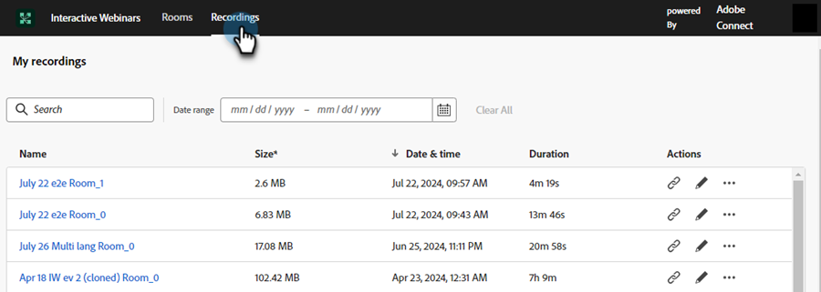

# Room Management {#room-management}

Interactive Webinar rooms powered by Adobe Connect are designed to facilitate engaging and collaborative online events. These webinars store content and recordings created and used during the webinar. As a member with the right to create a room, you can access and manage them from a central location.

>[!NOTE]
>
>You can only access the rooms you created for a webinar and not rooms of other members in your organization.

## Manage and access Rooms and Recordings {#manage-and-access-rooms-and-recordings}

1. Go to the **[!UICONTROL Design Studio]**.

   

1. Select **[!UICONTROL Interactive Webinars]**, then **[!UICONTROL Manage Rooms]**.

   

### Rooms {#rooms}

An interactive webinar room is a virtual space designed to host live, engaging, online events where participants can interact with the presenter and other participants. In these rooms, you can find the uploaded content and recordings from webinars.

To view the list of all your rooms, select **[!UICONTROL Rooms]** from the top menu bar. You can find all the rooms you created along with uploaded content and recordings in these rooms. You can also view the number of recordings, in-room file size, and last accessed date for respective rooms.

<table><tbody>
  <tr>
    <td><b>Recordings</td>
    <td>View the number of recordings available in a room.</td>
  </tr>
  <tr>
    <td><b>In-room file size</td>
    <td>View the combined file size of content and recordings available in a room.</td>
  </tr>
  <tr>
    <td><b>Last accessed on</td>
    <td>Shows the date when the room was last accessed. You can sort the information based on the timeline.</td>
  </tr>
</tbody>
</table>

   

You can perform the following actions from this centralized interface:

* Click the Launch room icon to launch and enter the room.
* Use the search bar to find the room you're looking for (will only search the rooms that you created).
* Click the Delete room icon to remove the room. Doing so will delete all recordings and files related to the room.

When you select a room, you can view content or recordings available in that room. On this screen, the information is available within two tabs: the **Content** tab and the **Recordings** tab.

**Content tab**

The Content tab lets you view the uploaded files, their type, size, last accessed date, and uploaded date.

<table><tbody>
  <tr>
    <td><b>Type</td>
    <td>Shows you the file type such as PDF, JPG, PNG, etc.</td>
  </tr>
  <tr>
    <td><b>Size</td>
    <td>View the size of the available file.</td>
  </tr>
  <tr>
    <td><b>Last accessed on</td>
    <td>Shows the date the room was last accessed. You can sort the information based on the timeline.</td>
  </tr>
  <tr>
    <td><b>Uploaded</td>
    <td>Shows you when the file was uploaded.</td>
  </tr>
</tbody>
</table>

   

You can perform the following actions in the Content tab:

* Click the **[!UICONTROL Launch room]** button to launch and enter the room.
* Use the search bar to find the file you're looking for.
* Click the Download file icon to download a file on your device. Select two or more files to download in bulk.
* Click the Delete room icon to remove the room. When a file is deleted, it cannot be retrieved.
* Select any file from the listed content to view it on the device.

**Recordings tab**

The Recordings tab allows you to view all recordings available in this room. Each recording is displayed with details such as its size, date and time of recording, and duration.

   

You can perform the following actions from this centralized hub:

* Click the **[!UICONTROL Launch room]** button to launch and enter the room.
* Use the search bar to find the recording you're looking for.
* Click the Download file icon to download a file on your device. Select two or more files to download in bulk.
* Click the Copy recording link icon to copy the recording URL.
* Click the Edit Recording icon to make changes to your recording.
* Click the Delete icon to remove the recording. When a recording is deleted, it cannot be retrieved.
* Select a recording to play it on the device.

## Manage and access Recordings {#manage-and-access-recordings}

Recordings are invaluable resources, capturing the essence of live discussions, presentations, and Q&A sessions. They allow participants to revisit key insights, missed details, or complex concepts at their own pace.

Click the **[!UICONTROL Recordings]** tab to see a list of all the recordings you've uploaded.

Under **[!UICONTROL My recordings]**, you can find all the recordings available in the room you created. You can also view their respective size, date and time, and duration of recordings.

   

You can perform the following actions from this centralized hub:

* Use the search bar to find the recording you're looking for. You can also search within a timeline by selecting a Date range.
* Click the Copy recording link icon to copy the recording URL.
* Click the Edit Recording icon to make changes to your recording.
* Click the Show linked page icon to view the information about the room where the selected recording is available.
* Click the Delete icon to remove the recording. When a recording is deleted, it cannot be retrieved.
* Select a recording to play it on the device.
