# Templates for Interactive Webinars {#templates-for-interactive-webinars}

Create easy-to-use templates in Interactive Webinars to produce content faster and stay in line with brand guidelines when working on a team.

## Create a Template {#create-a-template}

1. In Marketo Engage, click **[!UICONTROL Design Studio]**.

   

1. Click **[!UICONTROL Interactive Webinars]**.

   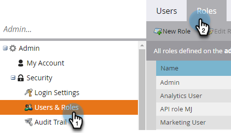

1. Click **[!UICONTROL Manage Templates]**.

   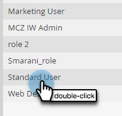

1. A new tab opens. Click **Create New**.

   

1. In the Standard templates tab, select the desired template and click **Next**.

   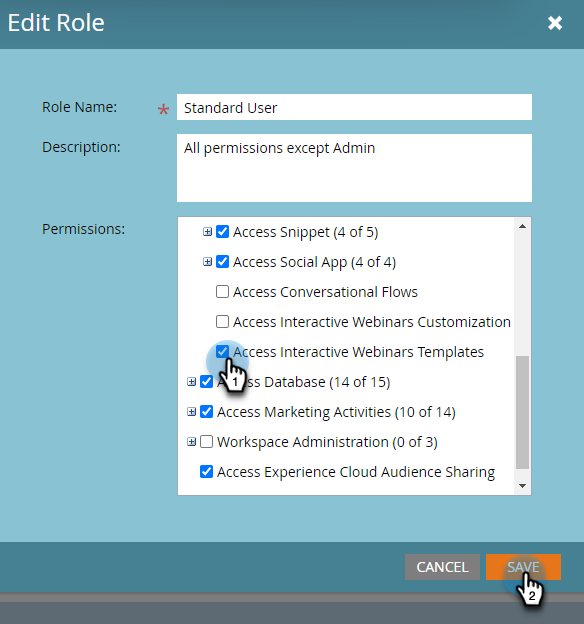

   >[!NOTE]
   >
   >Organization templates are the templates you or your team already created.

1. Enter a name and description. Click **Save and open**.

   

1. A new tab opens. To edit/save your template, you'll have to enter a room. As this is not an actual webinar room, no need to make audio/video selections. Click **Enter Room**.

   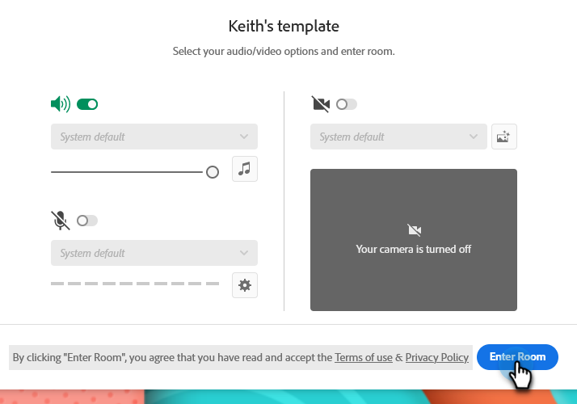

1. Make any desired changes to the existing template.

   

1. In the Exit menu on top right, select **End session for all**.

   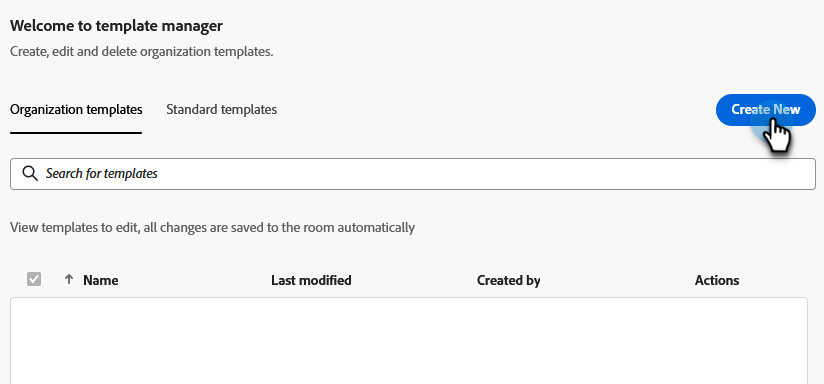

1. Click **End now**.

   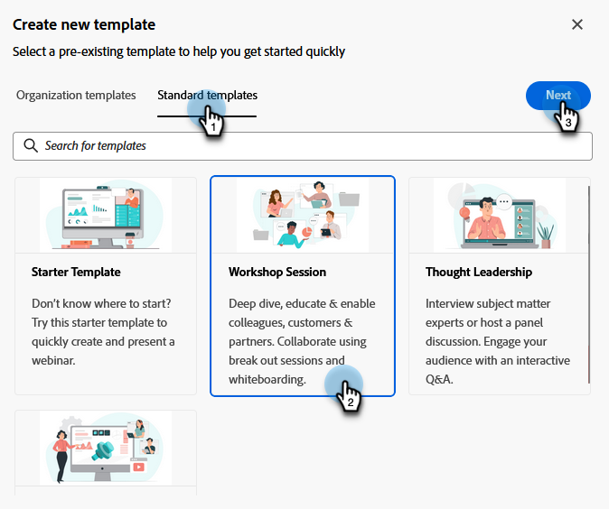

Your template is automatically saved.

## Edit a Template {#edit-a-template}

Follow the steps below to edit an existing template.

1. In Marketo Engage, click **[!UICONTROL Design Studio]**.

   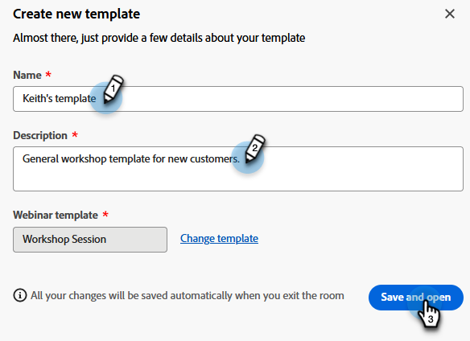

1. Click **[!UICONTROL Interactive Webinars]**.

   

1. Click **[!UICONTROL Manage Templates]**.

   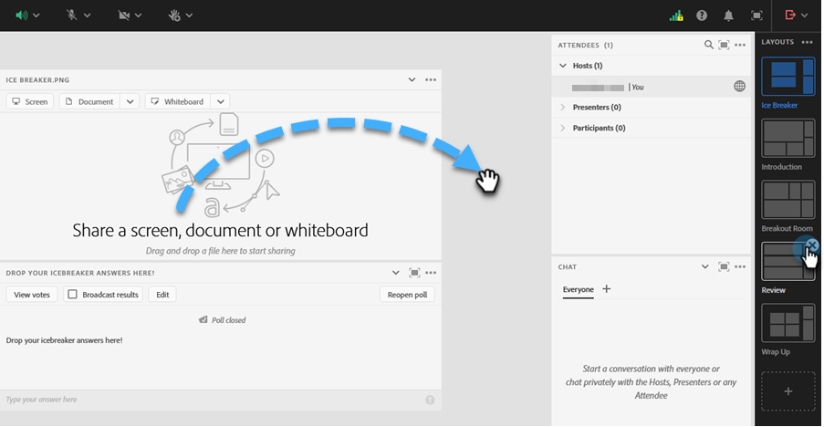

1. A new tab opens. Locate the template you want to edit and click the open icon.

   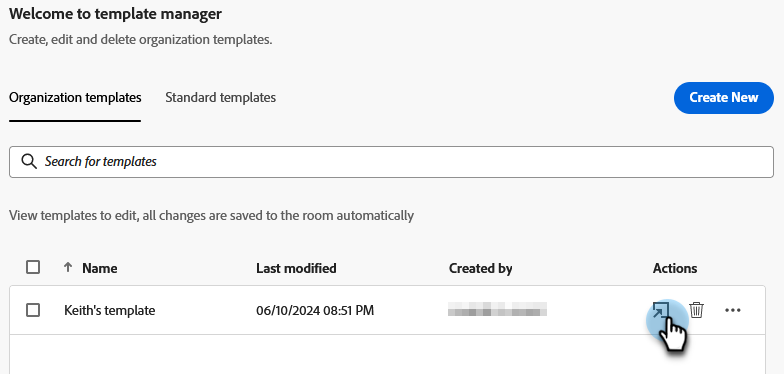

1. A new tab opens. To edit your template, you'll have to enter a room. As this is not an actual webinar room, no need to make audio/video selections. Click **Enter Room**.

   

1. Make the desired changes to your template.

   

1. In the Exit menu on top right, select **End session for all**.

   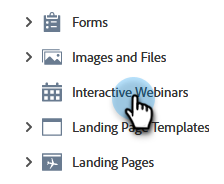

1. Click **End now**.

   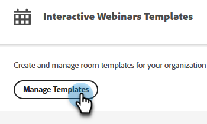

Your changes are automatically saved.
