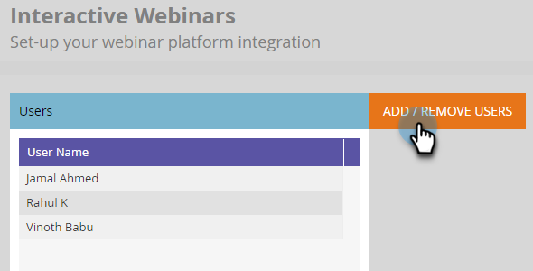
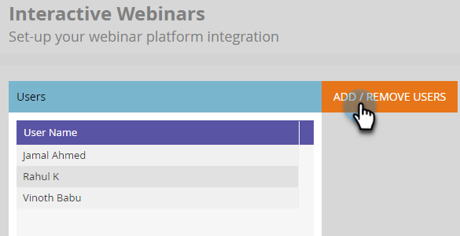
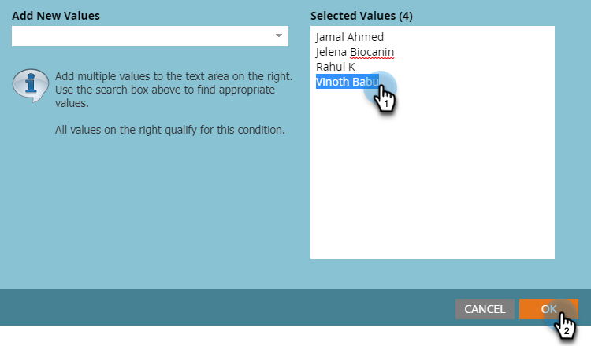
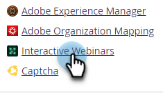
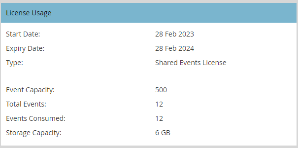
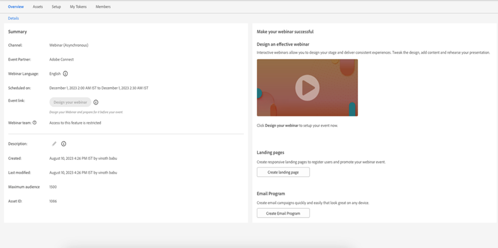

# User and License Management {#user-and-license-management}

Learn how to add and remove users as well as view your current licenses.

## Add a User {#add-a-user}

1. Go to the **Admin** area.

   

1. Click **Interactive Webinars**.

   

1. Click **Add/Remove Users**.

   

1. Click the Available Users drop-down, select the user(s) you wish to add, and click **OK**.

   

## Remove a User {#remove-a-user}

1. Go to the **Admin** area.

   

1. Click **Interactive Webinars**.

   

1. Click **Add/Remove Users**.

   

1. Highlight the user(s) you want removed and press the Delete key on your keyboard. Click **OK** when done.

   

## License Usage {#license-usage}

Interactive Webinars offers specific licenses to create events powered by Adobe Connect. Every time a license is added, a new license usage box will appear. Marketo Admins can view (not edit) the licenses by following the steps below. Contact the Adobe Account Team (your Account Manager) to obtain additional licenses.

1. Go to the **Admin** area.

   

1. Click **Interactive Webinars**.

   

1. Scroll down to the License Usage card(s).

   

<table> 
  <tr> 
   <td><b>Start Date</b></td>
   <td>Date the license begins.</td>
  </tr>
  <tr> 
   <td><b>Expiry Date</b></td>
   <td>Date the license expires.</td>
  </tr>
  <tr> 
   <td><b>Type</b></td>
   <td>The type of license purchased. There are three types available: Shared Events License, Shared Rooms License, Additional Storage License.</td>
  </tr>
  <tr> 
   <td><b>Event Capacity</b></td>
   <td>The maximum number of participants that can be accommodated in an event.</td>
  </tr>
  <tr> 
   <td><b>Total Events</b></td>
   <td>The total number of events that have been provisioned with this license.</td>
  </tr>
  <tr> 
   <td><b>Events Consumed</b></td>
   <td>The total number of completed events.</td>
  </tr>
  <tr> 
   <td><b>Storage Capacity</b></td>
   <td>Amount of storage available for storing recordings, collaterals, hero images, documentation, and other assets.</td>
  </tr>
  </tbody>
</table>

**Things to Note**

* The type "Additional Storage License" just provides storage, therefore the value in every field _besides_ Storage Capacity will be listed simply as "-".

* The type "Shared Room License" has unlimited events and "Additional Storage License" just provides storage, so the Total Events field for these licenses will be listed simply as "-".

* Every time an event is created, it will count as "consumed" from its respective license (unless it's a Shared Room License). Preference will be given to "Shared Event License" if there are both "Shared Event License" and "Shared Room License" of the same capacity. If the event has not been delivered and if the Event Program is deleted before the scheduled time, the event count is replenished by subtracting an event from Events Consumed.

* Once a license has been exhausted, its tile remains on the Interactive Webinars screen in the Admin section with "Total Events" and "Events Consumed" having the same value. Only when the license expires will it be removed from the screen.

## User Access {#user-access}

Interactive Webinars has the functionality to regulate usage by giving permissions to Marketo Engage users to create and deliver Interactive Webinars. However, an Interactive Webinar user (or non-user) could still have read/edit access to Interactive Webinars event programs created by other users.

Marketo users who have been given Interactive Webinars permissions and are owners of a particular Interactive Webinars Event Program would be able to perform all the Interactive Webinar functions related to that program. This includes: creating, accessing, modifying, cloning, moving, and deleting that program. However, once that user is no longer an Interactive webinar user, the owner of the program would be able to access and move the program, but not perform any other functions.

Marketo users who have been given Interactive Webinars permissions and are _not_ owners of a particular Interactive Webinars Event Program would be able to perform limited functions on those programs. Marketo non-Admin users will be able to access and clone the program, but won't be able to perform any other functions if they have permissions for Interactive Webinars. However, Marketo Admin users _will_ be able to perform all functions, such as accessing, modifying, cloning, moving, and deleting that program (as long as they have permissions for Interactive Webinars). Once this permission is revoked for Marketo Admin and non-Admin users, they would be able to only access the Interactive Webinar Event Program, and would not be able to perform any other functions.

The restriction of actionable functions would be indicated by a grayed out action button and a hover message. Some examples of the grayed out action buttons are "Design Your Webinar" or "Enter Your Webinar." For non-actionable functions, a message would be provided highlighting the restrictions. See example below:

